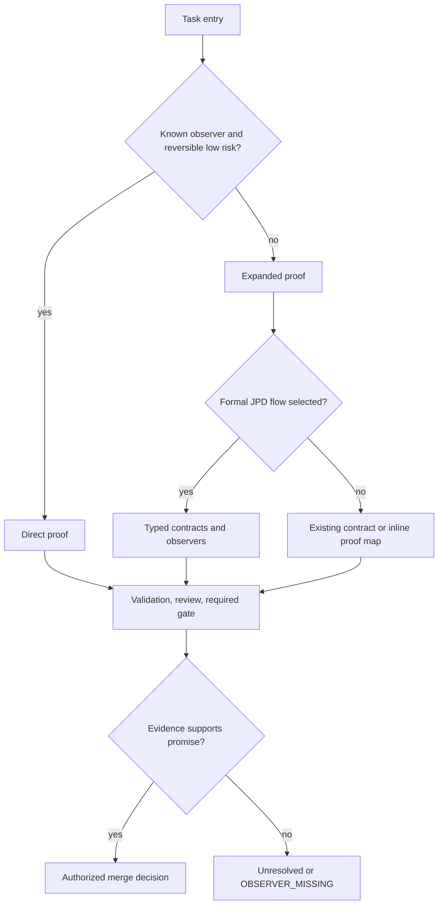

# Skill methodology and autonomy readiness

This guide routes ordinary development work by risk and evidence, subject to accepted contracts,
schemas, ADRs, and owner authority. It is normative for human and agent routing; it does not add
Runtime behavior, a new authority, or a universal ceremony.

## Choose a route

Use the direct route when all of these are true:

- the change is small, reversible, and bounded to a known surface;
- the promise and its observer already exist;
- it changes no persistence, permission, compatibility contract, external effect, or security
  boundary; and
- recovery is clear if the focused check fails.

Write the promise, scope, observer, and rollback in the task record. Make the change, run the
smallest meaningful validation plus required repository checks, and hand it to the normal review
and merge path. A direct result is an ordinary evidence-backed result. It is not JPD-certified.

Use the expanded route for persistence, permissions, compatibility, security, external effects,
uncertain recovery, multiple independent surfaces, or any promise whose observer is unavailable or
unclear. Start with a journey contract, or an equivalent existing contract, and a risk statement.
Compile promises into observation obligations; an inline promise-to-proof map is enough for an
ordinary change. Select only the needed implementation, focused tests, independent review, gate,
and owner decision. Invoke typed JPD artifacts only when the formal JPD flow is selected. Use
`OBSERVER_MISSING` or another typed unresolved result when an adequate observer does not exist. Do
not weaken the promise to obtain a green proxy.

The route may use `journey-contract`, `observation-compiler`, `plan-council`, `defect-bounty`,
`skill-synthesizer`, `retry-provenance`, `journey-verifier`, and `skill-evaluator`, plus the
development-contract skills `code-contract`, `context-retrieval`, and `memory-curator`, when their
specific evidence is useful. This is a capability map, not a fixed pipeline. A council or
synthesis pass is optional. Do not create a formal JPD artifact for an informal direct proof.

## Entry, handoff, and exit

Reuse the existing task or issue record for the actor, goal, scope, risk, authority, observer,
budget, and rollback; create no extra form when that record already carries them.
Handoffs are explicit:

1. Contract or plan → implementer: promise ids, constraints, and accepted scope.
2. Implementer → validator and reviewer: changed head, observable behavior, focused commands, and
   known gaps.
3. Validator → gate: exact head, passed/failed/skipped/unobserved evidence, and any required gate.
4. Gate and independent review → the already-authorized merger or the owner decision point when a
   decision is actually reserved: merge decision, residual risk, and rollback.

Exit requires the evidence promised by the selected route, mandatory checks and review, and a clear
state: delivered after the repository's merge and post-merge rules, or unresolved/blocked with the
missing authority or observer named. Never call package validation, a schema-shaped artifact, HTTP
acceptance, agent agreement, or a rendered node stronger than it is.

Keep every retry linked to its initial attempt and record the evidence delta. Retry only when a new
signal, changed input, or recovery action can change the result. Stop when no new evidence is
expected or the approved budget boundary is reached. There is no universal numeric quota for plans,
tests, reviewers, agents, or tokens.

## Current readiness evidence

The package is a data-only capability bundle. Its schemas, policies, evaluators, fixtures, and
skills are validated as package artifacts; that does not prove a live Runtime certification flow.
Current source inspection also finds focused infrastructure: `apps/cli/src/commands/quality.rs`
registers three deterministic gates (`gate-geometry`, `gate-retry-lineage`, and
`gate-journey-contract`), `core/extension-host` implements atomic version switching and claim
metadata, and the MCP session can enforce an opt-in per-contribution capability token with a
redacted audit record. These facts are source evidence, not a claim that a complete unattended
user journey is certified end to end.

| Capability | Current evidence | Readiness gap or next proof |
| --- | --- | --- |
| Deterministic JPD certification | Package contracts plus focused quality gates | A generic typed certification and final Journey Verification Result path needs current end-to-end evidence; see open #211. |
| Observer and evidence matching | Declarative package catalog and evidence-strength contracts | A registered observer capability receipt and deterministic evidence matcher must be proven in the active environment; package declarations are not availability. |
| Capsule evaluation and promotion | `skill-evaluator` defines candidate/advisory branches | Capsule-instance validation, authenticated receipts, and governed promotion remain candidate-only until their registered Runtime path is proven. |
| Extension activation and rollback | `core/extension-host/src/install.rs` and `activation.rs` | Verify the live host path and cross-platform lifecycle behavior at the exact head; package documentation alone is not proof. Issue #212 is closed. |
| Per-contribution MCP authority | `core/tool-broker/src/mcp_capability.rs` and `apps/cli/src/commands/mcp/session.rs` | Verify activation, token presentation, audit custody, and actor policy together; package declarations alone do not grant authority. Issue #213 is closed. |
| Full owner journey certification | Package contracts and dogfood graph | The complete journey and sabotage corpus still need the generic gate and independent evidence; see open #226. |
| Risk proportionality | This direct-versus-expanded route and recorded decision direction | A runtime triage decision and event-backed selection remain follow-up optimization work; see open #739. It does not block the first certification slice. |

The table is a proposed readiness rollout, not an implementation claim. Recheck source, exact head,
registered validators, observer receipts, and lifecycle state before promoting any capability.

## Proposed first vertical slice

This slice is proposed work for #211 and #226; the package does not claim it is executable today.
Use one bounded journey with a known deterministic observer. A submitted Journey Contract must be
preserved as an unresolved contract when its required observer is missing; a certification request
must remain unresolved or be refused when the observer is missing or its receipt is stale, and be
accepted only when its evidence is digest-bound and judged by the registered deterministic
evaluator. Exercise success, missing-observer, refusal, and recovered-retry cases. Replay the
resulting events and retain the initial failure. Then run the owner journey acceptance in #226
against the same exact head and report what remains unobserved. The quality certifier certifies a
registered gate against its pathogen suite; the gate evaluator separately judges node evidence.
That is separate from certifying that a live user journey was delivered. The slice may produce
advisory candidates while a registered validator or governed lifecycle is absent; it must not label
those candidates certified or automatically promote a skill.

Include crash or restart recovery, duplicate-effect refusal, and the retry budget stop in the slice.
These cases test unattended safety and are separate from proving that a quality gate accepted its
own contract input.

This plan keeps the first proof small enough to run offline and makes the missing Runtime,
observer, and authority pieces visible before broader unattended operation is attempted. It does
not change package manifests, runtime configuration, permissions, schemas, providers, or security
settings.

## Readiness measurement

Treat readiness as a proposed rollout decision, not a score invented after the run. Before a pilot,
agree the workload, comparison with the existing flow, observation method, and thresholds with the
owner. Measure false completion, escaped defects, safe recovery stops, manual interventions, and
cost or time. The pilot is ready only when those agreed thresholds hold across the selected workload
and every unresolved observer or authority gap is recorded. A green package validator or a single
successful run cannot establish unattended readiness.
