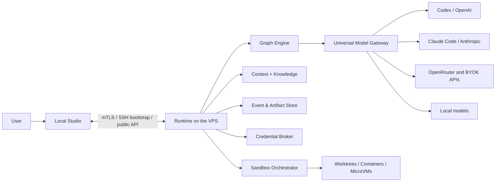
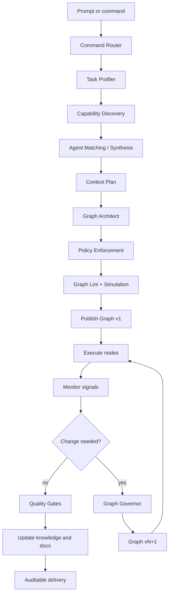

# MASTER PRD — GraphHelm

**Version:** 0.1.1
**State:** approved product vision; implementation is underway. See [README.md](README.md) and
the [milestone documents](docs/INDEX.md) for what currently runs.
**Category:** open-source Agentic Operating System
**Topology:** Local Studio + Runtime on the user's VPS

---

## 1. Executive summary

GraphHelm is an open platform for organizing, executing, and auditing work performed by artificial intelligence agents. The user submits a request in natural language. A dynamic harness interprets the goal, measures risk, complexity, uncertainty, and impact surface, discovers the available capabilities, and compiles a graph specific to that task.

The graph can combine investigation, planning, execution, testing, critique, security review, documentation, deployment, data analysis, research, content creation, automation, and any other registered capability. There are no rigid domain-specific packs. The system builds the appropriate setup by reading the project's real catalog of models, agents, skills, tools, policies, context, infrastructure, and budget.

The local Studio displays the execution as an operational diagram. The user observes agents in real time, opens linked documents and artifacts, edits nodes and edges, pauses branches, approves proposed nodes, swaps models, and, whenever desired, forces a different path — including skipping checks and going straight to deployment. The harness explains the impact, but does not take sovereignty away from the owner.

All execution happens on the user's VPS. Code, documents, events, credentials, indexes, memory, artifacts, and sandboxes remain under their control. The project is fully open source under the MIT license, with one license for everyone and no second tier.

---

## 2. Problem

Current agentic tools generally suffer from one or more limitations:

- they treat every request with a fixed flow or a single generalist agent;
- they send excessive context to every agent, increasing cost and noise;
- they don't clearly show who is doing what, with which permissions, and for what reason;
- they allow the same model to implement, critique, and approve its own work;
- they accumulate contradictory documentation and memories without governance;
- they don't adapt isolation, testing, and review to the risk discovered during execution;
- they depend on proprietary cloud, preventing audit and data control;
- they offer automation but little control for the user to change the workflow in progress;
- they create disposable agents and prompts, without learning in an auditable way within the project;
- they don't turn execution into reusable knowledge and living documentation.

GraphHelm solves this by treating orchestration as a problem of compilation, typing, policies, evidence, and visual control.

---

## 3. Vision

> Anyone should be able to turn a goal into a temporary organization of specialized agents, executed on their own infrastructure, with minimal context, verifiable evidence, visual control, and useful memory.

The product aims to become a universal framework for agentic applications, in the same way web frameworks organized interfaces, routing, state, and components. Its fundamental unit is not the chat, but the **governed work graph**.

---

## 4. Principles

### 4.1 Dynamic harness

The workflow is synthesized for the current request. The system does not select a closed template; it composes atomic capabilities.

### 4.2 Smallest sufficient graph

More agents does not mean more quality. The Graph Architect must generate the smallest graph capable of producing sufficient evidence of completion.

### 4.3 Proven quality

Success requires evidence: tests, sources, diffs, metrics, filled-in contracts, or explicit criteria. "The agent believes it's done" is not evidence.

### 4.4 Critical independence

When criticality demands it, the reviewer must be independent from the executor in model, subjective context, instructions, or a combination of these factors.

### 4.5 Low-consumption context

Agents receive capsules specific to their objective, not the full chat or project history.

### 4.6 Human sovereignty

The harness governs the default. The owner can interrupt, edit, replace, skip, or force the flow. The system records and explains the risk, without silently starting substitutes.

### 4.7 Security by capability

Permission is granted by capability, scope, and time. An agent does not inherit another's access.

### 4.8 Truth with provenance

Every important claim points to events, files, tests, sources, or decisions. Conflicts are represented, not hidden.

### 4.9 Real open source

Framework, Runtime, Studio, protocols, and essential extensions are public. There is no mandatory proprietary backend.

### 4.10 Reproducibility

Graphs, contracts, versions, policies, agents, context, and artifacts can be exported without credentials and re-executed with equivalent routes.

---

## 5. Users

### 5.1 Individual owner

Developer, founder, researcher, analyst, creator, or operator who wants a team of agents on their own VPS.

### 5.2 Graph Engineer

Person who registers capabilities, defines contracts, and creates skills, policies, evaluators, adapters, and visual components for the ecosystem.

### 5.3 Open source project maintainer

Uses the platform for triage, implementation, testing, review, security, documentation, and release.

### 5.4 Future team

Owner, Admin, Operator, Developer, Reviewer, Viewer, Billing, Service Account, and custom roles. V1 is single-user, but the identity model is born prepared for this.

---

## 6. Jobs to be done

- "When I describe a goal, I want the system to assemble the right process without me having to manually configure ten agents."
- "When a task turns out riskier than it looked, I want the graph to adapt and propose new checks."
- "When I disagree with the workflow, I want to edit the diagram and continue my way."
- "When an agent needs context, I want it to receive only what's necessary."
- "When the work is done, I want to know what was done, by whom, with which model, how much it cost, and what evidence supports the result."
- "When no one is using the project, I want the system to organize memory and documentation without rewriting history."
- "When a model subscription hits its limit, I want execution to wait, without automatically starting to spend my API budget."
- "When an agent created for my project proves useful, I want it to stay available for future tasks."

---

## 7. Full functional scope

### 7.1 Framework

- Universal Intake and Command Router;
- Task Profiler;
- Capability Registry;
- Agent Synthesizer and Agent Matcher;
- Harness Compiler;
- Graph Architect;
- Typed Graph DSL;
- Graph Linter and Graph Simulator;
- Graph Engine;
- Graph Governor and versioned mutations;
- Policy Engine;
- Quality/Evaluation Engine;
- Context Compiler;
- Evidence/Event Store;
- Project Knowledge Graph;
- Living Documentation materializer;
- Dreams Engine;
- Universal Model Gateway;
- Tool Broker;
- Sandbox/Isolation Orchestrator;
- Project Agent Registry;
- Skill and Plugin Runtime;
- observability and replay.

### 7.2 Runtime on the VPS

- installation and update via SSH + Docker;
- execution daemon;
- worker manager;
- containers, worktrees, and sandboxes;
- credential broker;
- Dreams scheduler and cron;
- event, artifact, and index stores;
- public APIs;
- event streaming to the Studio;
- checkpoints, pause, resume, cancel, and rollback;
- health checks and self-diagnosis.

### 7.3 Local Studio

- onboarding and VPS connection;
- workspace/project/subproject management;
- contextual chat;
- operational graph canvas;
- full node and edge editor;
- running agents panel;
- file and artifact explorer;
- living documentation;
- Knowledge Graph explorer;
- Project Agent Registry;
- capability/skill/plugin registry;
- model connections;
- policies and security;
- Dreams Center;
- event log, costs, and metrics;
- export/reproduction.

---

## 8. Topology



The Studio is the control plane. The VPS is the execution plane and data plane. No source code needs to pass through the project maintainer's infrastructure.

---

## 9. Main flow



### 9.1 Continuous classification

The initial classification is never final. The runtime, agents, tests, and tools can emit signals. The Graph Governor reassesses risk, depth, isolation, context, and gates.

### 9.2 Proposed expansions

In Autopilot, normal expansions can be applied automatically according to policy. When the user intervenes or is in Supervised/Manual mode, new agents appear as ghost nodes. They do not start, do not receive context, and do not consume tokens until approved.

### 9.3 Limits

Execution stops when:

- it meets the criteria;
- the user pauses or cancels;
- a model runs out of capacity and there is no manual switch;
- the mutation, retry, cost, or time limit is reached;
- there is an unresolved conflict;
- a genuinely non-inferable decision is missing;
- a technical impossibility occurs.

---

## 10. Dynamic harness

The harness is a program compiled for the execution. It contains:

```yaml
harness_manifest:
  task_profile: ...
  graph: ...
  agents: ...
  model_routes: ...
  context_plan: ...
  policies: ...
  isolation_plan: ...
  evidence_requirements: ...
  budgets: ...
  mutation_limits: ...
  completion_contract: ...
```

### 10.1 Inputs

- user's goal and criteria;
- project state;
- canonical context;
- capability catalog;
- persistent agents;
- skills and tools;
- models and available capacity;
- policies;
- infrastructure;
- budget, urgency, and preferences.

### 10.2 Outputs

- typed graph;
- functions and contracts for each node;
- agent and model selection;
- context capsules;
- permissions and isolation tiers;
- gates and required evidence;
- retry and compensation plan;
- cost/time estimate;
- mutation rules.

### 10.3 What is fixed

- types and contracts;
- rigid policies;
- registered capabilities;
- available permissions;
- event schemas;
- lint rules;
- security invariants.

### 10.4 What is dynamic

- number and role of agents;
- topology;
- parallelism;
- models;
- context;
- tests;
- reviews;
- retries;
- documentation to update;
- isolation above the minimum.

---

## 11. Operational graph

### 11.1 Node types

- `agent`
- `tool`
- `classifier`
- `planner`
- `gate`
- `evaluator`
- `fork`
- `join`
- `human_decision`
- `timer`
- `trigger`
- `subgraph`
- `materializer`
- `deploy`
- `rollback`
- `artifact_transform`

### 11.2 Edge types

- control;
- data;
- evidence;
- conditional;
- event;
- failure;
- compensation;
- human approval.

### 11.3 States

`draft`, `ghost`, `linting`, `ready`, `queued`, `running`, `waiting_input`, `waiting_capacity`, `paused`, `blocked`, `succeeded`, `failed`, `waived`, `skipped`, `cancelled`, `invalidated`.

### 11.4 Transactional editing

Visual changes are immediate. Operational changes create a `Graph Draft`. The Studio shows added and removed nodes/edges, invalidated outputs, skipped gates, and paused branches. After confirmation, the runtime creates a new atomic version.

### 11.5 Sovereignty

The user can connect implementation directly to deployment. The system must:

1. show skipped gates;
2. show unmet obligations;
3. record a waiver;
4. allow staying paused;
5. execute if technically possible.

---

## 12. Agents

### 12.1 Definition, runtime, and experience

- **Agent Definition:** persistent, versioned configuration.
- **Agent Runtime:** temporary instance within a node.
- **Agent Experience:** summarized memories, evaluations, and history.

### 12.2 Synthesis

The system can invent the necessary agent, but must declare:

- objective;
- capabilities;
- allowed tools;
- forbidden actions;
- input/output schemas;
- model profile;
- context budget;
- completion criteria;
- required evidence;
- minimum isolation tier.

### 12.3 Reuse

The Agent Matcher searches the Project Agent Registry. It can reuse, parameterize, version, derive, or create a new agent. Performance history never replaces verification of current compatibility.

### 12.4 Memory

Memories have origin, evidence, confidence, validity, expiration, and status: `candidate`, `validated`, `deprecated`, `contradicted`, `expired`.

---

## 13. Context and knowledge

### 13.1 Context Capsule

Each node receives:

1. Project Kernel;
2. Task Capsule;
3. Node Capsule;
4. Evidence Bundle;
5. Dependency Outputs;
6. valid Agent Experience.

The agent can request expansion by justifying missing information and the expected impact.

### 13.2 Three layers of truth

1. **Evidence/Event Store:** immutable events and evidence.
2. **Project Knowledge Graph:** entities, claims, relations, conflicts, and temporality.
3. **Living Documentation:** PRDs, architecture, guides, and runbooks in readable form.

### 13.3 Rules

- documents do not erase events;
- new claims can confirm, contradict, or replace;
- summaries carry provenance;
- conflicts remain visible;
- changes invalidate only dependent fragments;
- the reviewer does not automatically receive the executor's internal opinion.

---

## 14. Dreams Engine

The Dreams Engine runs when the project is idle or on a schedule. It can:

- consolidate documents;
- reclassify claims;
- flag contradictions;
- expire memories;
- deduplicate agents;
- suggest better versions of skills;
- optimize indexes and retrieval;
- evaluate harness patterns;
- generate well-founded tasks.

Every cognitive change happens in a Shadow Workspace:

`Dream Planner → Impact Classifier → Evidence Validator → Policy Engine → Shadow Change → Tests → Independent Critic → Atomic Commit/Discard`.

It does not change code directly. For bugs, technical debt, or opportunities, it creates a normal `dream_generated` task, reclassified from scratch by the harness.

---

## 15. Universal Model Gateway

### 15.1 Routes

- aggregators, such as OpenRouter;
- direct BYOK APIs;
- officially authenticated native runtimes;
- OpenAI-compatible endpoints;
- local models;
- cloud enterprise adapters.

### 15.2 Selection

The router scores fit, historical quality, context, tools, latency, cost, quota, privacy, independence, and availability. There is no fixed rule like "model X always plans."

### 15.3 Subscriptions

Subscription runtimes must use the provider's official flow. Web chat scraping, cookie import, or password capture are not permitted for unofficial automation. Credentials stay in the VPS broker, outside the code sandbox.

### 15.4 Exhausted capacity

When a subscription hits its limit:

- checkpoint;
- `waiting_for_model_capacity` state;
- no automatic switch to BYOK;
- the user chooses to wait, reconnect, switch route, or cancel;
- independent nodes can finish;
- resumption preserves valid outputs.

---

## 16. Security and isolation

### 16.1 Tiers

- **Tier 0:** reading, planning, research, and critique without destructive write/shell access.
- **Tier 1:** worktree/snapshot + ephemeral container.
- **Tier 2:** containers segmented by agent/group, with their own network and filesystem.
- **Tier 3:** microVM or hardened sandbox for unknown or high-risk code.

The tier can rise, never fall below the policy's minimum.

### 16.2 Capability leases

Each access defines capability, scope, duration, origin, and revocation. Secrets are injected only into the broker or an authorized process.

### 16.3 Priority threats

- prompt injection in repositories and sources;
- credential exfiltration;
- malicious dependencies;
- escalation via the Docker socket;
- policy bypass;
- context poisoning;
- outdated memory treated as truth;
- an agent approving its own result;
- infinite graph expansion;
- logs containing secrets;
- a plugin with excessive permissions.

---

## 17. Studio

Main layout inspired by the concept provided:

```text
┌─────────────┬────────────────────────────────────┬──────────────┬──────────────┐
│ Projects    │ Graph canvas                        │ Running      │ Docs/Files   │
│ and scopes  │                                    │ agents       │ Artifacts    │
│             │                                    │              │ Images       │
│             ├────────────────────────────────────┤              │              │
│             │ Contextual chat + commands         │              │              │
└─────────────┴────────────────────────────────────┴──────────────┴──────────────┘
```

Panels are resizable and collapsible. The graph is the operational center, not a decoration.

Required screens:

- onboarding;
- VPS connection;
- model connection;
- workspace home;
- project studio;
- node inspector;
- graph draft review;
- agents registry;
- skills/capabilities;
- docs/knowledge;
- Dreams Center;
- policies/security;
- artifacts/files;
- events/audit;
- settings/export.

---

## 18. Command Router

Each message is classified by intent, target, and confidence:

- query without mutation;
- instruction for a node;
- graph mutation;
- new execution;
- human decision;
- documentation update;
- conversation with no operational effect.

Explicit targeting:

`@project`, `@execution`, `@graph`, `@node`, `@agent`, `@document`, `@harness`.

Mutations become a Graph Draft. Ambiguities show interpretations. Simple instructions for a selected node can be applied without changing the topology.

---

## 19. Hierarchy

```text
Workspace
├── shared policies and connections
├── Project
│   ├── Knowledge Graph
│   ├── documentation
│   ├── agents
│   ├── executions
│   ├── repositories/sources
│   └── Subproject
└── Project
```

Inheritance is selective, with explicit visibility and provenance. Sibling content does not automatically enter context.

---

## 20. Open source and governance

### 20.1 Guarantees

- full clone and self-host;
- public API for everything the Studio does;
- public CLI and SDKs;
- opt-in external telemetry;
- versioned schemas and protocols;
- inspectable plugins;
- export with no vendor lock-in.

### 20.2 License

- MIT, for the whole codebase;
- no second tier and no community/enterprise split;
- no CLA: a contribution is offered under the same terms the project ships under;
- anything sold is a service beside the software, never a capability withheld from it.

### 20.3 Process

- public RFCs;
- ADRs;
- SemVer;
- contract changelog;
- conformance suite;
- security policy;
- open roadmap;
- reproducible benchmark.

---

## 21. Non-functional requirements

- self-host with no mandatory central service;
- idempotent events, orderable per execution;
- resume without repeating a validly completed node;
- secrets absent from logs and exports;
- every output with provenance;
- immutable graph versions;
- APIs compatible with external automation;
- 1,000 nodes rendered with smooth interaction in the reference Studio;
- execution status propagated to the Studio within 500 ms on a healthy local network;
- Studio failure does not stop the runtime;
- runtime failure preserves a durable checkpoint;
- untrusted plugins isolated;
- import/export with a versioned manifest;
- keyboard and screen reader accessibility.

---

## 22. Product metrics

- rate of tasks completed with sufficient evidence;
- time to first useful graph;
- token reduction versus full-context baseline;
- context retrieval accuracy;
- rate of gates that catch real problems;
- reviewer false positive rate;
- frequency of manual overrides;
- rework after completion;
- cost per accepted result;
- recovery time after pause/failure;
- agent and skill reuse;
- contradictions resolved by Dreams without regression;
- success rate of execution manifest reproduction.

---

## 23. Non-goals

- promising absolute correctness;
- using chat accounts for unofficial automation;
- hiding routing decisions;
- running everything in the same container;
- keeping infinite memory per agent;
- requiring a marketplace or central cloud;
- preventing the owner from consciously accepting risk;
- replacing professional legal, medical, or financial review;
- defining closed workflows as the source of the product's intelligence.

---

## 24. Recommended first vertical slice

Although the documentation covers the full product, the first future delivery should prove the architecture end-to-end in software engineering:

`prompt → harness → visual graph → agents → code → tests/critique → docs → auditable delivery`.

It includes Studio, VPS, Model Gateway, Graph Engine, Context Compiler, Event Store, Agent Registry, Tier 0/1, living docs, basic Dreams, and public APIs. The same contracts must support future domains without conceptual refactoring.

---

## 25. Vision-fulfilled criterion

The vision is fulfilled when a user is able to:

1. install the Runtime on their own VPS;
2. connect models via BYOK, official subscription, or local;
3. open a multimodal project;
4. write an open-ended request;
5. see a customized graph get compiled;
6. understand each agent, model, context, permission, and gate;
7. edit the workflow while it's running;
8. pause and resume without losing work;
9. receive a result backed by evidence;
10. see documentation and knowledge updated;
11. let Dreams maintain the project during idle time;
12. export and reproduce the execution without depending on the maintainer.
