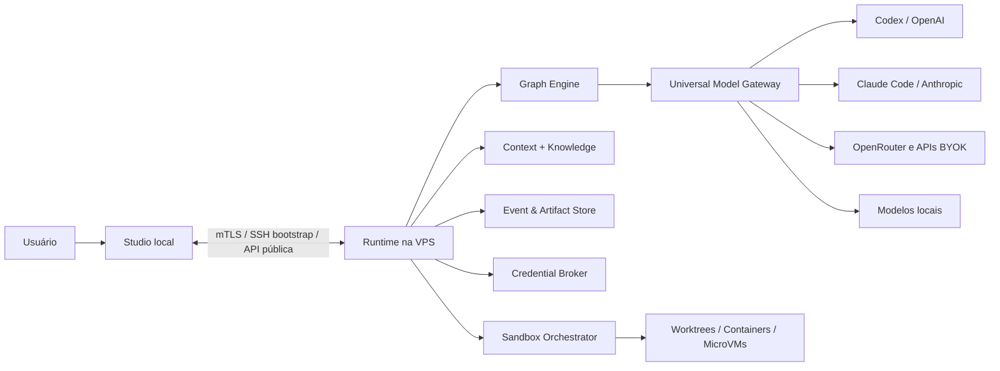
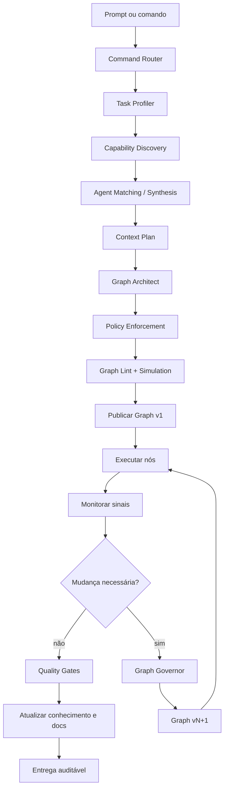

# MASTER PRD — GraphHelm

**Versão:** 0.1.1
**Estado:** especificação aprovada para implementação incremental; sem código neste pacote
**Categoria:** open-source Agentic Operating System
**Topologia:** Studio local + Runtime na VPS do usuário

---

## 1. Resumo executivo

GraphHelm é uma plataforma aberta para organizar, executar e auditar trabalho realizado por agentes de inteligência artificial. O usuário envia uma demanda em linguagem natural. Um harness dinâmico interpreta o objetivo, mede risco, complexidade, incerteza e superfície de impacto, descobre as capacidades disponíveis e compila um grafo específico para aquela tarefa.

O grafo pode combinar investigação, planejamento, execução, testes, crítica, revisão de segurança, documentação, deploy, análise de dados, pesquisa, criação de conteúdo, automação e qualquer outra capacidade registrada. Não existem packs rígidos por domínio. O sistema cria o setup adequado lendo o catálogo real de modelos, agentes, skills, ferramentas, políticas, contexto, infraestrutura e orçamento daquele projeto.

O Studio local mostra a execução como um diagrama operacional. O usuário observa agentes em tempo real, abre documentos e artefatos vinculados, edita nós e arestas, pausa branches, aprova nós propostos, troca modelos e, quando quiser, força um caminho diferente — inclusive ignorando verificações e indo diretamente ao deploy. O harness explica o impacto, mas não retira a soberania do proprietário.

Toda execução acontece na VPS do usuário. Código, documentos, eventos, credenciais, índices, memória, artefatos e sandboxes permanecem sob seu controle. O projeto é integralmente open source, com edição comunitária AGPLv3 e licença comercial alternativa sobre a mesma base de código.

---

## 2. Problema

Ferramentas agentivas atuais geralmente sofrem com uma ou mais limitações:

- tratam todo pedido com um fluxo fixo ou um único agente generalista;
- enviam contexto excessivo para todos os agentes, aumentando custo e ruído;
- não mostram claramente quem está fazendo o quê, com quais permissões e por qual motivo;
- permitem que o mesmo modelo implemente, critique e aprove seu próprio trabalho;
- acumulam documentação e memórias contraditórias sem governança;
- não adaptam isolamento, testes e revisão ao risco descoberto durante a execução;
- dependem de cloud proprietária, impedindo auditoria e controle de dados;
- oferecem automação, mas pouco controle para o usuário alterar o workflow em andamento;
- criam agentes e prompts descartáveis, sem aprender de maneira auditável dentro do projeto;
- não transformam a execução em conhecimento reutilizável e documentação viva.

GraphHelm resolve isso tratando a orquestração como um problema de compilação, tipagem, políticas, evidência e controle visual.

---

## 3. Visão

> Qualquer pessoa deve conseguir transformar um objetivo em uma organização temporária de agentes especializados, executada em sua própria infraestrutura, com contexto mínimo, evidência verificável, controle visual e memória útil.

O produto pretende se tornar um framework universal para aplicações agentivas, da mesma forma que frameworks web organizaram interfaces, roteamento, estado e componentes. Sua unidade fundamental não é o chat, mas o **grafo de trabalho governado**.

---

## 4. Princípios

### 4.1 Harness dinâmico

O workflow é sintetizado para a demanda atual. O sistema não seleciona um template fechado; ele compõe capacidades atômicas.

### 4.2 Menor grafo suficiente

Mais agentes não significam mais qualidade. O Graph Architect deve gerar o menor grafo capaz de produzir evidência suficiente de conclusão.

### 4.3 Qualidade comprovada

Sucesso exige evidências: testes, fontes, diffs, métricas, contratos preenchidos ou critérios explícitos. “O agente acredita que terminou” não é evidência.

### 4.4 Independência crítica

Quando a criticidade exigir, o revisor deve ser independente do executor em modelo, contexto subjetivo, instruções ou combinação desses fatores.

### 4.5 Contexto de baixo consumo

Agentes recebem cápsulas específicas para seu objetivo, não o histórico integral do chat ou do projeto.

### 4.6 Soberania humana

O harness governa o padrão. O proprietário pode interromper, editar, substituir, pular ou forçar o fluxo. O sistema registra e explica o risco, sem iniciar substitutos silenciosamente.

### 4.7 Segurança por capacidade

Permissão é concedida por capacidade, escopo e tempo. Um agente não herda o acesso de outro.

### 4.8 Verdade com proveniência

Toda claim importante aponta para eventos, arquivos, testes, fontes ou decisões. Conflitos são representados, não escondidos.

### 4.9 Open source real

Framework, Runtime, Studio, protocolos e extensões essenciais são públicos. Não existe backend proprietário obrigatório.

### 4.10 Reprodutibilidade

Grafos, contratos, versões, políticas, agentes, contexto e artefatos podem ser exportados sem credenciais e reexecutados com rotas equivalentes.

---

## 5. Usuários

### 5.1 Proprietário individual

Desenvolvedor, fundador, pesquisador, analista, criador ou operador que quer uma equipe de agentes em sua própria VPS.

### 5.2 Graph Engineer

Pessoa que registra capacidades, define contratos, cria skills, policies, evaluators, adapters e componentes visuais para o ecossistema.

### 5.3 Maintainer de projeto open source

Usa a plataforma para triagem, implementação, testes, revisão, segurança, documentação e release.

### 5.4 Equipe futura

Owner, Admin, Operator, Developer, Reviewer, Viewer, Billing, Service Account e funções customizadas. A V1 é single-user, mas o modelo de identidade nasce preparado.

---

## 6. Jobs to be done

- “Quando eu descrevo um objetivo, quero que o sistema monte o processo certo sem eu configurar dez agentes manualmente.”
- “Quando uma tarefa ficar mais arriscada do que parecia, quero que o grafo se adapte e proponha novas verificações.”
- “Quando eu discordar do workflow, quero editar o diagrama e continuar do meu jeito.”
- “Quando um agente precisar de contexto, quero que ele receba apenas o necessário.”
- “Quando o trabalho terminar, quero saber o que foi feito, por quem, com qual modelo, quanto custou e quais evidências sustentam o resultado.”
- “Quando ninguém estiver usando o projeto, quero que o sistema organize memória e documentação sem reescrever a história.”
- “Quando uma assinatura de modelo atingir o limite, quero que a execução espere, sem começar a gastar minha API automaticamente.”
- “Quando um agente criado para meu projeto se provar útil, quero que ele fique disponível para futuras tarefas.”

---

## 7. Escopo funcional integral

### 7.1 Framework

- Universal Intake e Command Router;
- Task Profiler;
- Capability Registry;
- Agent Synthesizer e Agent Matcher;
- Harness Compiler;
- Graph Architect;
- Graph DSL tipada;
- Graph Linter e Graph Simulator;
- Graph Engine;
- Graph Governor e mutações versionadas;
- Policy Engine;
- Quality/Evaluation Engine;
- Context Compiler;
- Evidence/Event Store;
- Project Knowledge Graph;
- Living Documentation materializer;
- Dreams Engine;
- Universal Model Gateway;
- Tool Broker;
- Sandbox/Isolation Orchestrator;
- Project Agent Registry;
- Skill e Plugin Runtime;
- observabilidade e replay.

### 7.2 Runtime na VPS

- instalação e atualização por SSH + Docker;
- daemon de execução;
- worker manager;
- containers, worktrees e sandboxes;
- credential broker;
- scheduler e cron de Dreams;
- stores de eventos, artefatos e índices;
- APIs públicas;
- streaming de eventos ao Studio;
- checkpoints, pause, resume, cancel e rollback;
- health checks e autodiagnóstico.

### 7.3 Studio local

- onboarding e conexão com VPS;
- gerenciamento de workspace/projeto/subprojeto;
- chat contextual;
- canvas de grafo operacional;
- editor integral de nós e arestas;
- painel de agentes em execução;
- explorador de arquivos e artefatos;
- documentação viva;
- Knowledge Graph explorer;
- Project Agent Registry;
- capability/skill/plugin registry;
- model connections;
- policies e segurança;
- Dreams Center;
- event log, custos e métricas;
- exportação/reprodução.

---

## 8. Topologia


```mermaid
flowchart LR
    U[Usuário] --> S[Studio local]
    S <-->|mTLS / SSH bootstrap / API pública| R[Runtime na VPS]
    R --> G[Graph Engine]
    R --> C[Context + Knowledge]
    R --> E[Event & Artifact Store]
    R --> B[Credential Broker]
    R --> X[Sandbox Orchestrator]
    G --> M[Universal Model Gateway]
    M --> OAI[Codex / OpenAI]
    M --> ANT[Claude Code / Anthropic]
    M --> OR[OpenRouter e APIs BYOK]
    M --> LOC[Modelos locais]
    X --> W[Worktrees / Containers / MicroVMs]
```

O Studio é control plane. A VPS é execution plane e data plane. Nenhum código-fonte precisa passar por infraestrutura do mantenedor do projeto.

---

## 9. Fluxo principal


```mermaid
flowchart TD
    A[Prompt ou comando] --> B[Command Router]
    B --> C[Task Profiler]
    C --> D[Capability Discovery]
    D --> E[Agent Matching / Synthesis]
    E --> F[Context Plan]
    F --> G[Graph Architect]
    G --> H[Policy Enforcement]
    H --> I[Graph Lint + Simulation]
    I --> J[Publicar Graph v1]
    J --> K[Executar nós]
    K --> L[Monitorar sinais]
    L --> M{Mudança necessária?}
    M -->|não| N[Quality Gates]
    M -->|sim| O[Graph Governor]
    O --> P[Graph vN+1]
    P --> K
    N --> Q[Atualizar conhecimento e docs]
    Q --> R[Entrega auditável]
```

### 9.1 Classificação contínua

A classificação inicial nunca é definitiva. O runtime, agentes, testes e ferramentas podem emitir sinais. O Graph Governor reavalia risco, profundidade, isolamento, contexto e gates.

### 9.2 Expansões propostas

Em Autopilot, expansões normais podem ser aplicadas automaticamente conforme política. Quando o usuário intervier ou estiver em Supervised/Manual, novos agentes aparecem como ghost nodes. Eles não começam, não recebem contexto e não consomem tokens até aprovação.

### 9.3 Limites

A execução para quando:

- conclui os critérios;
- usuário pausa ou cancela;
- modelo fica sem capacidade e não há troca manual;
- limite de mutações, retries, custo ou tempo é atingido;
- existe conflito não resolvido;
- falta uma decisão genuinamente não inferível;
- ocorre impossibilidade técnica.

---

## 10. Harness dinâmico

O harness é um programa compilado para a execução. Ele contém:

```yaml
harness_manifest:
  task_profile: ...
  graph: ...
  agents: ...
  model_routes: ...
  context_plan: ...
  policies: ...
  isolation_plan: ...
  evidence_requirements: ...
  budgets: ...
  mutation_limits: ...
  completion_contract: ...
```

### 10.1 Entradas

- objetivo e critérios do usuário;
- estado do projeto;
- contexto canônico;
- catálogo de capacidades;
- agentes persistentes;
- skills e tools;
- modelos e capacidade disponível;
- políticas;
- infraestrutura;
- orçamento, urgência e preferências.

### 10.2 Saídas

- grafo tipado;
- funções e contratos de cada nó;
- seleção de agentes e modelos;
- cápsulas de contexto;
- permissões e isolation tiers;
- gates e evidências necessárias;
- plano de retries e compensação;
- estimativa de custo/tempo;
- regras de mutação.

### 10.3 O que é fixo

- tipos e contratos;
- políticas rígidas;
- capabilities registradas;
- permissões disponíveis;
- schemas de eventos;
- regras de lint;
- invariantes de segurança.

### 10.4 O que é dinâmico

- número e papel dos agentes;
- topologia;
- paralelismo;
- modelos;
- contexto;
- testes;
- revisões;
- retries;
- documentação a atualizar;
- isolamento acima do mínimo.

---

## 11. Grafo operacional

### 11.1 Tipos de nós

- `agent`
- `tool`
- `classifier`
- `planner`
- `gate`
- `evaluator`
- `fork`
- `join`
- `human_decision`
- `timer`
- `trigger`
- `subgraph`
- `materializer`
- `deploy`
- `rollback`
- `artifact_transform`

### 11.2 Tipos de aresta

- controle;
- dados;
- evidência;
- condicional;
- evento;
- falha;
- compensação;
- aprovação humana.

### 11.3 Estados

`draft`, `linting`, `ready`, `queued`, `running`, `waiting_input`, `waiting_capacity`, `paused`, `blocked`, `succeeded`, `failed`, `waived`, `skipped`, `cancelled`, `invalidated`.

### 11.4 Edição transacional

Mudanças visuais são imediatas. Mudanças operacionais criam `Graph Draft`. O Studio mostra nós/arestas adicionados, removidos, outputs invalidados, gates ignorados e branches pausadas. Após confirmação, o runtime cria nova versão atômica.

### 11.5 Soberania

O usuário pode conectar implementação diretamente ao deploy. O sistema deve:

1. mostrar gates ignorados;
2. mostrar obrigações não atendidas;
3. registrar waiver;
4. permitir manter pausado;
5. executar se tecnicamente possível.

---

## 12. Agentes

### 12.1 Definição, runtime e experiência

- **Agent Definition:** configuração persistente e versionada.
- **Agent Runtime:** instância temporária dentro de um nó.
- **Agent Experience:** memórias resumidas, avaliações e histórico.

### 12.2 Síntese

O sistema pode inventar o agente necessário, mas precisa declarar:

- objetivo;
- capabilities;
- ferramentas permitidas;
- ações proibidas;
- input/output schemas;
- perfil de modelo;
- orçamento de contexto;
- critérios de conclusão;
- evidências obrigatórias;
- isolation tier mínimo.

### 12.3 Reuso

O Agent Matcher pesquisa o Project Agent Registry. Pode reutilizar, parametrizar, versionar, derivar ou criar novo agente. O histórico de desempenho nunca substitui a verificação da compatibilidade atual.

### 12.4 Memória

Memórias possuem origem, evidência, confiança, validade, expiração e status: `candidate`, `validated`, `deprecated`, `contradicted`, `expired`.

---

## 13. Contexto e conhecimento

### 13.1 Context Capsule

Cada nó recebe:

1. Project Kernel;
2. Task Capsule;
3. Node Capsule;
4. Evidence Bundle;
5. Dependency Outputs;
6. Agent Experience válida.

O agente pode pedir expansão justificando informação faltante e impacto esperado.

### 13.2 Três camadas de verdade

1. **Evidence/Event Store:** eventos e evidências imutáveis.
2. **Project Knowledge Graph:** entidades, claims, relações, conflitos e temporalidade.
3. **Living Documentation:** PRDs, arquitetura, guias e runbooks legíveis.

### 13.3 Regras

- documentos não apagam eventos;
- claims novas podem confirmar, contradizer ou substituir;
- resumos carregam proveniência;
- conflitos permanecem visíveis;
- mudanças invalidam somente fragmentos dependentes;
- revisor não recebe automaticamente a opinião interna do executor.

---

## 14. Dreams Engine

O Dreams Engine roda quando o projeto está ocioso ou por agendamento. Ele pode:

- consolidar documentos;
- reclassificar claims;
- marcar contradições;
- expirar memórias;
- deduplicar agentes;
- sugerir versões melhores de skills;
- otimizar índices e recuperação;
- avaliar padrões de harness;
- gerar tarefas fundamentadas.

Toda mudança cognitiva ocorre em Shadow Workspace:

`Dream Planner → Impact Classifier → Evidence Validator → Policy Engine → Shadow Change → Tests → Independent Critic → Atomic Commit/Discard`.

Ele não altera código diretamente. Para bugs, dívida técnica ou oportunidades, cria uma tarefa normal `dream_generated`, reclassificada do zero pelo harness.

---

## 15. Universal Model Gateway

### 15.1 Rotas

- agregadores, como OpenRouter;
- APIs diretas BYOK;
- runtimes nativos autenticados oficialmente;
- endpoints OpenAI-compatible;
- modelos locais;
- cloud enterprise adapters.

### 15.2 Seleção

O roteador pontua adequação, qualidade histórica, contexto, ferramentas, latência, custo, quota, privacidade, independência e disponibilidade. Não existe regra fixa “modelo X sempre planeja”.

### 15.3 Assinaturas

Runtimes de assinatura devem usar fluxo oficial do provedor. Não é permitido scraping de chat web, importação de cookie ou captura de senha. Credenciais ficam no broker da VPS, fora do sandbox de código.

### 15.4 Capacidade esgotada

Quando uma assinatura atinge limite:

- checkpoint;
- estado `waiting_for_model_capacity`;
- nenhuma troca para BYOK automática;
- usuário escolhe esperar, reconectar, trocar rota ou cancelar;
- nós independentes podem terminar;
- retomada preserva outputs válidos.

---

## 16. Segurança e isolamento

### 16.1 Tiers

- **Tier 0:** leitura, planejamento, pesquisa e crítica sem escrita/shell destrutivo.
- **Tier 1:** worktree/snapshot + container efêmero.
- **Tier 2:** containers segmentados por agente/grupo, rede e filesystem próprios.
- **Tier 3:** microVM ou sandbox reforçada para código desconhecido ou alto risco.

O tier pode subir, nunca descer abaixo do mínimo da policy.

### 16.2 Capability leases

Cada acesso define capacidade, escopo, duração, origem e revogação. Segredos são injetados apenas no broker ou processo autorizado.

### 16.3 Ameaças prioritárias

- prompt injection em repositórios e fontes;
- exfiltração de credenciais;
- dependências maliciosas;
- escalada via Docker socket;
- bypass de policy;
- context poisoning;
- memória obsoleta tratada como verdade;
- agente aprovando próprio resultado;
- expansão infinita de grafo;
- logs contendo segredos;
- plugin com permissões excessivas.

---

## 17. Studio

Layout principal inspirado no conceito fornecido:

```text
┌─────────────┬────────────────────────────────────┬──────────────┬──────────────┐
│ Projetos    │ Canvas do grafo                    │ Agentes      │ Docs/Files   │
│ e escopos   │                                    │ em execução  │ Artefatos    │
│             │                                    │              │ Imagens      │
│             ├────────────────────────────────────┤              │              │
│             │ Chat contextual + comandos         │              │              │
└─────────────┴────────────────────────────────────┴──────────────┴──────────────┘
```

Painéis são redimensionáveis e recolhíveis. O grafo é o centro operacional, não uma decoração.

Telas obrigatórias:

- onboarding;
- conexão de VPS;
- conexão de modelos;
- workspace home;
- project studio;
- node inspector;
- graph draft review;
- agents registry;
- skills/capabilities;
- docs/knowledge;
- Dreams Center;
- policies/security;
- artifacts/files;
- events/audit;
- settings/export.

---

## 18. Command Router

Cada mensagem é classificada por intenção, alvo e confiança:

- consulta sem mutação;
- instrução para nó;
- mutação de grafo;
- nova execução;
- decisão humana;
- atualização documental;
- conversa sem efeito operacional.

Direcionamento explícito:

`@projeto`, `@execução`, `@graph`, `@nó`, `@agente`, `@documento`, `@harness`.

Mutações viram Graph Draft. Ambiguidades mostram interpretações. Instruções simples para nó selecionado podem ser aplicadas sem alterar topologia.

---

## 19. Hierarquia

```text
Workspace
├── políticas e conexões compartilhadas
├── Projeto
│   ├── Knowledge Graph
│   ├── documentação
│   ├── agentes
│   ├── execuções
│   ├── repositórios/fontes
│   └── Subprojeto
└── Projeto
```

Herança é seletiva, com visibilidade e proveniência explícitas. Conteúdo de irmãos não entra automaticamente no contexto.

---

## 20. Open source e governança

### 20.1 Garantias

- clone e self-host completos;
- API pública para tudo que o Studio faz;
- CLI e SDKs públicos;
- telemetria externa opt-in;
- schemas e protocolos versionados;
- plugins inspecionáveis;
- exportação sem vendor lock-in.

### 20.2 Licença

- edição comunitária: AGPLv3;
- licença comercial: contrato alternativo;
- mesma base de código;
- ICLA/CCLA não exclusivos;
- textos jurídicos validados antes do lançamento.

### 20.3 Processo

- RFCs públicas;
- ADRs;
- SemVer;
- changelog de contratos;
- conformance suite;
- security policy;
- roadmap aberto;
- benchmark reproduzível.

---

## 21. Requisitos não funcionais

- self-host sem serviço central obrigatório;
- eventos idempotentes e ordenáveis por execução;
- resume sem repetir nó concluído válido;
- segredos ausentes de logs e exports;
- cada output com provenance;
- graph versions imutáveis;
- APIs compatíveis com automação externa;
- 1.000 nós renderizados com interação fluida no Studio de referência;
- status de execução propagado ao Studio em até 500 ms na rede local saudável;
- falha do Studio não encerra runtime;
- falha do runtime preserva checkpoint durável;
- plugins não confiáveis isolados;
- import/export com manifest versionado;
- acessibilidade de teclado e leitores de tela.

---

## 22. Métricas de produto

- taxa de tarefas concluídas com evidência suficiente;
- tempo até primeiro grafo útil;
- redução de tokens contra baseline de contexto integral;
- precisão de recuperação de contexto;
- taxa de gates que encontram problemas reais;
- taxa de falsos positivos de revisores;
- frequência de overrides manuais;
- retrabalho após conclusão;
- custo por resultado aceito;
- tempo de recuperação após pausa/falha;
- reutilização de agentes e skills;
- contradições resolvidas pelo Dreams sem regressão;
- sucesso de reprodução de execution manifests.

---

## 23. Não objetivos

- prometer correção absoluta;
- usar contas de chat por automação não oficial;
- esconder decisões de roteamento;
- executar tudo no mesmo container;
- manter memória infinita por agente;
- obrigar marketplace ou cloud central;
- impedir o proprietário de aceitar risco consciente;
- substituir revisão jurídica, médica ou financeira profissional;
- definir workflows fechados como fonte da inteligência do produto.

---

## 24. Primeira fatia vertical recomendada

Embora a documentação cubra o produto integral, a primeira entrega futura deverá provar a arquitetura de ponta a ponta em engenharia de software:

`prompt → harness → grafo visual → agentes → código → testes/crítica → docs → entrega auditável`.

Inclui Studio, VPS, Model Gateway, Graph Engine, Context Compiler, Event Store, Agent Registry, Tier 0/1, docs vivas, Dreams básico e APIs públicas. Os mesmos contratos precisam suportar os domínios futuros sem refatoração conceitual.

---

## 25. Critério de visão cumprida

A visão é cumprida quando um usuário consegue:

1. instalar o Runtime na própria VPS;
2. conectar modelos por BYOK, assinatura oficial ou local;
3. abrir um projeto multimodal;
4. escrever uma demanda aberta;
5. ver um grafo customizado ser compilado;
6. entender cada agente, modelo, contexto, permissão e gate;
7. editar o workflow em execução;
8. pausar e continuar sem perder trabalho;
9. receber resultado sustentado por evidências;
10. ver documentação e conhecimento atualizados;
11. permitir que Dreams mantenha o projeto durante ociosidade;
12. exportar e reproduzir a execução sem depender do mantenedor.
