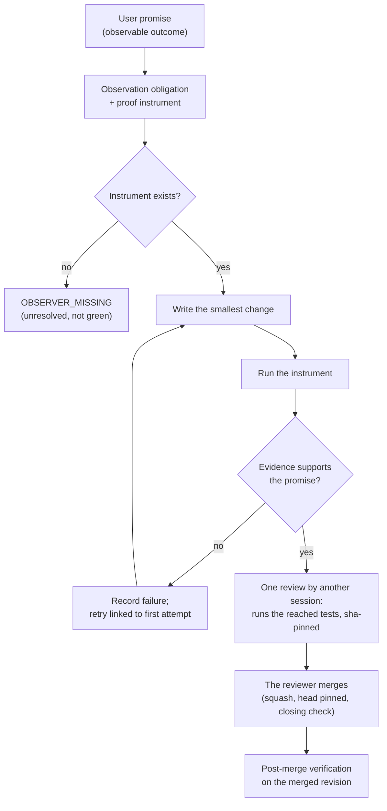
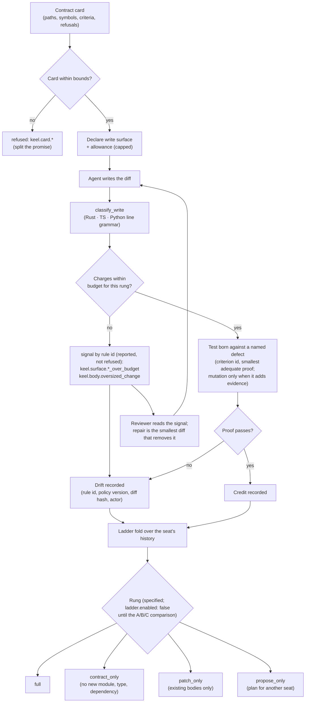

# GraphHelm — full product documentation

> **Repository:** https://github.com/stabem/GraphHelm
> **Code licence:** MIT — see [LICENSE](LICENSE); bundled fonts retain [OFL-1.1 notices](apps/studio/src/fonts/README.md)
> **Contribute:** [CONTRIBUTING.md](CONTRIBUTING.md) · **Security reports:** [SECURITY.md](SECURITY.md)
> **Source history:** [one reviewed public import](docs/open-source/SOURCE_PROVENANCE.md); earlier development records remain private
> **Start here:** [QUICKSTART.md](QUICKSTART.md) — a real run, offline, no account, no daemon ·
> [docs/install/GETTING_STARTED.md](docs/install/GETTING_STARTED.md) — clone → `graphhelm init` → Runtime → Studio → a chat harness, one page
>
> **Product name:** GraphHelm
> **Original codename:** Programação 5.0
> **Category:** open source operating system for AI agents
> **Specification version:** 0.1.1

### What actually runs today

This section is the one a newcomer needs, and it is written last on purpose: it stated
`2026-08-08` for eleven days while the binary moved three milestones ahead of it. A newcomer
given only the old text concluded the project was still a validator and would have closed the
tab — measured, in a probe run against this README.

**Runs now, verifiable with the clone and no accounts:**

* Graph authoring: validate, lint, semantic hashing, immutable versions, drafts, waivers.
* A versioned JSON Schema catalog with an immutable `1.0.0` snapshot and conformance
  fixtures.
* An append-only event store (local JSONL and PostgreSQL) with byte-identical replay,
  cryptographic erasure, and verified restore.
* **Execution**: start a graph, drive it, pause, resume, approve, cancel — offline via
  fixtures, or against a real model gateway and a brokered tool sandbox.
* **Provider-less mode as a guarantee**: with no manifest, no keyring, no credentials and no
  network, a complete run, its monitor page, its Studio view and its export — every fixture run
  labelled as a demonstration on every view. Declared in
  [docs/product/PROVIDER_LESS_MODE.md](docs/product/PROVIDER_LESS_MODE.md), held by
  `apps/cli/tests/providerless_journey.rs`.
* **A resume briefing from the store alone**: `execution briefing`, `GET /v1/executions/{id}/briefing`
  and the MCP `briefing` tool fold the objective, the decisions with their actors, the work done,
  what is pending and the next step from the event stream — a second harness picks an execution
  up without anyone narrating it (#1071).
* **Tools without a model credential**: `serve --staging --allow-program` with a keyring runs real
  tool nodes (apply a patch, run the tests, commit) while cognitive nodes stay on fixtures; the
  commit lands as `refs/graphhelm/executions/<id>` in the project, never on the operator's branch.
  See [docs/operations/TOOLS_ONLY_RUNTIME.md](docs/operations/TOOLS_ONLY_RUNTIME.md) (#1073).
* **The one-glance answer**: `attention` says `needs_you`, `can_sleep`, `unknown` or
  `calmed_by_amendment`, with the reason and the node named, and time on the surface.
* **A read-only monitor**, an HTTP API, and an **MCP server** exposing the same operations to a
  chat client.
* **A Local Studio MVP** — GraphHelm now includes a Local Studio MVP for inspecting and
  controlling executions through the Public Runtime API, with optional WebMCP site tools. It
  lists runs, answers which one needs you and why, shows the event evidence, and can pause,
  approve a node, and resume — each mutation verified after the fact. See
  [apps/studio/README.md](apps/studio/README.md). It is an operator surface, not the visual
  Studio specified below: no graph canvas, no DSL editor, no chat, no collaboration, no cloud.
* **A quality gate** that refuses to certify itself against a suite of deliberately useless
  deliverables, and a **blind judge** — an evaluator that cannot see the code and only probes
  the shipped surface.

**Does not exist yet, said plainly because the specification below describes it in detail:**

* **Studio, the visual application** — the graph canvas, the Graph DSL editor, the embedded
  chat, and the collaboration surfaces described in `docs/ux/STUDIO_SPEC.md` are specified, not
  built. What exists today is the operator MVP named above.
* **Context Compiler** and **Dreams Engine** — specified, not built.
* Anything describing a VPS daemon deployment story.

**Known limitation you would otherwise hit:** `execution status` exits `0` whatever the answer,
so a script must read the `attention` field rather than the exit code.

GraphHelm is a local-first platform in which the user controls, through a visual interface, an agentic infrastructure running on their own VPS. Each request is classified, decomposed, and converted into an execution graph specific to the scenario. The system selects or creates agents, models, tools, context, isolation, tests, and reviews without relying on fixed domain-specific workflows.

## The methodology

GraphHelm is not only a runtime; it installs a way of working into an existing agent environment
and checks its objective contracts with code. Three pieces fit together: **adoption** puts the
method into your Claude Code or Codex setup reversibly; **Journey-Proven Development (JPD)** makes
an observable promise the unit of work; **Keel** guides scoped reads and writes with a card and
a deterministic classifier. Its watchdog and penalty routing are planned. Penalty-based limits
await a controlled comparison; objective contract violations already block. The reasoning behind
the paradigm choices is in the position paper
[docs/harness/KEEL_PARADIGMS_PAPER.md](docs/harness/KEEL_PARADIGMS_PAPER.md); the normative text is
[docs/harness/JOURNEY_PROVEN_DEVELOPMENT.md](docs/harness/JOURNEY_PROVEN_DEVELOPMENT.md) and the Keel
specification [docs/keel/KEEL_SPEC.md](docs/keel/KEEL_SPEC.md).

### 1. Adoption: `graphhelm setup`, reviewed and reversible

`graphhelm setup` inventories the host as it is (instruction files, rules, skills, plugins, MCP
servers, settings — links recorded, never followed), decides only what exists, and leaves every
instruction file to the owner. The owner answers each one; the answers become a sealed plan whose
digest is the only thing `--apply` accepts. A private backup precedes the first write, and
`graphhelm restore` returns the original bytes without a running Runtime, model or host.

```mermaid
flowchart LR
  A["graphhelm setup --dry-run"] --> B["Inventory<br/>(what exists, incl. linked)"]
  B --> C{"Decision per item"}
  C -->|"tools, settings, MCP"| D["keep"]
  C -->|"instruction files"| E["unresolved<br/>(owner decides)"]
  E --> F["--resolve item=keep<br/>--resolve item=replace:file"]
  D --> G["--out plan.json<br/>(private, sealed digest)"]
  F --> G
  G --> H["--plan plan.json<br/>(preview, no mutation)"]
  H --> I["--apply plan.json --accept sha256:…"]
  I --> J["backup, then journaled apply"]
  J --> K["installed_unverified<br/>(files only; no trusted observer)"]
  K --> L["graphhelm restore --backup original"]
  L --> M["original bytes back;<br/>later user edits kept or reported as conflict"]
```



### 2. Journey-Proven Development: a promise is the unit of work

Every change starts as a promise a user could observe. The promise is compiled into an obligation
that names its proof instrument (the command whose output decides it). Only then is code written.
A missing instrument is a first-class result, `OBSERVER_MISSING`, never a green proxy; a retry is
linked to its first failure and never erases it.



### 3. Keel: scoped writing and a planned watchdog

Keel is the paradigm GraphHelm installs for code written by agents. A bounded direct change
uses a short card naming paths, the promise, and its proof; riskier work uses the full
**contract card** with symbols and criteria. The agent then searches specific code on purpose
and records any context the card was missing. In the full route, each node declares
a **write surface** — new modules, types, public functions, dependencies, tests — and a
deterministic classifier charges the diff and reports overruns **by rule id**; only objective
contracts are refused. A test is admitted against a **named defect**, with the smallest proof that
catches it; mutation is used only when it adds evidence the existing proof lacks. Drift and proof
fold into a **rung** per seat; the ladder that would narrow what a seat may write is implemented but
off (`ladder.enabled: false`). The rules file is versioned and its version travels with every
verdict.



**Today Keel is guidance and measurement, not punishment.** The diagram shows its full route;
small reversible changes use the direct route in [the delivery process](docs/process/DELIVERY.md).
The classifier reports what a diff adds and blocks only objective contracts. The rung ladder is
implemented but disabled (`ladder.enabled: false`) until a controlled comparison shows penalties
add value. The rules, schema, fixtures, entry skill, and deterministic classifier landed in
#1213. The rest of #1212 remains under development. Repository changes currently use reached
checks and one independent review, with no mandatory gate.

### Measured coding pilot: cost, time, and quality

GraphHelm measures the whole delivery: the agent must pass a hidden acceptance check, preserve
the old regression check, and survive a blind patch review. Fewer tokens alone do not count as a
gain. In the first complete three-arm pilot, one frozen Unicode bug was given to the same
requested Sonnet route on runner version 11. These are **one-task measurements**, not a general
benchmark result:

| Agent workflow | Agent time | Estimated model cost | Automated checks | Blind review |
| --- | ---: | ---: | --- | --- |
| A: ordinary coding | 585 s | USD 0.773 | Passed | Found a test that breaks on Linux |
| B: GraphHelm | 401 s | USD 0.848 | Passed | No material code defect |
| C: GraphHelm + Keel | 415 s | USD 0.734 | Passed | No material code defect |

On this task, C cost **13.4% less than B** with the same automated result and no material
production-code finding in either blind review. C also took 29.2% less agent time and cost 5.1%
less than A, but A's Linux test failure means those numbers do not establish quality-matched
savings over ordinary coding. The dollar amounts are Claude CLI estimates, not paid invoices;
review, setup, machine time, and earlier attempts are not priced. The GraphHelm Runtime used
fixture executors, and whether C wrote its Keel card before editing remains unobserved.
The [full report and patches](docs/keel/benchmark-evidence/task-1279-v11/README.md) record the
inputs, token categories, checks, and limitations. The [benchmark protocol](docs/keel/BENCHMARK_PROTOCOL.md)
requires varied tasks before
claiming a repeatable quality or total-cost gain.
An [authored-test replay](docs/keel/benchmark-evidence/task-1279-proof-sensitivity/README.md)
found that all three pilot tests went red before their patches and green after them in one
Windows configuration, but only one exercised real child-process delivery. This does not show
that reducing unit tests improves cost or quality.

## Foundation Graph Kernel

The first executable milestone is written in Rust 1.97.1. It provides offline YAML/JSON validation, semantic hashing, immutable versions, deterministic lint and policy, transactional drafts, waivers, side-effect-free simulation, an append-only Event Store, replay, and a JSON CLI.

```bash
cargo run --locked -p graphhelm-cli -- graph validate examples/graphs/software-feature.yaml
cargo run --locked -p graphhelm-cli -- graph lint examples/graphs/software-feature.yaml
cargo run --locked -p graphhelm-cli -- graph hash examples/graphs/software-feature.yaml
```

See [docs/milestones/foundation-graph-kernel.md](docs/milestones/foundation-graph-kernel.md) for contracts, commands, exit codes, security, and acceptance evidence.

## Protocols and schema evolution

The JSON Schemas have a verifiable catalog, canonical hashes, an immutable `1.0.0` snapshot, conservative compatibility analysis, exact SemVer rules, declarative and scoped migrations, public conformance fixtures, and a JSON CLI. The initial release does not publish any data migration; the provisional `p50.dev` identifiers have been preserved.

```bash
cargo run --locked -p graphhelm-cli -- schema catalog --catalog schemas/catalog.json
cargo run --locked -p graphhelm-cli -- schema check --baseline schemas/releases/1.0.0/catalog.json --candidate schemas/catalog.json
cargo run --locked -p graphhelm-cli -- schema conformance --catalog schemas/catalog.json --fixtures conformance/manifest.json
cargo run --locked -p graphhelm-cli -- schema view --catalog schemas/catalog.json --schema graph
```

See [docs/milestones/protocols-and-schema-evolution.md](docs/milestones/protocols-and-schema-evolution.md) for the catalog contract, limits, compatibility matrix, SemVer, migrations, security, rollback, and acceptance evidence.

## Production Event and Evidence Store

The Governor externalizes every free-form authoring value into encrypted Evidence and publishes a `PersistedGraphVersion` that keeps only safe topology and ordered content references inline. The local JSONL repository and the PostgreSQL adapter share one wire contract with forced row-level security, authenticated stream heads and checkpoints, legal holds, auditable cryptographic erasure, disposable projection generations, and encrypted backup with verified restore. Replay never requires plaintext.

```bash
cargo run --locked -p graphhelm-cli -- events verify --repository PATH
cargo run --locked -p graphhelm-cli -- events rebuild --config OPERATOR_CONFIG --workspace WORKSPACE --project PROJECT --stream STREAM
cargo run --locked -p graphhelm-cli -- events backup --config OPERATOR_CONFIG --output ARCHIVE
cargo run --locked -p graphhelm-cli -- events restore --config OPERATOR_CONFIG --archive ARCHIVE
```

See [docs/milestones/production-event-evidence-store.md](docs/milestones/production-event-evidence-store.md) for trust boundaries, repository formats, hash semantics, keys, retention, limits, diagnostics, rollback, and acceptance evidence.

The product is made up of three open surfaces:

1. **Framework** — Graph Engine, Harness Compiler, Context Compiler, Policy Engine, Agent Registry, Model Gateway, Dreams Engine, and protocols.
2. **Runtime** — daemon installed on the user's VPS, responsible for execution, sandboxes, events, artifacts, credentials, and jobs.
3. **Studio** — local application for chat, graph, running agents, documents, files, auditing, and sovereign workflow control. Today an MVP of its operator surface exists ([apps/studio](apps/studio/README.md)); the rest is specification.

## How to read this repository

For a new checkout, start with the runnable path. The specifications describe the intended
product; they are not a list of features already shipped. If sources disagree, follow the
[repository's source order](AGENTS.md), beginning with the decision register and accepted ADRs.

**Run and work with what exists today**

- [QUICKSTART.md](QUICKSTART.md): an offline run without an account or daemon.
- [docs/install/GETTING_STARTED.md](docs/install/GETTING_STARTED.md): setup through a first Runtime and Studio run.
- [docs/INDEX.md](docs/INDEX.md): full documentation index.
- [docs/ux/STUDIO_MVP.md](docs/ux/STUDIO_MVP.md): the shipped operator surface, distinct from the planned visual Studio.
- [docs/milestones/foundation-graph-kernel.md](docs/milestones/foundation-graph-kernel.md), [protocols-and-schema-evolution.md](docs/milestones/protocols-and-schema-evolution.md), and [production-event-evidence-store.md](docs/milestones/production-event-evidence-store.md): implemented milestones and their acceptance evidence.
- [docs/harness/JOURNEY_PROVEN_DEVELOPMENT.md](docs/harness/JOURNEY_PROVEN_DEVELOPMENT.md), [docs/keel/KEEL_SPEC.md](docs/keel/KEEL_SPEC.md), and [docs/process/DELIVERY.md](docs/process/DELIVERY.md): the development method and current repository delivery process.
- [docs/skills/README.md](docs/skills/README.md): horizontal skills flowchart and the built-in skill catalog.
- [docs/keel/BENCHMARK_PROTOCOL.md](docs/keel/BENCHMARK_PROTOCOL.md): how the methodology's quality and total cost will be compared.
- [docs/keel/benchmark-evidence/task-1279-v11/README.md](docs/keel/benchmark-evidence/task-1279-v11/README.md): measured coding pilot, patches, and limits.

**Decisions, contracts, and product specification**

- [docs/DECISION_REGISTER.md](docs/DECISION_REGISTER.md): approved decisions and amendments; first authority when specifications conflict.
- [docs/reference/REFERENCE_STACK_AND_ADRS.md](docs/reference/REFERENCE_STACK_AND_ADRS.md): reference stack and accepted architectural decisions.
- [schemas/](schemas/): canonical JSON Schema wire contracts.
- [docs/product/PRODUCT_REQUIREMENTS.md](docs/product/PRODUCT_REQUIREMENTS.md): functional and non-functional requirements.
- [docs/ux/STUDIO_SPEC.md](docs/ux/STUDIO_SPEC.md): planned visual Studio screens, components, and interactions.
- [docs/architecture/SYSTEM_ARCHITECTURE.md](docs/architecture/SYSTEM_ARCHITECTURE.md): target architecture and topology.
- [docs/harness/HARNESS_SPEC.md](docs/harness/HARNESS_SPEC.md): dynamic harness specification.
- [docs/graph-engineer/GRAPH_ENGINEER_GUIDE.md](docs/graph-engineer/GRAPH_ENGINEER_GUIDE.md): building capabilities, agents, gates, and extensions.
- [docs/graph-engineer/GRAPH_DSL_SPEC.md](docs/graph-engineer/GRAPH_DSL_SPEC.md): typed graph DSL.
- [docs/context/CONTEXT_KNOWLEDGE_DREAMS.md](docs/context/CONTEXT_KNOWLEDGE_DREAMS.md): context, knowledge, and planned Dreams Engine.
- [docs/agents/AGENTS_SKILLS_PLUGINS.md](docs/agents/AGENTS_SKILLS_PLUGINS.md): agents, skills, tools, and plugins.
- [docs/models/UNIVERSAL_MODEL_GATEWAY.md](docs/models/UNIVERSAL_MODEL_GATEWAY.md): model routing design and capability policy.
- [docs/security/SECURITY_ISOLATION_THREAT_MODEL.md](docs/security/SECURITY_ISOLATION_THREAT_MODEL.md): isolation, secrets, and threat model.
- [docs/architecture/DATA_AND_PROTOCOLS.md](docs/architecture/DATA_AND_PROTOCOLS.md): entities, events, and API design; schemas govern wire details.
- [docs/operations/OBSERVABILITY_AND_RECOVERY.md](docs/operations/OBSERVABILITY_AND_RECOVERY.md): observability and recovery design.
- [docs/open-source/GOVERNANCE_AND_LICENSING.md](docs/open-source/GOVERNANCE_AND_LICENSING.md): MIT licence, contributions, and governance.
- [docs/product/ROADMAP_AND_ACCEPTANCE.md](docs/product/ROADMAP_AND_ACCEPTANCE.md): original phases and acceptance targets, not a live progress tracker.
- [docs/product/NAMING_DECISION.md](docs/product/NAMING_DECISION.md): name and brand architecture.
- [docs/reference/EXAMPLE_EXECUTIONS.md](docs/reference/EXAMPLE_EXECUTIONS.md): example graph executions.
- [examples/](examples/): example graphs and manifests.

**Original vision and background references**

- [MASTER_PRD.md](MASTER_PRD.md): consolidated product vision; use newer decisions and subsystem contracts for current authority.
- [CODEX_BOOTSTRAP_PROMPT.md](CODEX_BOOTSTRAP_PROMPT.md): historical prompt for the first implementation milestone.
- [docs/reference/PROVIDER_AND_LICENSE_REFERENCES.md](docs/reference/PROVIDER_AND_LICENSE_REFERENCES.md): official references verified in August 2026; revalidate before release.

## Constitutional principles

1. **No essential function depends on a proprietary server.**
2. **The harness proposes and governs; the user remains sovereign.**
3. **Each task receives a graph specific to it, not a fixed pack.**
4. **Every important claim requires provenance and evidence.**
5. **Agents share artifacts and compiled context, not entire chats.**
6. **Quality is proven by gates and evidence, not by the executor's self-confidence.**
7. **Permissions, context, and secrets follow the principle of least privilege.**
8. **Every operational mutation of the graph is versioned, transactional, and reversible.**
9. **The system must seek the smallest graph capable of producing sufficient evidence.**
10. **The core and the protocols are public, documented, and replaceable.**

## Scope of this package

This repository describes the entire product, including the generalist vision. The recommended first slice remains developer-first, but the architecture does not depend on the programming domain. Research, product, marketing, data, documents, design, automation, operations, and other work all use the same catalog of atomic capabilities and the same graph compiler.

## Legal status

The licence is MIT: anyone may use, modify and redistribute the code, including inside a closed commercial product. An earlier strategy proposed AGPLv3 with a commercial dual licence; it was reversed, and `docs/open-source/GOVERNANCE_AND_LICENSING.md` records that rather than hiding it.
