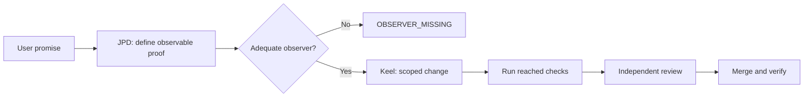

# GraphHelm

**Build and run AI-agent workflows with explicit control and evidence.** GraphHelm turns a request into a typed execution graph, runs it through a local-first Runtime, and records what happened so a person can inspect, pause, approve, or resume the work. [Journey-Proven Development](docs/harness/JOURNEY_PROVEN_DEVELOPMENT.md) and [Keel](docs/keel/KEEL_SPEC.md) guide how agents change code and prove the result.

GraphHelm is **experimental**. This repository contains a working CLI, Runtime, MCP server, host-setup flow, and a local operator Studio. It also contains specifications for a larger product; [the visual graph editor, embedded chat, Context Compiler, and Dreams Engine are not built yet](docs/product/ROADMAP_AND_ACCEPTANCE.md). There is no stable release or hosted CI service. A [CLI preview release](https://github.com/stabem/GraphHelm/releases/tag/v0.1.0) offers tested Windows and Linux x86-64 downloads; the Studio still runs from source.

**Choose a path:** [Download the CLI preview](https://github.com/stabem/GraphHelm/releases/tag/v0.1.0) · [Run a local example](#try-it-locally) · [Install the Runtime and Studio](docs/install/GETTING_STARTED.md) · [Explore the code](#repository-map) · [Read the methodology](#development-method) · [Contribute](CONTRIBUTING.md)

## Try it locally

Install the [pinned Rust toolchain](rust-toolchain.toml), then validate an example graph:

```sh
git clone https://github.com/stabem/GraphHelm.git
cd GraphHelm
cargo run --locked -p graphhelm-cli -- graph validate examples/graphs/software-feature.yaml
```

This command needs no model account, API key, database, or running service. Cargo may download build dependencies on the first run. To **start an execution and see when it needs you**, follow the [offline quickstart](QUICKSTART.md). To connect a real project, Runtime, Studio, and chat harness, use the [getting-started guide](docs/install/GETTING_STARTED.md).

## What works today

| Surface | Current capability | Start here |
| --- | --- | --- |
| Graph CLI | Validate and lint graphs; compute semantic hashes; create immutable versions and transactional drafts. | [Graph examples](examples/graphs/) · [Graph DSL](docs/graph-engineer/GRAPH_DSL_SPEC.md) |
| Runtime | Start, monitor, pause, approve, resume, and cancel executions; use fixtures without a provider or configure model and tool routes. | [Offline quickstart](QUICKSTART.md) · [provider-less mode](docs/product/PROVIDER_LESS_MODE.md) |
| Evidence | Append-only local and PostgreSQL event stores, replay, and execution briefings. | [Architecture](docs/architecture/SYSTEM_ARCHITECTURE.md) · [operations](docs/operations/OBSERVABILITY_AND_RECOVERY.md) |
| Local Studio | Inspect executions and evidence, see what needs attention, and perform supported control actions through the public Runtime API. | [Studio README](apps/studio/README.md) |
| MCP and setup | Expose Runtime operations to a chat client; inventory host configuration, preview adoption, back it up, and restore it. | [Getting started](docs/install/GETTING_STARTED.md) · [setup specification](docs/agents/AGENTS_SKILLS_PLUGINS.md) |

The Studio above is an **operator MVP**, not the planned visual graph editor. The [roadmap](docs/product/ROADMAP_AND_ACCEPTANCE.md) separates implemented behavior from product goals. The [documentation index](docs/INDEX.md) leads to the full specifications, examples, and historical evidence.

## Development method

GraphHelm treats an observable user promise as the unit of work. JPD asks what evidence would prove that promise. Keel keeps the change and its context scoped, then counts the **total cost of a proven delivery**, including repairs and review. An unavailable observer remains `OBSERVER_MISSING`; a later pass does not erase an earlier failure.



Read the [JPD specification](docs/harness/JOURNEY_PROVEN_DEVELOPMENT.md), [Keel specification](docs/keel/KEEL_SPEC.md), [left-to-right skills guide](docs/skills/README.md), and [current delivery process](docs/process/DELIVERY.md). These documents distinguish guidance from controls the software actually enforces.

### Measured pilot, with limits

A [three-arm pilot on one frozen Unicode bug](docs/keel/benchmark-evidence/task-1279-v11/README.md) measured the same requested model route and runner version:

| Workflow | Agent time | Estimated model cost | Automated checks | Blind review |
| --- | ---: | ---: | --- | --- |
| Ordinary coding | 585 s | USD 0.773 | Passed | Found a Linux-breaking test |
| GraphHelm | 401 s | USD 0.848 | Passed | No material code defect |
| GraphHelm + Keel | 415 s | USD 0.734 | Passed | No material code defect |

On **this task**, Keel cost 13.4% less than GraphHelm alone with the same automated outcome. This does **not** establish a general saving or a quality-matched win over ordinary coding: the ordinary arm had a review finding, the costs are CLI estimates rather than invoices, and setup, review, machine time, and earlier attempts were not priced. The [full report](docs/keel/benchmark-evidence/task-1279-v11/README.md) and [benchmark protocol](docs/keel/BENCHMARK_PROTOCOL.md) show the inputs and remaining work.

## Repository map

| Path | Purpose |
| --- | --- |
| [`core/`](core/) · [`adapters/`](adapters/) | Typed contracts and deterministic rules; provider, persistence, and host boundaries. |
| [`apps/`](apps/) | CLI and local Studio. |
| [`schemas/`](schemas/) · [`examples/`](examples/) · [`conformance/`](conformance/) | Wire contracts, runnable examples, and compatibility fixtures. |
| [`extensions/`](extensions/) | Built-in agent skills and extension packages. |
| [`install/`](install/) · [`deploy/`](deploy/) | Installation and deployment assets. |
| [`ci/`](ci/) · [`scripts/`](scripts/) · [`tools/`](tools/) · [`tests/`](tests/) | Local validation, maintainer tools, and test fixtures. |
| [`docs/`](docs/INDEX.md) | Product specifications, architecture, methodology, evidence, and decisions. |

The root keeps standard entry points (`README`, `CONTRIBUTING`, `SECURITY`, `LICENSE`, Rust and container manifests) and the [normative master PRD](MASTER_PRD.md). `.claude/` contains host-specific project integration. Moving these paths solely to shorten the GitHub listing would break documented links or tool discovery.

## Contributing and trust

Start with [CONTRIBUTING.md](CONTRIBUTING.md). It explains issues, branches, local checks, review, and the absence of GitHub Actions CI. For usage questions, see [support](.github/SUPPORT.md); participation follows the [community conduct policy](.github/CODE_OF_CONDUCT.md). Report vulnerabilities through the **private form** in [SECURITY.md](SECURITY.md), never a public issue. GraphHelm code is [MIT licensed](LICENSE); the bundled Studio fonts retain their [OFL notices](apps/studio/src/fonts/README.md).

This public repository began with [one reviewed source import](docs/open-source/SOURCE_PROVENANCE.md). Older issue numbers and commit hashes in design or acceptance documents refer to a private development archive, not to this repository. Historical records are context, not fresh validation of the current commit.
