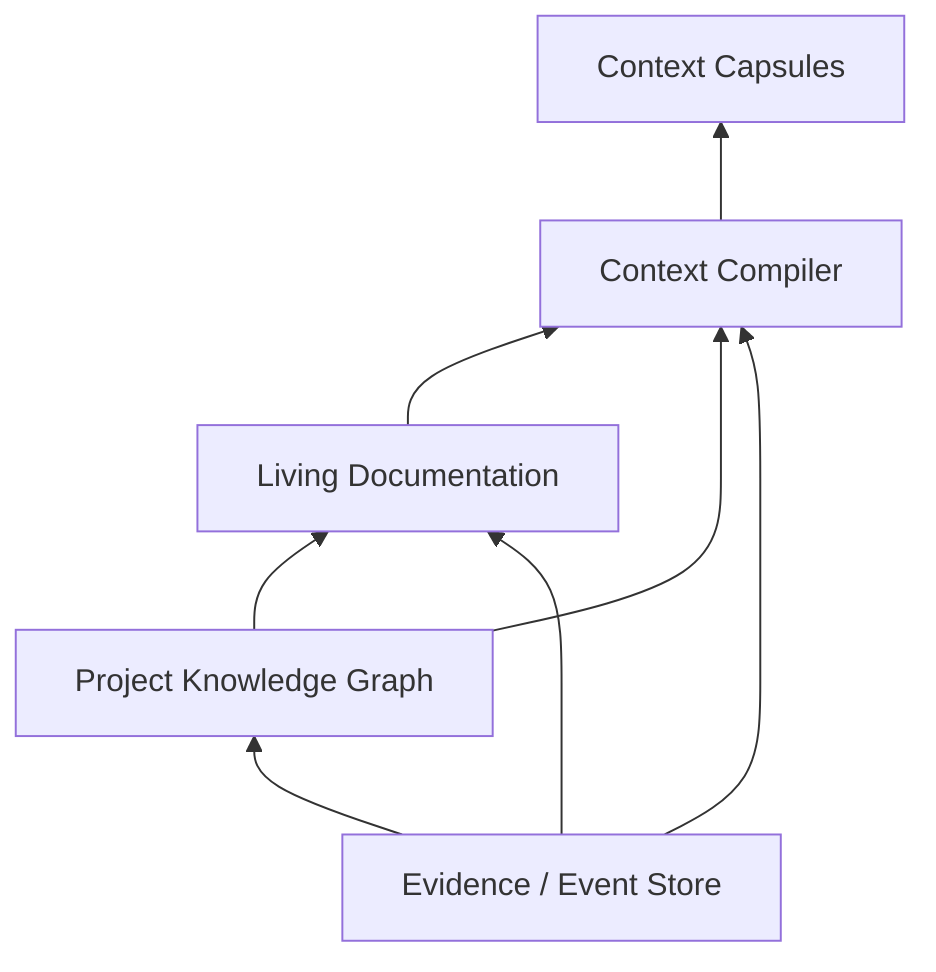

# Context Compiler, Knowledge, and Dreams Engine

## 1. Objective

This layer prevents every agent from receiving the entire project, turns execution into traceable knowledge, and keeps documentation/memory useful over time. It is the foundation of "context low": the system shares just enough, while preserving recoverable references and provenance.

## 1.1 What runs today (#1065, measured at `0e398e75`)

Everything below §1.1 is the design. This section is the part of it that RUNS, so a reader can
tell the two apart without opening the tree.

**The chain, in the tree's own names.** For every plain cognitive node (Agent, Planner,
Classifier, Evaluator without a `judge` block — the blind judge keeps its own diet), before the
prompt is assembled:

1. `context::objective_terms` derives query terms from the node objective — `objective-terms/v1`:
   lowercase; split on every non-alphanumeric character; drop terms shorter than 3 or longer
   than 64 and a fixed 40-word English stop-list; dedupe preserving first occurrence; cap at
   12. The split rule is what makes an objective unable to name a path: `../` and `/` are
   separators. A declared `context.budgetBytes` must be an integer in `1..=1 MiB`; anything
   else refuses the node (`Unassemblable`) rather than silently applying the default.
2. `BoundedSourceSearch::search` — the workspace channel of #622 (`WorkspaceSourceChannel`),
   ranked by (distinct terms matched, path), text suffixes only, `.factory/` and the other
   working-notes prefixes excluded — within `context::SEARCH_BOUNDS`: 50,000 entries visited,
   20,000 files opened, 256 MiB read, 12 terms / 1,024 term bytes, 8 results.
3. `BoundedSourceReader::read_prefix` — `WorkspaceExcerptReader`, root-contained through
   `RelativePath` + `resolve_within`, no-follow — at most 16 KiB per candidate, at most 8
   candidates, at most 64 KiB shipped in total. A ceiling REFUSES the item it would cut and counts
   it; nothing is trimmed to fit. The one declared partial is the prefix read, stated in the item
   text as `bytes 0..n of len`. **Secrets never enter a capsule** (AGENTS.md invariant): a
   credential LOCATION (`.env*`, `*.key`, `*.token`, `.graphhelm/`, `keyring/`) is refused before
   a byte is read, and an excerpt carrying a secret SHAPE (`context::SECRET_SHAPES`: a bare
   64-hex run that is not a `sha256:` digest, an `sk-`/`ghp_`/`AKIA` token, a PEM private-key
   block, a `password=`/`token=`/`secret=` assignment) is refused after the read and before it
   can become an item; both are counted as `candidatesSecretShaped`, never named.
4. `context_compiler::fit_within_budget` against the node's `context.budgetBytes` (default 32
   KiB; optional items only, so a node with nothing that fits still runs), then
   `compile_capsule` with a single `evidence` section of `source://<repository-relative path>`
   items carrying the excerpt. The budget bounds the RENDERED capsule, framing included: the
   last-ranked item is dropped (and counted) until the compiled bytes fit.
5. The capsule bytes are the third field of `AssembledPrompt` and enter its length-prefixed
   digest, so the sealed record names exactly what the model was shown; on the wire the executor
   places the capsule between the system block and the task.
6. Accounting: a content-free `context-provenance@1` record seals beside the reply — paths,
   counts, digest, and six lines in the accounting receipt's own `CostField` vocabulary:
   `zero_result_queries`, `retrieval_pages`, `retrieval_fallbacks` `measured` (producer
   `context_retrieval`); `compiled_input_tokens`, `eligible_candidate_tokens`, `tokens_saved`
   `derived` under the estimator below, with the arithmetic in each note. The accounting
   receipt's own six context lines stay `unavailable`: the schema-evolution guards admit only
   comparator-compatible changes to a schema the frozen release never held, and its positional
   lines cannot change that way (`schemas/CHANGELOG.md`); they move at the next frozen baseline.
   The drive reply publishes the same numbers per node under `context.nodes`; a door that holds
   only the projection publishes `context.nodes: null` with the reason.

**The estimator, `bytes-div-4/v1`** (§9.2 of the roadmap, "a free compiler byproduct … stated
explicitly as a conservative lower bound"): `tokens = bytes / 4`, floored. `eligible` is the total
length of every candidate the search returned before any cut, `shipped` is the capsule's own
length, `saved = eligible − shipped` floored at zero. It is an estimate and is recorded as one
(`derived`, never `measured`); a provider that reports per-part counts would let
`compiled_input_tokens` move to `measured` under the same field.

**Fallbacks, all counted, none fatal.** No terms, a refused search (`Unavailable` /
`BoundExceeded`), zero candidates, no readable candidate, nothing that fits the budget
(`nothing_fits_budget` — raise the budget), or only secret-shaped candidates
(`secret_shaped_candidate`): `retrieval_fallbacks = 1`, the fallback's name in the provenance,
the node runs with an empty capsule. Zero candidates is additionally `zero_result_queries = 1`.
An immediate stop that arrives while a node's context is compiling is observed: the compile is
raced against the cancel channel and nothing after it is dispatched.

**Measured** (`adapters/tool-host/tests/context_quality.rs`, ten objective → expected-file pairs
written from real files and run against this repository's own tree, the test's own path excluded
from the count because it holds every objective verbatim): **precision@3 = 6/10 = 0.60**; tokens
over the ten cases eligible 1,629,696 / shipped 60,713 / saved 1,568,983 at the first run, and
6/10 with eligible 1,556,434 / shipped 61,810 / saved 1,494,624 after the secret-shape refusal
(which changes which files ship, not the count). The floor the test asserts is 0.60. The four misses are what a term-count ranking does: `CHANGELOG.md` and
`docs/DECISION_REGISTER.md` mention every subsystem and outrank the file that implements it. Two
sources ship per case on average, because a 16 KiB prefix of two large files fills a 32 KiB
budget — the excerpt is a prefix, not the passage that matched.

**What does not run** (open under #302): entity RRF, graph-neighbour RRF, vectors, authority
ranking, passage-level excerpts, the Knowledge Graph (#111), Dreams, and the RetrievalPlan
adapter half of #724 (the producer half — `development compile-context` on the same
`context::compile_items` — is closed by #1065).

## 2. Three-layer architecture of truth



### 2.1 Evidence/Event Store

Contains raw, immutable facts:

- prompts and decisions;
- Graph Versions;
- node inputs/outputs;
- tool calls;
- source snapshots;
- diffs;
- tests;
- redacted logs;
- external sources;
- model route decisions;
- policies and waivers;
- artifacts;
- dream reports.

Corrections are new events, never retroactive edits.

### 2.2 Project Knowledge Graph

Represents entities and claims:

- requirements;
- decisions;
- components;
- people/actors;
- APIs;
- risks;
- hypotheses;
- sources;
- agents;
- skills;
- documents;
- executions;
- incidents;
- temporal relations.

### 2.3 Living Documentation

Human materializations:

- PRD;
- architecture;
- ADRs;
- runbooks;
- guides;
- glossaries;
- research reports;
- decision logs;
- changelogs;
- task summaries;
- business rules (atomic rule documents, §12.5).

A document is a versioned view of knowledge, not the sole truth.

## 3. Context Compiler

### 3.1 Input

- node objective;
- input schema;
- completion/evidence contract;
- project/subproject scope;
- graph dependency outputs;
- context policy;
- snapshot/watermark;
- budget;
- agent memory policy;
- blind review restrictions;
- data sensitivity.

### 3.2 Output

An immutable, versioned `Context Capsule`, with:

- materialized content;
- artifact/context refs;
- stable per-item ids (the citation and utilization unit, §6.4);
- summaries;
- provenance;
- conflicts;
- exclusions;
- token estimates;
- dependency hash;
- expansion policy.

User-pinned items are ordinary capsule items: stable ids, layer ceilings (§8.1) and utilization
recording (§6.4) apply; they are demotion-exempt like explicit rule references.

## 4. Capsule layers

### 4.1 Project Kernel

Small, stable context:

- project identity;
- vision;
- permanent constraints;
- conventions;
- relevant policies;
- essential glossary.

Must be short, versioned, and different per scope, bounded by its layer ceiling (§8.1).

### 4.2 Task Capsule

- current request;
- success criteria;
- user decisions;
- boundaries;
- current execution state;
- definition of done.

### 4.3 Node Capsule

- subtask;
- agent role;
- input/output contracts;
- tools;
- permissions;
- forbidden actions;
- budget;
- completion evidence.

### 4.4 Evidence Bundle

Only useful evidence:

- source locations;
- file sections;
- tests;
- external sources;
- claims;
- relevant history;
- artifact refs.

### 4.5 Dependency Outputs

Typed outputs from predecessors. Internal chats or private reasoning are not included.

### 4.6 Agent Experience

Valid memories, directly related, with confidence and TTL.

## 5. Context compilation pipeline

```text
Objective analysis
→ retrieval query plan
→ permission/scope filter
→ freshness filter
→ contradiction expansion
→ rank by expected decision impact
→ deduplicate
→ choose representation
→ token allocation
→ provenance attach
→ capsule validation
```

## 6. Retrieval

### 6.1 Types

- exact ID/ref;
- keyword/full-text;
- semantic/vector;
- graph neighborhood;
- code symbol/AST;
- dependency graph;
- temporal;
- execution similarity;
- claim/evidence relation;
- source authority;
- artifact metadata.

### 6.2 Ranking

Conceptual score:

```text
relevance
× scope_permission
× freshness
× source_authority
× evidence_strength
× decision_impact
× contract_fit
× observed_utilization
− redundancy
− token_cost
− contamination_risk
```

### 6.3 Contradictions

When a relevant item contradicts another, both enter with status and provenance. The compiler does not silently merge them.

### 6.4 Observed utilization

The loop that makes capsules cheaper with use — the structural advantage over an agent that
carries full context and never learns what it wasted:

- every capsule item carries a stable id (§3.2);
- the node's structured output cites the ids it relied on, riding the existing evidence-ref
  channel (HARNESS_SPEC §18.2) — grounding, not chain-of-thought;
- utilization is recorded per item and per retrieval recipe; the §17 metrics (irrelevant
  context ratio, per-item utilization) are computed from these citations, not estimated;
- `observed_utilization` enters the ranking with decay and a floor: a never-yet-included
  item is not penalized, and utilization can demote but never overrule `scope_permission`
  or contract-required evidence (§14.3's rule: never save by removing required evidence);
- Dreams consumes the same signal through its existing `retrieval recipe optimization`
  category (§14.4); recipe changes ship as normal Dreams proposals, shadow-validated.

An explicitly referenced rule document (§12.5) is exempt from utilization demotion: an
explicit contract reference is a binding, not a retrieval guess.

## 7. Efficient representation

The compiler chooses:

- short full content;
- excerpt with line/symbol refs;
- structural summary;
- hierarchical summary;
- table/JSON;
- diff;
- graph neighborhood;
- artifact pointer;
- lazy retrieval handle.

Large files never enter in full by default.

Index-first strategy: when the node holds a retrieval capability, the compiler may prefer a
one-line-per-item index of handles over materialized content — the agent pulls exactly what
it needs through the auditable expansion request (§8.2), under its leases. Prefer it for
exploratory objectives where relevance is genuinely unknown at compile time; the expansion
rate metric (§17) is the guard against a node that thrashes instead of reading its index.

## 8. Context budget

### 8.1 Allocation

Budget is divided by priority:

1. contract and instructions;
2. user criteria;
3. indispensable evidence;
4. dependency outputs;
5. project conventions;
6. memories;
7. optional background.

Each capsule layer (§4) declares a budget ceiling, with configurable defaults per scope.
Exceeding a ceiling is a linter finding, resolved by a cheaper representation (§7) or a
recorded exclusion — never silently absorbed. A ceiling bounds a layer; it never removes
contract-required evidence (§14.3's rule in the harness applies here unchanged).

### 8.2 Expansion request

```yaml
context_request:
  node_id: security_review
  missing_information: password recovery flow
  reason: may share the same session token
  expected_decision_impact: high
  requested_scope:
    - src/auth/recovery/**
    - related_adrs
```

The compiler evaluates scope, budget, sensitivity, and relevance. The response can be full, partial, or denied with a reason.

### 8.3 Delta context

Retries receive only the changes since the previous capsule, plus stable references. This reduces tokens and inconsistency.

## 9. Caching and invalidation

Cache key includes:

- objective signature;
- scope;
- source snapshot;
- claims watermark;
- policy hash;
- retrieval recipe;
- budget;
- blind exclusions.

A change invalidates only dependent fragments. A new marketing file does not invalidate an unrelated backend capsule.

Provider prompt-cache awareness: assembly is canonical and deterministic so the model
provider's prefix cache hits on every repeated call, not just the compiler's own cache —
the stable prefix first (versioned Project Kernel, then stable content ordered by item id),
volatile material last (Task/Node Capsules, dependency outputs, deltas); cache boundaries
align with the provider's breakpoints where the route supports them; the same capsule
version always serializes to the same bytes. The §17 cache-hit metric covers both caches,
reported separately.

## 10. Reviewer isolation

To reduce bias:

- the reviewer does not receive "executor says success" by default;
- it receives diff, source, tests, and acceptance criteria;
- subjective summaries are excluded in blind mode;
- execution identity can be hidden;
- reviewer output requires evidence refs;
- the final verifier can receive findings without the reviewer's recommendation, to test independently.

## 11. Knowledge Graph

### 11.1 Entities

- `Project`, `Subproject`, `Repository`, `Component`, `Service`, `Requirement`, `Decision`, `Risk`, `Claim`, `Evidence`, `Document`, `Execution`, `Agent`, `Skill`, `Tool`, `ModelRoute`, `Artifact`, `Incident`, `Environment`.

### 11.2 Relations

- `contains`
- `depends_on`
- `implements`
- `tests`
- `documents`
- `supports`
- `contradicts`
- `supersedes`
- `derived_from`
- `produced_by`
- `consumed_by`
- `applies_to`
- `valid_during`
- `failed_in`
- `resolved_by`
- `recommended_for`
- `incompatible_with`

### 11.3 Claim lifecycle

```text
candidate → validated → superseded/deprecated/expired
candidate → contradicted
validated → contradicted (new evidence)
```

Validation may require deterministic evidence, a user decision, multiple sources, or an evaluator, depending on claim type.

### 11.4 Temporality

Claims have `valid_from` and `valid_until`. An old architecture can remain historically correct without contaminating the current context.

### 11.5 Confidence

Confidence represents the strength of the claim, not metaphysical certainty. It must be recomputable from evidence, source authority, recency, and contradiction.

## 12. Living Documentation

### 12.1 Document metadata

```yaml
document:
  id: architecture-auth
  path: docs/architecture/authentication.md
  scope: project
  status: current
  source_claims: [...]
  source_evidence: [...]
  materializer_version: 2
  generated_sections: [...]
  human_owned_sections: [...]
  last_validated_at: ...
```

### 12.2 Section ownership

A document can mix:

- protected human section;
- generated section;
- collaborative section;
- artifact embed.

Dreams does not overwrite a protected human section; it creates a proposal or conflict note.

### 12.3 Freshness

Freshness score considers:

- source changes;
- superseded claims;
- related incidents;
- age;
- unresolved conflicts;
- last validation.

### 12.4 Parallel updates

The documentation branch uses a snapshot/claim watermark. If code/decisions change before the commit, the materializer rebases or marks it stale; it does not publish an inconsistent document.

### 12.5 Atomic rule documents

A business rule is materialized as its own document: one file, one rule, one stable id.

```yaml
document:
  id: rule-refund-window
  kind: rule
  path: docs/rules/refund-window.md
  scope: project
  status: current
  source_claims: [claim-refund-window-days]
  source_evidence: [...]
  materializer_version: 1
  generated_sections: [statement, edge_cases]
  human_owned_sections: [rationale]
  last_validated_at: ...
```

Properties:

- one rule per document, small enough to be included whole in a capsule;
- the id is stable and referenceable from node contracts;
- the body states the rule, its rationale, and its edge cases; the underlying claims remain the truth (§2.3's rule applies — the document is a view).

Explicit binding:

- a node/task contract may reference rule ids directly;
- a referenced rule enters the Context Capsule whole, with provenance, counted against budget;
- retrieval (§6) may add unreferenced-but-relevant rules; an explicit reference is never dropped by ranking — only by the permission/scope filter, and then it is recorded as an exclusion;
- explicit references make inclusion deterministic where search alone would be probabilistic.

Update loop:

- after execution, the `documentation_impact` signal names the rule ids touched;
- the materializer updates generated sections through the claim lifecycle (§11.3): the change enters as a candidate and is validated per claim type;
- an executor's own edit never validates its own rule — validation requires deterministic evidence, another evaluator, or a user decision, exactly as §11.3 already demands;
- concurrent updates follow §12.4's watermark.

When not to split:

- narrative documents (architecture, runbooks, reports) stay whole; a rule document is for a normative, referenceable statement with clear applicability;
- a rule that cannot be stated apart from its surrounding narrative is a section of that document, not a rule document.

## 13. Agent memory

### 13.1 What can be remembered

- a strategy that worked;
- a recurring error;
- a stable local pattern;
- feedback received;
- a reference to a canonical document;
- a limitation of the agent's own definition.

### 13.2 What must not be remembered

- full chat;
- secrets;
- unlabeled conjecture;
- copy of documentation;
- opinion about the user;
- temporary output with no future value;
- information outside the scope.

### 13.3 Memory validator

Before promoting a candidate:

- evidence exists;
- it does not contradict a canonical claim without marking it;
- scope is correct;
- TTL is adequate;
- text contains no prohibited secret/PII;
- expected reuse value is positive.

## 14. Dreams Engine

### 14.1 Trigger

- project idle for a configured period;
- cron;
- manual;
- after a number of executions;
- after an incident;
- when the stale/conflict threshold is exceeded;
- when index fragmentation is exceeded.

### 14.2 Idle safety

A project is "idle" when there is no active write-critical section. Dreams can analyze during executions, but cognitive commits wait for a safe point or use versioned merge.

### 14.3 Dream Planner

Analyzes:

- documents;
- claims;
- contradictions;
- memories;
- agents;
- skills;
- context metrics;
- execution failures;
- graph patterns;
- duplicated artifacts;
- stale indexes.

Generates hypotheses with expected benefit, risk, and evidence.

### 14.4 Dream categories

- documentation consolidation;
- claim reconciliation;
- memory expiration;
- agent deduplication;
- skill improvement;
- context index rebuild;
- retrieval recipe optimization;
- policy drift report;
- harness pattern evaluation;
- unresolved failure analysis;
- code finding generation.

### 14.5 Shadow Workspace

Every mutable change happens in a separate snapshot:

1. clone of relevant metadata/docs/config;
2. apply change set;
3. schema validation;
4. knowledge consistency checks;
5. retrieval benchmark;
6. documentation diff;
7. agent/skill conformance;
8. independent critic;
9. compare metrics;
10. atomic commit or discard.

### 14.6 Prohibitions

Dreams cannot:

- delete/rewrite the Event Store;
- remove provenance;
- hide failures;
- promote a hypothesis without evidence;
- expand its own permission;
- reduce a hard policy;
- access production outside a normal task;
- alter code directly;
- initiate BYOK spend outside budget/policy;
- install a plugin outside the normal process.

### 14.7 Code findings

```yaml
dream_finding:
  category: probable_bug
  description: possible race condition in webhook
  confidence: 0.81
  evidence: [...]
  suggested_outcome:
    - confirm or refute
    - fix if reproducible
    - add test
```

The finding becomes a normal `Task Request`. The Task Profiler can reject/refute the hypothesis.

### 14.8 Dream Report

```yaml
dream_report:
  id: dream_0042
  trigger: idle
  analyzed:
    documents: 74
    claims: 1328
    agents: 19
    executions: 46
  changes:
    documents_consolidated: 3
    claims_superseded: 12
    memories_expired: 7
    agents_merged: 2
  validation:
    consistency: passed
    critic: approved
    rollback_available: true
  expected_effect:
    context_reduction_percent: 18
```

## 15. Dreams and agent consolidation

Two agents can be merge candidates when:

- objective overlap is high;
- capabilities are similar;
- contracts are compatible;
- performance is complementary;
- no policy requires separation.

A merge creates a new version; the original agents remain reproducible/archived. History is never deleted.

## 16. Dreams and skill optimization

Possible changes:

- improve instruction;
- add negative case;
- adjust completion contract;
- fix schema;
- add evaluator;
- reduce redundant context.

Every change goes through conformance tests. Dreams does not silently promote a change to a third party's global skill; it creates a fork/project override or a proposal, depending on ownership.

## 17. Metrics

### Context

- tokens allocated/used;
- relevant evidence recall;
- irrelevant context ratio;
- per-item utilization rate (from cited ids, §6.4);
- expansion rate;
- cache hit (compiler and provider prefix, separately);
- layer ceiling violations;
- stale item rate;
- contradiction exposure;
- downstream quality correlation.

### Knowledge

- validated claim ratio;
- unresolved contradictions;
- orphan evidence;
- stale docs;
- provenance coverage;
- supersession latency.

### Dreams

- accepted/discarded changes;
- regressions;
- token savings;
- agent consolidation quality;
- generated task precision;
- rollback frequency;
- time to consistency.

## 18. Acceptance criteria

- no agent receives full history by default;
- every Context Capsule has provenance and exclusions;
- utilization is computed from the node's cited item ids, and it demotes ranking without ever overruling permission filters or contract-required evidence;
- a layer ceiling violation is a linter finding resolved by compression or a recorded exclusion, never silently absorbed;
- an expansion request is auditable;
- relevant conflict appears explicitly;
- the Event Store remains immutable;
- document diff points to claims/evidence;
- an explicitly referenced rule document is included whole or recorded as an exclusion; its post-execution update enters as a candidate, never as direct truth;
- memory without TTL/evidence is not validated;
- Dreams operates in shadow and has rollback;
- a code finding becomes a normal task;
- a blind reviewer does not receive a subjective executor summary.
