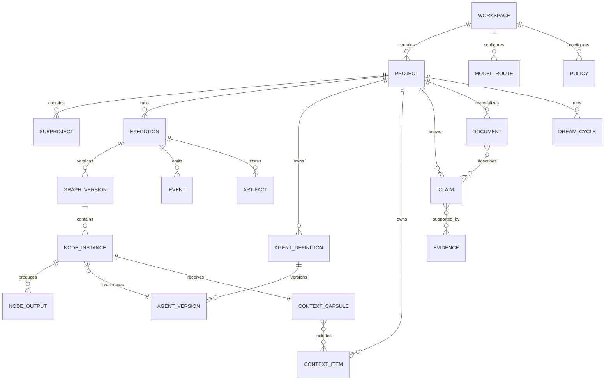

# Data model and protocols

## 1. Purpose

Define entities, relationships, events, and public contracts of GraphHelm. The JSON Schemas in `/schemas` are initial normative examples; implementations may use Protobuf, JSON, or other encodings as long as they preserve semantics and versioning.

## 2. Main entities



## 3. Identity and scope

All resources have:

```yaml
identity:
  id: globally_unique
  version: integer_or_semver
  workspace_id: ws_...
  project_id: optional
  subproject_id: optional
  created_at: timestamp
  created_by:
    actor_type: user|agent|service|dream|system
    actor_id: ...
```

Explicit scope:

```yaml
scope:
  level: workspace|project|subproject|execution|node
  inherit_from_parent: selective|none|all_allowed
  expose_to_children: true
  expose_to_siblings: false
```

## 4. Task Request

```yaml
task_request:
  id: task_...
  origin: user|dream|event|api|schedule
  text: string
  attachments: [artifact_ref]
  explicit_target:
    workspace_id: ws_...
    project_id: prj_...
    execution_id: optional
    node_id: optional
  constraints:
    max_cost: optional
    deadline: optional
    allowed_models: optional
    forbidden_tools: optional
    operation_mode: autopilot|supervised|manual
  user_success_criteria: [string]
```

## 5. Task Profile

Minimum fields:

```yaml
task_profile:
  domains: [{name, confidence}]
  complexity: trivial|low|medium|high|extreme
  depth: local|component|cross_component|systemic
  uncertainty: 0..1
  reversibility: high|medium|low
  security_risk: 0..1
  regression_risk: 0..1
  data_sensitivity: public|internal|confidential|secret
  production_impact: none|indirect|direct
  estimated_scope:
    files: range
    systems: [string]
    external_services: [string]
  required_outcomes: [string]
  signals: [typed_signal]
  provenance: [evidence_ref]
```

## 6. Harness Manifest

The Harness Manifest references a Graph Version and the entire compiled setup:

```yaml
harness_manifest:
  id: harness_...
  version: 1
  task_request_id: task_...
  task_profile_id: profile_...
  graph_version_id: graph_...v1
  capability_snapshot_id: caps_...
  agent_bindings: [binding]
  model_route_plan: [route_plan]
  context_plan: [context_plan]
  policies_applied: [policy_ref]
  isolation_plan: [isolation_profile]
  budgets:
    max_nodes: 40
    max_mutations: 12
    max_retries_per_node: 2
    max_wall_clock_seconds: 7200
    max_api_cost: 10.00
  completion_contract: contract_ref
  compiled_at: timestamp
  compiler_version: semver
```

## 7. Graph Version

A version is immutable:

```yaml
graph_version:
  id: graph_exec482_v7
  execution_id: exec_482
  number: 7
  based_on: graph_exec482_v6
  nodes: [node_definition]
  edges: [edge_definition]
  policies_hash: sha256
  schema_version: 1
  change_reason: graph_signal|user_draft|retry|initial_compile
  mutation_record: optional
  published_at: timestamp
```

## 8. Node Definition

Main fields:

```yaml
node:
  id: security_review
  type: agent
  name: Review security
  objective: string
  agent_binding: agent_version_or_ephemeral_spec
  model_profile: critical_reasoning
  input_schema: schema_ref
  output_schema: schema_ref
  context_policy: context_policy_ref
  permissions: [capability_lease_request]
  isolation_minimum: tier_0|tier_1|tier_2|tier_3
  completion_contract: contract_ref
  evidence_requirements: [requirement]
  retry_policy: retry_ref
  timeout_seconds: 1800
  optionality: required|recommended|optional
  user_override_allowed: true
```

## 9. Edge Definition

```yaml
edge:
  id: edge_review_deploy
  from: security_review
  to: deploy
  type: control|data|evidence|event|failure|compensation
  payload_schema: optional_schema_ref
  condition:
    expression: output.blocking_findings == 0
  on_false:
    route_to: remediation
  on_missing:
    action: pause|fail|skip|route
  priority: 100
```

Expressions must use a limited, deterministic language with no arbitrary access to the filesystem/network.

## 10. Agent Definition

```yaml
agent_definition:
  id: payment_regression_investigator
  version: 4
  purpose: string
  capabilities: [capability_ref]
  default_permissions: [lease_template]
  input_schema: schema_ref
  output_schema: schema_ref
  instructions: string
  context_strategy: strategy_ref
  model_requirements: [requirement]
  completion_contract: contract_ref
  memory_policy: memory_policy_ref
  status: active|suspended|deprecated|archived
  scope: project
```

## 11. Capability

A capability is an atomic, detectable skill:

```yaml
capability:
  id: repository_dependency_trace
  version: 1.2.0
  description: string
  provided_by: tool|skill|agent|runtime|plugin
  input_schema: schema_ref
  output_schema: schema_ref
  permissions_required: [permission]
  isolation_minimum: tier_0
  estimated_cost_profile: low
  deterministic: false
  trust_level: builtin|verified|community|untrusted
```

## 12. Skill

A skill is versioned operational guidance, not a permission authority:

```yaml
skill:
  id: review_auth_boundary
  version: 2.1.0
  purpose: string
  applicability: expression
  instructions: markdown_ref
  required_capabilities: [capability_ref]
  recommended_evaluators: [evaluator_ref]
  input_schema: schema_ref
  output_schema: schema_ref
  tests: [conformance_test_ref]
```

## 13. Tool Call

```yaml
tool_call:
  id: call_...
  execution_id: exec_...
  node_id: node_...
  tool_id: repository.read_file
  input: object
  lease_id: lease_...
  sandbox_id: sbx_...
  started_at: timestamp
  finished_at: timestamp
  status: succeeded|failed|denied|timed_out
  output_artifacts: [artifact_ref]
  redactions: [redaction_record]
```

## 14. Context Capsule

```yaml
context_capsule:
  id: ctx_...
  version: 3
  node_id: node_...
  objective: string
  sections:
    project_kernel: [context_ref]
    task: [context_ref]
    node: [context_ref]
    evidence: [context_ref]
    dependency_outputs: [context_ref]
    agent_experience: [context_ref]
  excluded: [context_ref]
  token_budget:
    allocated: 18000
    expandable_to: 30000
  provenance: [event_ref]
  dependency_hash: sha256
```

## 15. Claim and Evidence

```yaml
claim:
  id: claim_...
  subject: entity_ref
  predicate: string
  object: value_or_entity_ref
  status: candidate|validated|contradicted|deprecated|expired
  confidence: 0.96
  valid_from: timestamp
  valid_until: optional
  provenance: [evidence_ref]
  relationships:
    supports: [claim_ref]
    contradicts: [claim_ref]
    supersedes: [claim_ref]
```

Evidence can be a source location, test result, artifact, user decision, external source, log, or observation.

## 16. Memory Record

```yaml
memory_record:
  id: mem_...
  agent_id: agent_...
  observation: string
  evidence: [evidence_ref]
  confidence: 0.87
  scope: project|subproject|agent
  created_at: timestamp
  expires_at: timestamp
  status: candidate|validated|deprecated|contradicted|expired
  usage_count: 0
  last_validated_at: timestamp
```

## 17. Graph Signal

Agents and the runtime emit signals, not mutations:

```yaml
graph_signal:
  id: signal_...
  source:
    type: node|runtime|tool|test|user|dream
    id: ...
  type: unexpected_security_boundary
  severity: low|medium|high|critical
  description: string
  evidence: [evidence_ref]
  recommendations: [add_gate, elevate_isolation]
  emitted_at: timestamp
```

## 18. Mutation Record

```yaml
mutation_record:
  id: mutation_...
  graph_before: graph_v6
  graph_after: graph_v7
  trigger: signal_ref_or_user_draft
  operations:
    - op: add_node
      value: node_ref
    - op: add_edge
      value: edge_ref
  preserved_outputs: [output_ref]
  invalidated_outputs: [output_ref]
  policy_decisions: [decision_ref]
  actor: actor_ref
```

## 19. Policy and Waiver

```yaml
policy:
  id: require_security_review_for_auth
  version: 1
  scope: workspace
  when: signals.touches_authentication == true
  require:
    - capability: independent_security_review
    - isolation_minimum: tier_1
  override:
    allowed_roles: [owner]
    acknowledgement_required: true
```

```yaml
policy_waiver:
  id: waiver_...
  requirement: independent_security_review
  execution_id: exec_...
  graph_version: 13
  actor: owner_local
  acknowledged_risks: [unreviewed_security_change]
  scope: this_execution_only
  created_at: timestamp
  expires_at: execution_end
```

## 20. Model Route

```yaml
model_route:
  id: claude_subscription
  provider: anthropic
  transport: native_runtime
  authentication: account_subscription
  capabilities: [reasoning, coding, tool_use]
  billing_mode: subscription_quota
  restrictions: object
  health:
    state: available|degraded|unavailable|auth_required
    observed_at: timestamp
  capacity:
    remaining: unknown
    recent_throttles: 0
    recommended_parallelism: 1
```

## 21. Artifact

Artifacts are content-addressed:

```yaml
artifact:
  id: art_sha256...
  mime_type: application/json
  size_bytes: 1234
  hash: sha256:...
  sensitivity: internal
  created_by: node_ref
  source_snapshot: optional
  storage_uri: internal_reference
  metadata: object
```

## 22. Event envelope

```yaml
event:
  id: evt_...
  type: node.started
  schema_version: 1
  sequence: 1842
  workspace_id: ws_...
  project_id: prj_...
  execution_id: exec_...
  graph_version: 7
  node_id: optional
  actor: actor_ref
  occurred_at: timestamp
  idempotency_key: string
  payload: object
  sensitivity: internal
```

## 23. Initial event taxonomy

### Intake and harness

- `task.accepted`
- `task.interpreted`
- `task.profiled`
- `capabilities.discovered`
- `agent.matched`
- `agent.synthesized`
- `harness.compiled`
- `graph.linted`
- `graph.published`

### Execution

- `execution.started`
- `execution.paused`
- `execution.resumed`
- `execution.waiting_capacity`
- `execution.completed`
- `execution.failed`
- `execution.cancelled`

### Node

- `node.queued`
- `node.started`
- `node.context_compiled`
- `node.tool_called`
- `node.output_produced`
- `node.signal_emitted`
- `node.succeeded`
- `node.failed`
- `node.invalidated`
- `node.waived`

### Graph

- `graph.draft_created`
- `graph.draft_analyzed`
- `graph.mutation_proposed`
- `graph.mutation_applied`
- `graph.version_rolled_back`

### Knowledge

- `claim.created`
- `claim.validated`
- `claim.contradicted`
- `claim.superseded`
- `document.materialized`
- `memory.created`
- `memory.expired`

### Dreams

- `dream.started`
- `dream.change_proposed`
- `dream.validation_completed`
- `dream.committed`
- `dream.discarded`
- `dream.task_generated`

### Security

- `lease.granted`
- `lease.denied`
- `secret.accessed`
- `sandbox.elevated`
- `sandbox.quarantined`
- `policy.waived`

## 24. Public API surface

Minimum resources:

```text
/workspaces
/projects
/subprojects
/executions
/graphs
/graph-drafts
/nodes
/agents
/capabilities
/skills
/tools
/models
/connections
/context
/claims
/documents
/artifacts
/policies
/waivers
/dreams
/events
/metrics
/exports
```

Critical protocol operations:

- create execution;
- stream execution events;
- pause/resume/cancel;
- create/apply/rebase graph draft;
- inspect/patch node overlay;
- approve/reject ghost node;
- switch model route;
- request context expansion;
- grant/revoke capability lease;
- export/replay.

## 25. Concurrency

Mutations use optimistic concurrency:

```yaml
mutation_request:
  expected_graph_version: 14
  idempotency_key: client_generated
  operations: [...]
```

If the version has changed, the response includes the current version and a semantic diff for rebasing.

## 26. Versioning

- API: SemVer major in path/header or negotiation;
- schemas: version field required;
- graph DSL: `apiVersion`;
- plugins: compatibility ranges;
- events: type + schema_version;
- agent/skill: SemVer;
- graph versions: monotonic integer per execution.

## 27. Redaction and classification

Data has a sensitivity level. Serializers apply:

- secret redaction;
- PII minimization;
- path normalization in exports;
- provider payload filtering;
- user-configurable retention.

## 28. Export Manifest

```yaml
execution_manifest:
  format_version: 1
  framework_version: 0.1.0-spec
  execution_id: exec_...
  graph_versions: [graph_ref]
  policies_hash: sha256
  agents: [agent_version_ref]
  skills: [skill_version_ref]
  tools: [tool_version_ref]
  model_routes:
    - route_type: native_runtime
      provider: openai
      model_family: codex
      credentials_included: false
  context_capsules: [sanitized_ref]
  artifacts: [artifact_ref]
  events: [event_ref]
  secrets_included: false
```
