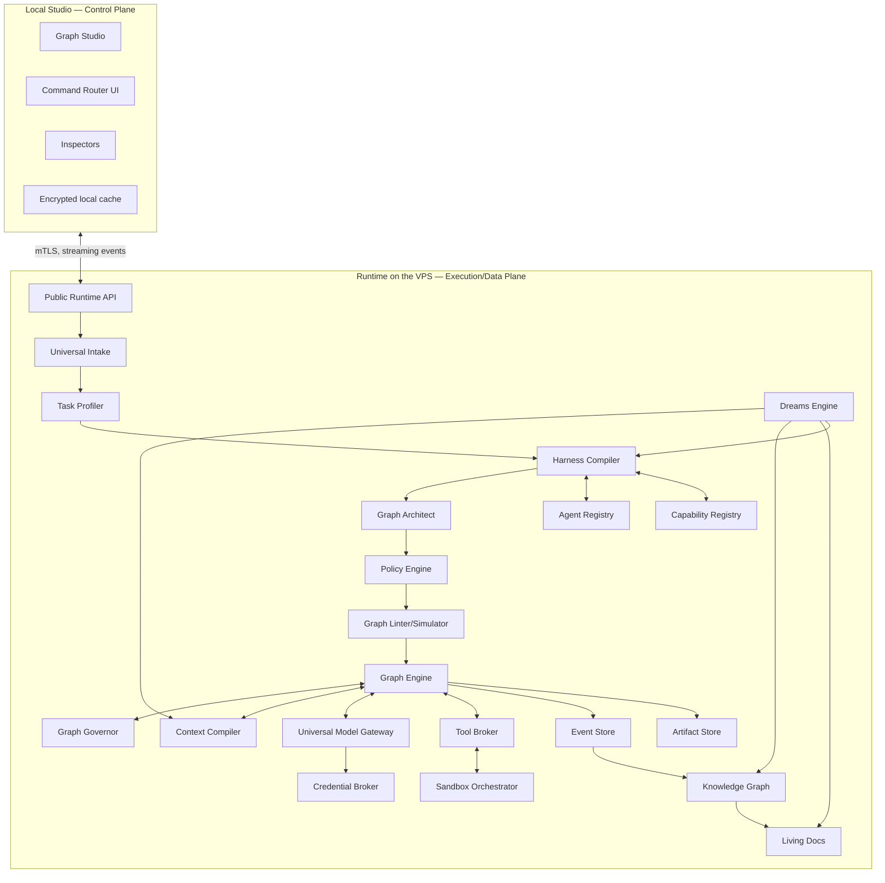

# System Architecture

## 1. Overview

GraphHelm cleanly separates experience, decision, execution, data, and integrations. This separation enables self-hosting, auditing, component replacement, and evolution toward teams/distribution without changing the conceptual model.



## 2. Architectural planes

### 2.1 Control Plane

Responsible for visualization, commands, drafts, configuration, and auditing. The Studio does not execute agents directly and does not need to remain open.

### 2.2 Execution Plane

Graph Engine, workers, tools, sandboxes, model runtimes, scheduler, checkpoints, and deployment adapters.

### 2.3 Data Plane

Event Store, Knowledge Graph, Living Documentation, Artifact Store, indexes, and Project Agent Registry.

### 2.4 Trust Plane

Credential Broker, identity, policies, leases, signatures, secrets scanning, plugin trust, and audit log.

## 3. Components

### 3.1 Public Runtime API

The single official entry point for Studio, CLI, SDK, and integrations. It must expose:

- workspace/project CRUD;
- execution lifecycle;
- graph read/draft/apply/rollback;
- node control;
- context inspection;
- agents/capabilities/skills;
- models/connections;
- documents/claims/artifacts;
- policies/waivers;
- dreams;
- events/metrics/export.

The API uses local identity authentication and mTLS. Every mutation receives an idempotency key and expected version.

### 3.2 Universal Intake

Normalizes prompts, attachments, mentions, canvas selection, external events, and tasks generated by Dreams into a `Task Request`.

### 3.3 Task Profiler

Produces structured signals. It may use models, heuristics, deterministic parsing, and project state. The output is evidence for the harness, not final authority.

### 3.4 Harness Compiler

Coordinates discovery, matching, graph design, policy enforcement, model routing, context planning, budgets, and compilation. Generates the Harness Manifest and initial Graph Version.

### 3.5 Graph Architect

A reasoning component that proposes the minimally sufficient topology. It never grants permissions nor removes invariants.

### 3.6 Policy Engine

Deterministic rules engine. Transforms signals into constraints, gates, isolation minimums, review independence, budgets, and prohibited actions.

### 3.7 Graph Linter and Simulator

Validates schemas, dependencies, cycles, dead ends, unreachable nodes, missing compensation, incompatibilities, budgets, policies, and stop conditions. The simulator executes transitions without calling models/tools.

### 3.8 Graph Engine

Executes published Graph Versions. Responsibilities:

- scheduling;
- state transitions;
- dependency resolution;
- checkpoints;
- retries;
- concurrency;
- cancellation;
- compensation;
- payload routing;
- event emission;
- immutable output references;
- dynamic mutation handoff.

### 3.9 Graph Governor

Receives Graph Signals, reclassifies risk/impact, proposes mutations, and publishes a new version after checks. Preserves outputs whose dependency hash remains valid.

### 3.10 Context Compiler

Assembles Context Capsules per node, performs retrieval, compression, deduplication, provenance, conflict presentation, token budgeting, and expansion requests.

### 3.11 Universal Model Gateway

Normalizes model routes, capabilities, health, quota, latency, costs, tool support, and authentication. Never hides which route was used.

### 3.12 Tool Broker

Mediates tool calls. Validates schema, lease, policy, sandbox, path, network, and secret scope. Records request, result, artifacts, and redactions.

### 3.13 Sandbox Orchestrator

Provisions Tier 0–3, worktrees, containers, microVMs, network policies, resource limits, immutable caches, cleanup, and quarantine.

### 3.14 Credential Broker

Stores and delivers secrets by reference and lease. Authenticated model runtimes live separately from execution sandboxes.

### 3.15 Evidence/Event Store

Append-only record of operational facts. Events are immutable; corrections are new events.

The closed set of replay-safe event kinds currently has 44 members. `core/protocols/src/event.rs::EventKind` and its adjacent `wire_names!` table are the authoritative inventory. The set now covers graph, draft, policy, simulation, execution, signal, mutation, pause/resume, Evidence, reuse, wake, quality-gate, clearance, dead-letter queue, sweep, and overdue-stage records. Production code publishes execution, signal, pause/resume, wake, gate, and memory-admission refusal events; these are no longer test-only contracts.

The execution projection is a disposable, rebuildable fold over this journal, not a mutable table: replaying the same events twice yields byte-identical state, and a discarded generation rebuilt from a checkpoint lands on the same state as a direct replay. It exposes autonomy mode, node attempts and outcomes, pause/resume state, signal and mutation counters, wake leases, gate certifications, clearance, and memory-admission refusal receipts. Gate VERDICTS are not among them: the journal retains every `gate_verdict` event, and the fold treats that kind as a no-op (`core/events/src/projection.rs`, the `EventKind::GateVerdict(_)` arm), so a reader using this inventory to reason about what replay reconstructs must not expect verdicts to be there. `gate_certifications` is the only gate-shaped field the projection carries. See [docs/milestones/graph-engine-governor.md](../milestones/graph-engine-governor.md) for the execution and governance contracts.

### 3.16 Project Knowledge Graph

Materializes entities, claims, relations, temporality, confidence, conflicts, and provenance from events and documents.

### 3.17 Living Documentation

Materializes and versions human documents. May exist within a Git repository, project store, or both.

### 3.18 Dreams Engine

Idle cognitive scheduler. Analyzes knowledge, agents, docs, indexes, and harness history in a shadow workspace.

## 4. Deployment topology

### 4.1 Desktop

- Studio installed on Windows/macOS/Linux;
- control plane private key protected by the OS keychain;
- encrypted, disposable local cache;
- no model credentials required on the desktop after provisioning.

### 4.2 VPS single-node

Reference deployment:

```text
reverse proxy / mTLS endpoint
runtime-api
orchestrator
worker-manager
credential-broker
postgres
artifact-store
sandbox-host
model-runtime-host
optional observability stack
```

### 4.3 Multi-node evolution

The architecture allows separating:

- control API;
- execution workers;
- model runtime hosts;
- sandbox hosts;
- stores;
- GPU nodes;
- hardened nodes;
- observability.

Not required in the first implementation, but IDs, leases, and scheduling must not assume `localhost`.

## 5. Connectivity

### 5.1 Bootstrap

1. Studio opens SSH using the chosen key.
2. Runs a read-only diagnostic.
3. Displays the change plan.
4. Installs containers and the service unit.
5. Generates the Runtime's mTLS identity.
6. Registers the endpoint in Studio.
7. Ends the operational dependency on SSH; SSH remains available for optional maintenance.

### 5.2 Runtime API

- mTLS required;
- WebSocket or equivalent stream for events;
- versioned request/response;
- no public internet by default;
- supports VPN/Tailscale/WireGuard or SSH tunnel;
- CORS is not a security mechanism.

## 6. Persistence

### 6.1 PostgreSQL

Reference store for:

- metadata;
- Event Store;
- graphs;
- executions;
- agents;
- policies;
- claims/relations;
- model routes;
- leases;
- aggregated metrics;
- jobs.

### 6.2 Artifact Store

Content-addressed filesystem by default, with an S3-compatible adapter. Artifacts are immutable by hash; versions point to new objects.

### 6.3 Git

Used for repositories, worktrees, versioned documents, patches, and integration. The Graph Engine does not depend exclusively on Git for tasks unrelated to code.

### 6.4 Indexes

Postgres FTS + reference vector. The Retriever interface allows other engines.

## 7. Consistency

### 7.1 Eventual vs. strong

- node/graph state transition: strong transactional consistency;
- event stream and metrics: at-least-once with idempotency;
- Knowledge Graph: eventual, with a source event watermark;
- Living Docs: eventual and versioned;
- Studio cache: eventual, reconciled by version.

### 7.2 Dependency hash

Each output records a semantic hash of:

- node definition;
- input artifacts;
- context capsule;
- model route/profile;
- relevant policies;
- tool versions;
- source snapshot.

A mutation invalidates only outputs whose dependent hash changed.

Every persisted cache key in the system must be a declared subset of these dependency-hash
components; the Tool Broker's read cache is the first declared instance.

## 8. State machines

### 8.1 Execution

```text
created → profiling → compiling → ready → running
running ↔ paused
running → waiting_capacity | waiting_input | blocked
waiting_* → running | cancelled
running → completed | completed_with_waivers | failed | cancelled
```

### 8.2 Node

```text
ghost → ready
draft → linting → ready → queued → running
running → succeeded | failed | paused | waiting_input | waiting_capacity
failed → retrying → queued
succeeded → invalidated
any nonterminal → cancelled
ready/queued → skipped | waived
```

### 8.3 Graph Draft

```text
editing → analyzing → ready_to_apply
ready_to_apply → applied | rejected | stale
stale → rebasing → editing
```

## 9. Extensibility

Extension points:

- model adapter;
- tool;
- capability;
- skill;
- agent template;
- evaluator;
- policy provider;
- context retriever;
- compressor;
- document materializer;
- sandbox adapter;
- artifact renderer;
- graph visualizer;
- trigger;
- deployment adapter;
- dreams strategy.

Each extension runs with compatible trust level and isolation.

## 10. Replaceability rules

- The official Studio uses only public APIs.
- The Graph DSL does not depend on React or a specific database.
- The Model Gateway does not expose a provider's private types as the central contract.
- Context items use generic references and MIME/type metadata.
- Tool results are typed artifacts.
- Policies are separated from the Graph Architect's prompt.
- The Knowledge Graph has an adapter, but normative semantics.

## 11. Failures and degradation

- Studio offline: the Runtime continues.
- model route unavailable: node waits; no automatic paid fallback.
- worker crash: lease expires and node resumes from checkpoint.
- sandbox cleanup fails: quarantine.
- delayed Knowledge projection: execution uses watermark and direct evidence.
- doc materializer fails: task may complete with pending documentation if policy allows.
- event consumer duplicates: idempotency key prevents duplicate effect.
- graph mutation conflict: optimistic concurrency and rebase.

## 12. Architectural limits

- Event Store is immutable.
- Dreams does not call code integrations through a privileged path.
- untrusted code does not access model credentials.
- agent output does not alter the graph directly.
- a hard policy constraint cannot be removed by a model.
- the owner may change their own policy, but this is a separate, explicit event.
- any optional central backend must be replaceable and non-essential.
