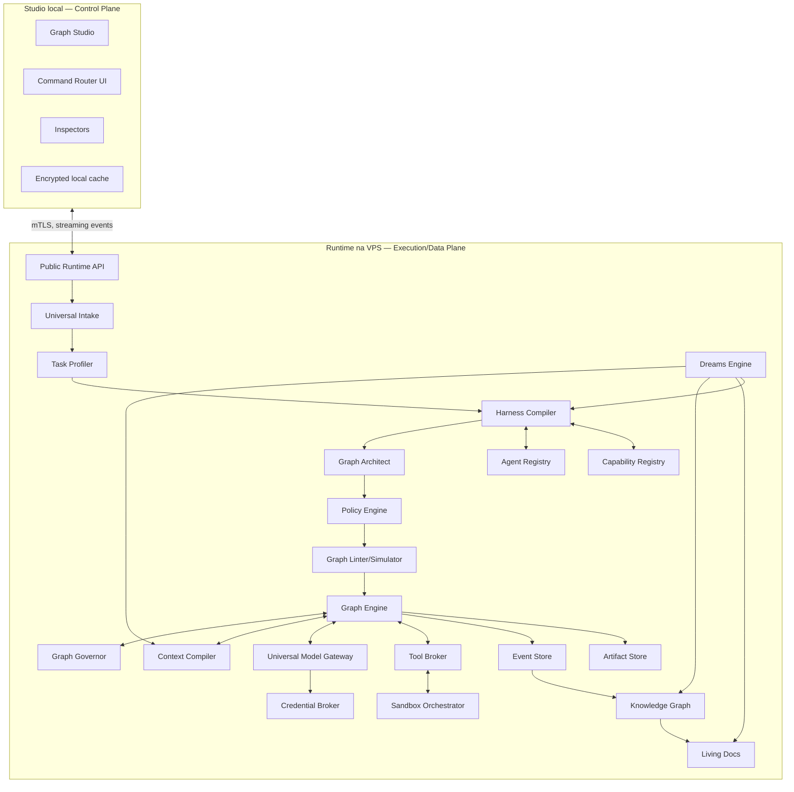

# Arquitetura do sistema

## 1. Visão geral

GraphHelm separa claramente experiência, decisão, execução, dados e integrações. A separação permite self-host, auditoria, substituição de componentes e evolução para equipes/distribuição sem mudar o modelo conceitual.


```mermaid
flowchart TB
    subgraph Desktop[Studio local — Control Plane]
      UI[Graph Studio]
      CHAT[Command Router UI]
      INS[Inspectors]
      CACHE[Encrypted local cache]
    end

    subgraph VPS[Runtime na VPS — Execution/Data Plane]
      API[Public Runtime API]
      INT[Universal Intake]
      PROF[Task Profiler]
      HC[Harness Compiler]
      GA[Graph Architect]
      PE[Policy Engine]
      GL[Graph Linter/Simulator]
      GE[Graph Engine]
      GG[Graph Governor]
      CC[Context Compiler]
      AR[Agent Registry]
      CR[Capability Registry]
      MG[Universal Model Gateway]
      TB[Tool Broker]
      SO[Sandbox Orchestrator]
      DE[Dreams Engine]
      ES[Event Store]
      KG[Knowledge Graph]
      LD[Living Docs]
      AS[Artifact Store]
      CB[Credential Broker]
    end

    Desktop <-->|mTLS, streaming events| API
    API --> INT
    INT --> PROF --> HC
    HC --> GA --> PE --> GL --> GE
    GE <--> GG
    GE <--> CC
    GE <--> MG
    GE <--> TB
    TB <--> SO
    HC <--> AR
    HC <--> CR
    DE --> CC
    DE --> KG
    DE --> LD
    DE --> HC
    ES --> KG --> LD
    GE --> ES
    GE --> AS
    MG --> CB
```

## 2. Planos arquiteturais

### 2.1 Control Plane

Responsável por visualização, comandos, drafts, configuração e auditoria. O Studio não executa agentes diretamente e não precisa permanecer aberto.

### 2.2 Execution Plane

Graph Engine, workers, tools, sandboxes, model runtimes, scheduler, checkpoints e deployment adapters.

### 2.3 Data Plane

Event Store, Knowledge Graph, Living Documentation, Artifact Store, índices e Project Agent Registry.

### 2.4 Trust Plane

Credential Broker, identity, policies, leases, signatures, secrets scanning, plugin trust e audit log.

## 3. Componentes

### 3.1 Public Runtime API

Única porta de entrada oficial para Studio, CLI, SDK e integrações. Deve expor:

- workspace/project CRUD;
- execution lifecycle;
- graph read/draft/apply/rollback;
- node control;
- context inspection;
- agents/capabilities/skills;
- models/connections;
- documents/claims/artifacts;
- policies/waivers;
- dreams;
- events/metrics/export.

A API usa autenticação por identidade local e mTLS. Toda mutação recebe idempotency key e expected version.

### 3.2 Universal Intake

Normaliza prompt, anexos, menções, seleção de canvas, eventos externos e tarefas geradas pelo Dreams em um `Task Request`.

### 3.3 Task Profiler

Produz sinais estruturados. Ele pode usar modelos, heurísticas, parsing determinístico e estado do projeto. A saída é evidência para o harness, não autoridade final.

### 3.4 Harness Compiler

Coordena discovery, matching, graph design, policy enforcement, model routing, context planning, budgets e compilation. Gera Harness Manifest e Graph Version inicial.

### 3.5 Graph Architect

Componente de raciocínio que propõe a topologia mínima suficiente. Nunca concede permissões nem remove invariantes.

### 3.6 Policy Engine

Motor determinístico de regras. Transforma sinais em constraints, gates, isolation minimum, review independence, budgets e ações proibidas.

### 3.7 Graph Linter e Simulator

Valida schemas, dependências, ciclos, dead ends, unreachable nodes, missing compensation, incompatibilidades, budgets, policies e condição de parada. O simulator executa transições sem chamar modelos/tools.

### 3.8 Graph Engine

Executa Graph Versions publicadas. Responsabilidades:

- scheduling;
- state transitions;
- dependency resolution;
- checkpoints;
- retries;
- concurrency;
- cancellation;
- compensation;
- payload routing;
- event emission;
- immutable output references;
- dynamic mutation handoff.

### 3.9 Graph Governor

Recebe Graph Signals, reclassifica risco/impacto, propõe mutations e publica nova versão após checks. Preserva outputs cujo dependency hash continua válido.

### 3.10 Context Compiler

Monta Context Capsules por nó, realiza retrieval, compressão, deduplicação, provenance, conflict presentation, token budgeting e expansion requests.

### 3.11 Universal Model Gateway

Normaliza rotas de modelos, capabilities, health, quota, latency, costs, tool support e authentication. Nunca esconde qual rota foi usada.

### 3.12 Tool Broker

Media chamadas de tools. Valida schema, lease, policy, sandbox, path, network e secret scope. Registra request, result, artifacts e redactions.

### 3.13 Sandbox Orchestrator

Provisiona Tier 0–3, worktrees, containers, microVMs, network policies, resource limits, immutable caches, cleanup e quarantine.

### 3.14 Credential Broker

Armazena e entrega secrets por referência e lease. Runtimes de modelo autenticados vivem separados de sandboxes de execução.

### 3.15 Evidence/Event Store

Registro append-only de fatos operacionais. Eventos são imutáveis; correções são novos eventos.

### 3.16 Project Knowledge Graph

Materializa entidades, claims, relações, temporalidade, confidence, conflicts e provenance a partir de eventos e documentos.

### 3.17 Living Documentation

Materializa e versiona documentos humanos. Pode existir dentro de repositório Git, store do projeto ou ambos.

### 3.18 Dreams Engine

Scheduler cognitivo ocioso. Analisa conhecimento, agentes, docs, indices e harness history em shadow workspace.

## 4. Topologia de deployment

### 4.1 Desktop

- Studio instalado em Windows/macOS/Linux;
- chave privada de control plane protegida pelo keychain do SO;
- cache local criptografado e descartável;
- nenhuma credencial de modelo obrigatória no desktop após provisionamento.

### 4.2 VPS single-node

Deployment de referência:

```text
reverse proxy / mTLS endpoint
runtime-api
orchestrator
worker-manager
credential-broker
postgres
artifact-store
sandbox-host
model-runtime-host
observability stack opcional
```

### 4.3 Evolução multi-node

A arquitetura permite separar:

- control API;
- workers de execução;
- model runtime hosts;
- sandbox hosts;
- stores;
- GPU nodes;
- hardened nodes;
- observability.

Não é necessário na primeira implementação, mas IDs, leases e scheduling não devem assumir `localhost`.

## 5. Conectividade

### 5.1 Bootstrap

1. Studio abre SSH usando chave escolhida.
2. Executa diagnóstico read-only.
3. Exibe plano de alterações.
4. Instala containers e unidade de serviço.
5. Gera identidade mTLS do Runtime.
6. Registra endpoint no Studio.
7. Encerra dependência operacional de SSH; SSH continua para manutenção opcional.

### 5.2 Runtime API

- mTLS obrigatório;
- WebSocket ou stream equivalente para events;
- request/response versionado;
- no public internet por padrão;
- suporte a VPN/Tailscale/WireGuard ou túnel SSH;
- CORS não é mecanismo de segurança.

## 6. Persistência

### 6.1 PostgreSQL

Store de referência para:

- metadata;
- Event Store;
- graphs;
- executions;
- agents;
- policies;
- claims/relations;
- model routes;
- leases;
- metrics agregadas;
- jobs.

### 6.2 Artifact Store

Filesystem content-addressed por padrão, com adapter S3-compatible. Artefatos são imutáveis por hash; versões apontam para novos objetos.

### 6.3 Git

Usado para repositórios, worktrees, documentos versionados, patches e integração. O Graph Engine não depende exclusivamente de Git para tarefas não relacionadas a código.

### 6.4 Índices

Postgres FTS + vetor de referência. O Retriever interface permite outros motores.

## 7. Consistência

### 7.1 Eventual vs forte

- state transition de node/graph: consistência forte transacional;
- event stream e métricas: at-least-once com idempotência;
- Knowledge Graph: eventual, com source event watermark;
- Living Docs: eventual e versionada;
- Studio cache: eventual, reconciliado por version.

### 7.2 Hash de dependência

Cada output registra hash semântico de:

- node definition;
- input artifacts;
- context capsule;
- model route/profile;
- policies relevantes;
- tool versions;
- source snapshot.

Uma mutation invalida somente outputs cujo hash dependente mudou.

## 8. State machines

### 8.1 Execution

```text
created → profiling → compiling → ready → running
running ↔ paused
running → waiting_capacity | waiting_input | blocked
waiting_* → running | cancelled
running → completed | completed_with_waivers | failed | cancelled
```

### 8.2 Node

```text
draft → linting → ready → queued → running
running → succeeded | failed | paused | waiting_input | waiting_capacity
failed → retrying → queued
succeeded → invalidated
any nonterminal → cancelled
ready/queued → skipped | waived
```

### 8.3 Graph Draft

```text
editing → analyzing → ready_to_apply
ready_to_apply → applied | rejected | stale
stale → rebasing → editing
```

## 9. Extensibilidade

Extension points:

- model adapter;
- tool;
- capability;
- skill;
- agent template;
- evaluator;
- policy provider;
- context retriever;
- compressor;
- document materializer;
- sandbox adapter;
- artifact renderer;
- graph visualizer;
- trigger;
- deployment adapter;
- dreams strategy.

Cada extensão roda com trust level e isolation compatíveis.

## 10. Regras de substituibilidade

- Studio oficial usa somente APIs públicas.
- Graph DSL não depende de React ou banco específico.
- Model Gateway não expõe tipos privados de um provider como contrato central.
- Context items usam referências genéricas e MIME/type metadata.
- Tool results são artifacts tipados.
- Policies são separadas do prompt do Graph Architect.
- Knowledge Graph possui adapter, mas semantics normativas.

## 11. Falhas e degradação

- Studio offline: Runtime continua.
- model route indisponível: node espera; sem fallback pago automático.
- worker crash: lease expira e node retoma de checkpoint.
- sandbox cleanup falha: quarantine.
- Knowledge projection atrasada: execução usa watermark e evidence direta.
- doc materializer falha: tarefa pode concluir com documentação pendente se policy permitir.
- event consumer duplica: idempotency key evita efeito duplo.
- graph mutation conflict: optimistic concurrency e rebase.

## 12. Limites arquiteturais

- Event Store é imutável.
- Dreams não chama integration de código por caminho privilegiado.
- código não confiável não acessa model credentials.
- agent output não altera graph diretamente.
- policy hard constraint não pode ser removida por modelo.
- owner pode mudar própria policy, mas isso é evento separado e explícito.
- qualquer backend central opcional precisa ser substituível e não essencial.
