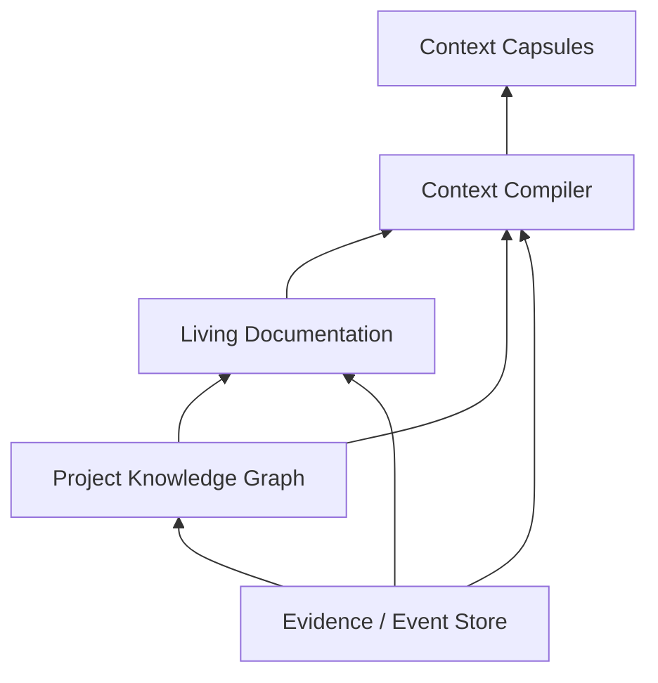

# Context Compiler, conhecimento e Dreams Engine

## 1. Objetivo

Esta camada evita que cada agente receba o projeto inteiro, transforma execução em conhecimento rastreável e mantém documentação/memória úteis ao longo do tempo. Ela é a base do “context low”: o sistema compartilha o mínimo suficiente, preservando referências recuperáveis e provenance.

## 2. Arquitetura de verdade em três camadas



### 2.1 Evidence/Event Store

Contém fatos brutos e imutáveis:

- prompts e decisões;
- Graph Versions;
- node inputs/outputs;
- tool calls;
- source snapshots;
- diffs;
- testes;
- logs redigidos;
- external sources;
- model route decisions;
- policies e waivers;
- artifacts;
- dream reports.

Correções são novos eventos, nunca edição retroativa.

### 2.2 Project Knowledge Graph

Representa entidades e claims:

- requisitos;
- decisões;
- componentes;
- pessoas/atores;
- APIs;
- riscos;
- hipóteses;
- fontes;
- agentes;
- skills;
- documentos;
- execuções;
- incidentes;
- relações temporais.

### 2.3 Living Documentation

Materializações humanas:

- PRD;
- arquitetura;
- ADRs;
- runbooks;
- guias;
- glossários;
- research reports;
- decision logs;
- changelogs;
- task summaries.

Documento é uma view versionada do conhecimento, não a única verdade.

## 3. Context Compiler

### 3.1 Entrada

- objetivo do nó;
- input schema;
- completion/evidence contract;
- project/subproject scope;
- graph dependency outputs;
- context policy;
- snapshot/watermark;
- budget;
- agent memory policy;
- blind review restrictions;
- data sensitivity.

### 3.2 Saída

`Context Capsule` imutável por versão, com:

- conteúdo materializado;
- artifact/context refs;
- summaries;
- provenance;
- conflicts;
- exclusions;
- token estimates;
- dependency hash;
- expansion policy.

## 4. Camadas da cápsula

### 4.1 Project Kernel

Contexto pequeno e estável:

- identidade do projeto;
- visão;
- restrições permanentes;
- convenções;
- políticas relevantes;
- glossário essencial.

Deve ser curto, versionado e diferente por scope.

### 4.2 Task Capsule

- pedido atual;
- critérios de sucesso;
- decisões do usuário;
- limites;
- current execution state;
- definition of done.

### 4.3 Node Capsule

- subtarefa;
- papel do agente;
- input/output contracts;
- tools;
- permissions;
- forbidden actions;
- budget;
- completion evidence.

### 4.4 Evidence Bundle

Somente evidências úteis:

- source locations;
- file sections;
- tests;
- external sources;
- claims;
- relevant history;
- artifact refs.

### 4.5 Dependency Outputs

Outputs tipados de predecessors. Não incluir chats internos ou raciocínio privado.

### 4.6 Agent Experience

Memórias válidas, diretamente relacionadas, com confidence e TTL.

## 5. Pipeline de compilação de contexto

```text
Objective analysis
→ retrieval query plan
→ permission/scope filter
→ freshness filter
→ contradiction expansion
→ rank by expected decision impact
→ deduplicate
→ choose representation
→ token allocation
→ provenance attach
→ capsule validation
```

## 6. Retrieval

### 6.1 Tipos

- exact ID/ref;
- keyword/full-text;
- semantic/vector;
- graph neighborhood;
- code symbol/AST;
- dependency graph;
- temporal;
- execution similarity;
- claim/evidence relation;
- source authority;
- artifact metadata.

### 6.2 Ranking

Score conceitual:

```text
relevance
× scope_permission
× freshness
× source_authority
× evidence_strength
× decision_impact
× contract_fit
− redundancy
− token_cost
− contamination_risk
```

### 6.3 Contradições

Quando item relevante contradiz outro, ambos entram com status e provenance. O compiler não faz merge silencioso.

## 7. Representação eficiente

O compiler escolhe:

- conteúdo integral curto;
- excerpt com line/symbol refs;
- structural summary;
- hierarchical summary;
- table/JSON;
- diff;
- graph neighborhood;
- artifact pointer;
- lazy retrieval handle.

Arquivos grandes nunca entram integralmente por padrão.

## 8. Context budget

### 8.1 Alocação

Budget é dividido por prioridade:

1. contrato e instruções;
2. user criteria;
3. evidence indispensável;
4. dependency outputs;
5. project conventions;
6. memories;
7. optional background.

### 8.2 Expansion request

```yaml
context_request:
  node_id: security_review
  missing_information: fluxo de recuperação de senha
  reason: pode compartilhar o mesmo token de sessão
  expected_decision_impact: high
  requested_scope:
    - src/auth/recovery/**
    - related_adrs
```

O compiler avalia scope, budget, sensitivity e relevance. A resposta pode ser full, partial ou denied com reason.

### 8.3 Delta context

Retries recebem somente mudanças desde a cápsula anterior, mais referências estáveis. Isso reduz tokens e inconsistência.

## 9. Caching e invalidação

Cache key inclui:

- objective signature;
- scope;
- source snapshot;
- claims watermark;
- policy hash;
- retrieval recipe;
- budget;
- blind exclusions.

Mudança invalida apenas fragmentos dependentes. Um novo arquivo de marketing não invalida cápsula de backend sem relação.

## 10. Reviewer isolation

Para reduzir viés:

- reviewer não recebe “executor says success” por padrão;
- recebe diff, source, tests e acceptance criteria;
- subjective summaries ficam excluídos em blind mode;
- execution identity pode ser escondida;
- reviewer output exige evidence refs;
- final verifier pode receber findings sem recommendation do reviewer para testar independentemente.

## 11. Knowledge Graph

### 11.1 Entidades

- `Project`, `Subproject`, `Repository`, `Component`, `Service`, `Requirement`, `Decision`, `Risk`, `Claim`, `Evidence`, `Document`, `Execution`, `Agent`, `Skill`, `Tool`, `ModelRoute`, `Artifact`, `Incident`, `Environment`.

### 11.2 Relações

- `contains`
- `depends_on`
- `implements`
- `tests`
- `documents`
- `supports`
- `contradicts`
- `supersedes`
- `derived_from`
- `produced_by`
- `consumed_by`
- `applies_to`
- `valid_during`
- `failed_in`
- `resolved_by`
- `recommended_for`
- `incompatible_with`

### 11.3 Claim lifecycle

```text
candidate → validated → superseded/deprecated/expired
candidate → contradicted
validated → contradicted (new evidence)
```

Validation pode exigir deterministic evidence, user decision, multiple sources ou evaluator, conforme claim type.

### 11.4 Temporalidade

Claims possuem `valid_from` e `valid_until`. Uma arquitetura antiga pode permanecer historicamente correta sem contaminar contexto atual.

### 11.5 Confidence

Confidence representa força da claim, não certeza metafísica. Ela deve ser recalculável a partir de evidence, source authority, recency e contradiction.

## 12. Living Documentation

### 12.1 Document metadata

```yaml
document:
  id: architecture-auth
  path: docs/architecture/authentication.md
  scope: project
  status: current
  source_claims: [...]
  source_evidence: [...]
  materializer_version: 2
  generated_sections: [...]
  human_owned_sections: [...]
  last_validated_at: ...
```

### 12.2 Ownership de seção

Um documento pode misturar:

- seção humana protegida;
- seção gerada;
- seção collaborative;
- embed de artifact.

Dreams não sobrescreve seção humana protegida; cria proposta ou conflict note.

### 12.3 Freshness

Freshness score considera:

- source changes;
- superseded claims;
- related incidents;
- age;
- unresolved conflicts;
- last validation.

### 12.4 Atualização em paralelo

A branch documental usa snapshot/claim watermark. Se código/decisões mudarem antes do commit, materializer faz rebase ou marca stale; não publica documento inconsistente.

## 13. Agent memory

### 13.1 O que pode ser lembrado

- estratégia que funcionou;
- erro recorrente;
- padrão local estável;
- avaliação recebida;
- referência para documento canônico;
- limitação da própria definição.

### 13.2 O que não deve ser lembrado

- chat integral;
- secret;
- conjectura sem label;
- cópia de documentação;
- opinião sobre usuário;
- output temporário sem valor futuro;
- informação fora do scope.

### 13.3 Memory validator

Antes de promover candidate:

- evidence existe;
- não contradiz claim canônica sem marcação;
- scope está correto;
- TTL adequado;
- texto não contém secret/PII proibida;
- reuse value esperado é positivo.

## 14. Dreams Engine

### 14.1 Trigger

- projeto ocioso por período configurado;
- cron;
- manual;
- após número de execuções;
- após incidente;
- quando stale/conflict threshold excede;
- quando index fragmentation excede.

### 14.2 Idle safety

Projeto é “ocioso” quando não há write-critical section ativa. Dreams pode analisar durante execuções, mas commits cognitivos aguardam safe point ou usam versioned merge.

### 14.3 Dream Planner

Analisa:

- documents;
- claims;
- contradictions;
- memories;
- agents;
- skills;
- context metrics;
- execution failures;
- graph patterns;
- duplicated artifacts;
- stale indexes.

Gera hypotheses com expected benefit, risk e evidence.

### 14.4 Categorias de dream

- documentation consolidation;
- claim reconciliation;
- memory expiration;
- agent deduplication;
- skill improvement;
- context index rebuild;
- retrieval recipe optimization;
- policy drift report;
- harness pattern evaluation;
- unresolved failure analysis;
- code finding generation.

### 14.5 Shadow Workspace

Toda mudança mutável acontece em snapshot separado:

1. clone de metadata/docs/config relevantes;
2. aplicar change set;
3. schema validation;
4. knowledge consistency checks;
5. retrieval benchmark;
6. documentation diff;
7. agent/skill conformance;
8. independent critic;
9. compare metrics;
10. atomic commit ou discard.

### 14.6 Proibições

Dreams não pode:

- apagar/rewrite Event Store;
- remover provenance;
- ocultar failures;
- promover hipótese sem evidence;
- ampliar própria permission;
- reduzir hard policy;
- acessar produção sem task normal;
- alterar código diretamente;
- iniciar gasto BYOK fora de budget/policy;
- instalar plugin sem processo normal.

### 14.7 Achados de código

```yaml
dream_finding:
  category: probable_bug
  description: possível race condition em webhook
  confidence: 0.81
  evidence: [...]
  suggested_outcome:
    - confirmar ou refutar
    - corrigir se reproduzível
    - adicionar teste
```

O finding vira `Task Request` normal. Task Profiler pode rejeitar/refutar a hipótese.

### 14.8 Dream Report

```yaml
dream_report:
  id: dream_0042
  trigger: idle
  analyzed:
    documents: 74
    claims: 1328
    agents: 19
    executions: 46
  changes:
    documents_consolidated: 3
    claims_superseded: 12
    memories_expired: 7
    agents_merged: 2
  validation:
    consistency: passed
    critic: approved
    rollback_available: true
  expected_effect:
    context_reduction_percent: 18
```

## 15. Dreams e agent consolidation

Dois agentes podem ser candidatos a merge quando:

- objective overlap alto;
- capabilities semelhantes;
- contracts compatíveis;
- performance complementar;
- nenhuma policy exige separação.

Merge cria nova versão; agentes originais permanecem reproduzíveis/arquivados. Nunca apagar histórico.

## 16. Dreams e skill optimization

Mudanças possíveis:

- melhorar instrução;
- adicionar negative case;
- ajustar completion contract;
- corrigir schema;
- adicionar evaluator;
- reduzir contexto redundante.

Toda mudança passa por conformance tests. Dreams não promove mudança silenciosa em skill global de terceiros; cria fork/project override ou proposal conforme ownership.

## 17. Métricas

### Context

- tokens allocated/used;
- relevant evidence recall;
- irrelevant context ratio;
- expansion rate;
- cache hit;
- stale item rate;
- contradiction exposure;
- downstream quality correlation.

### Knowledge

- validated claim ratio;
- unresolved contradictions;
- orphan evidence;
- stale docs;
- provenance coverage;
- supersession latency.

### Dreams

- accepted/discarded changes;
- regressions;
- token savings;
- agent consolidation quality;
- generated task precision;
- rollback frequency;
- time to consistency.

## 18. Critérios de aceite

- nenhum agente recebe full history por default;
- toda Context Capsule tem provenance e exclusions;
- expansion request é auditável;
- conflict relevante aparece explicitamente;
- Event Store permanece imutável;
- document diff aponta claims/evidence;
- memory sem TTL/evidence não é validada;
- Dreams opera em shadow e possui rollback;
- finding de código vira task normal;
- revisor blind não recebe subjective executor summary.
