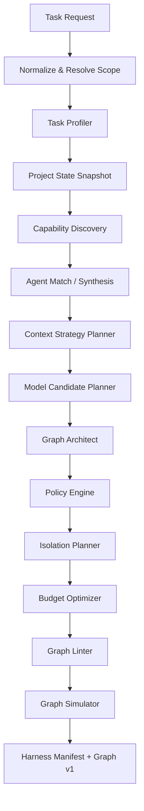

# Dynamic harness — complete specification

## 1. Definition

The harness is the system that transforms an open intent into an executable organization of agents, tools, models, context, policies, sandboxes and gates. It is not a master prompt and it is not a fixed sequence. It is an adaptive compiler with probabilistic components and deterministic verifiers.

The harness output is a **Harness Manifest** associated with a **Graph Version**. During execution, findings produce signals; the Graph Governor can recompile parts of the harness and publish new graph versions.

## 2. Objectives

1. select the smallest set of capabilities able to fulfill the objective;
2. adapt depth, critique, testing and security to the actual risk;
3. limit tokens, cost, latency and expansion without sacrificing essential evidence;
4. prevent agents from granting themselves permissions or waiving gates;
5. reduce confirmation bias;
6. make every relevant decision explainable and auditable;
7. allow manual control without breaking technical consistency;
8. keep learning within the project scope without creating opaque memory.

## 3. Non-objectives

- producing the same graph for every installation;
- mapping a domain to a static pack;
- using an LLM as the sole security layer;
- requiring human approval at every phase;
- preventing a conscious override by the owner;
- preserving steps that no longer contribute;
- maximizing the number of agents.

## 4. Compilation pipeline



Components can work in parallel when their inputs allow it, but the final result always passes through deterministic policy and lint checks.

## 5. Universal Intake and target resolution

Intake converts text, attachments, UI selection and origin into a `Task Request`.

### 5.1 Intent resolution

Minimum categories:

- `new_execution`
- `continue_execution`
- `node_instruction`
- `graph_mutation`
- `human_decision`
- `document_update`
- `query_only`
- `conversation_only`

### 5.2 Ambiguity

When two operational interpretations are plausible and would alter state differently, the system presents options. An informative response can be given without waiting, but no ambiguous mutation is applied.

### 5.3 Scope resolution

Intake determines Workspace, Project, Subproject, execution and node. Explicit mentions take precedence. Active selection on the canvas is contextual evidence, not an irreversible command.

## 6. Task Profiler

### 6.1 Output

The Task Profiler produces a vector of signals, not a single label.

```yaml
task_profile:
  domains:
    - software_engineering: 0.82
    - product: 0.44
  complexity: high
  depth: cross_component
  uncertainty: 0.36
  security_risk: 0.71
  regression_risk: 0.78
  reversibility: medium
  data_sensitivity: confidential
  production_impact: direct
  evidence_need: high
  interaction_need: low
  initial_isolation_minimum: tier_1
  signals:
    touches_authentication: true
    modifies_database_schema: false
    deploy_requested: true
```

### 6.2 Classification sources

- user request;
- project selection;
- referenced files and symbols;
- recent history;
- canonical claims;
- repository and dependencies;
- production/configuration;
- required tools;
- threat model;
- deterministic heuristics;
- cheap model classifier;
- stronger verifier for ambiguous cases.

### 6.3 Redundancy

High-impact signals must be confirmed by more than one source when possible. Example: `touches_authentication` can come from user language, path analysis and the dependency graph.

### 6.4 Continuous reclassification

The profile is versioned. Later findings can raise or lower scope, but policies ensure that a reduction never ignores contradictory evidence.

## 7. Capability Discovery

### 7.1 Atomic catalog

The catalog contains capabilities, not workflows. Examples:

- repository_search;
- dependency_trace;
- semantic_diff;
- code_write;
- unit_test_execution;
- browser_navigation;
- web_research;
- source_verification;
- dataset_query;
- image_generation;
- document_materialization;
- security_review;
- deployment;
- rollback;
- stakeholder_simulation;
- copy_critique.

### 7.2 Query

Discovery considers:

- input/output compatibility;
- objective similarity;
- permissions;
- isolation;
- provider/model requirements;
- trust level;
- installed/available status;
- historical reliability;
- cost/latency;
- scope visibility;
- version compatibility.

### 7.3 Capability gap

If a required capability does not exist, the harness can:

1. compose smaller capabilities;
2. synthesize an agent using existing tools;
3. propose installing an extension;
4. request a human decision;
5. declare technical impossibility.

It never invents a nonexistent tool as if it were available.

## 8. Agent Matcher and Agent Synthesizer

### 8.1 Agent Match Score

Conceptual scoring:

```text
match = objective_fit
      × contract_compatibility
      × capability_coverage
      × permission_feasibility
      × context_compatibility
      × freshness
      × historical_quality
      × availability
      − expected_cost
      − correlated_failure_risk
```

No single historical value authorizes reuse on its own. An agent that excels in one scenario may be unsuitable in another.

### 8.2 Reuse

The matcher can:

- reuse without changes;
- parameterize the instance;
- use the definition with a temporary overlay;
- derive a new definition, if the user saves it afterward;
- create an ephemeral agent.

### 8.3 Synthesis

An ephemeral agent must declare:

```yaml
agent_spec:
  objective: ...
  required_capabilities: [...]
  allowed_tools: [...]
  prohibited_actions: [...]
  input_schema: ...
  output_schema: ...
  completion_contract: ...
  evidence_requirements: [...]
  model_requirements: ...
  context_budget: ...
  isolation_minimum: ...
  memory_write_policy: ...
```

The linter rejects an agent without contracts, permissions or a termination condition.

## 9. Context Strategy Planner

Plans what knowledge will be needed at each phase, without materializing all tokens up front.

### 9.1 Principle

The planner creates references and retrieval recipes. The Context Compiler materializes the capsule at node time, using the correct snapshot.

### 9.2 Strategies

- exact file/symbol retrieval;
- semantic retrieval;
- graph-neighborhood retrieval;
- temporal retrieval;
- contradiction-aware retrieval;
- dependency output inclusion;
- hierarchical summary;
- delta context;
- blind reviewer bundle;
- source bundle.

### 9.3 Budgets

Each node receives:

- initial budget;
- expandable maximum;
- item priority;
- allowed compression;
- prohibited content;
- expansion condition.

Initial budgets and recipe choices are sized by the observed utilization of comparable past
nodes (`CONTEXT_KNOWLEDGE_DREAMS.md` §6.4), with a floor for node shapes not seen before.
Learning shrinks optional background first and §14.3 stands unchanged: contract-required
evidence is never removed by a utilization-informed budget.

## 10. Model Candidate Planner

### 10.1 Model profiles

Instead of fixed names, the harness declares needs:

- `fast_classification`
- `structured_extraction`
- `long_context_reasoning`
- `critical_reasoning`
- `software_execution`
- `vision_analysis`
- `creative_generation`
- `low_cost_synthesis`
- `local_private`

### 10.2 Route score

```text
route_score = capability_fit
            + project_history
            + current_health
            + context_fit
            + tool_fit
            + privacy_fit
            + independence_bonus
            + cache_affinity
            − latency_penalty
            − marginal_cost
            − quota_risk
            − correlated_error_risk
```

`cache_affinity`: a route whose provider prefix cache is warm for the capsule's stable prefix
(`CONTEXT_KNOWLEDGE_DREAMS.md` §9's canonical assembly) has a genuinely lower marginal cost —
quality ties resolve toward the warm route, and nodes sharing a stable prefix prefer the same
route. It never overrides the diversity requirements of §10.3 or `privacy_fit`: an independent
review that must change provider changes provider, cold cache and all.

### 10.3 Diversity

When policy requires independent review, the planner favors:

- a different provider;
- a different model family;
- a different prompt/role;
- blind context;
- distinct verification tools.

### 10.4 Subscription capacity

Capacity may be unknown. The planner uses observed signals, but never assumes it is unlimited. A reached limit pauses the route; BYOK is not triggered automatically.

## 11. Graph Architect

### 11.1 Responsibility

Proposes topology, parallelism, agents, gates, joins, retries and criteria. It does not grant secrets, does not remove policies and does not execute anything.

### 11.2 Smallest-graph heuristic

For each candidate node, estimate:

```text
expected_value = risk_reduction
               + evidence_gain
               + progress_gain
               + uncertainty_reduction
               − cost
               − latency
               − coordination_overhead
               − context_duplication
```

Nodes with low expected value are removed or merged, unless a policy requirement dictates otherwise.

### 11.3 Allowed patterns, not packs

The Architect can use abstract patterns:

- inspect → act → verify;
- independent parallel investigations;
- propose → critic → revise;
- fork by component → join evidence;
- canary → observe → expand;
- research → source verification → synthesis;
- generate variants → evaluate → select.

These patterns are reasoning primitives, not fixed domain-specific workflows.

### 11.4 Decomposition

A node must have a clear objective, finite input, typed output and a verifiable conclusion. If the subtask requires incompatible contexts or permissions, split it.

### 11.5 Parallelism

Parallelize when:

- branches are independent;
- outputs can be joined by contract;
- diversity improves confidence;
- resources allow it;
- concurrent-state risk is controlled.

Avoid parallelism when it increases duplication, write conflicts or quota pressure.

## 12. Policy Engine

### 12.1 Characteristics

Deterministic, versioned and separate from the LLM. It can consume probabilistic signals, but applies explicit rules.

### 12.2 Policy types

- security;
- quality;
- privacy;
- cost;
- model/provider;
- isolation;
- deployment;
- data retention;
- collaboration;
- plugin trust;
- documentation;
- user interaction.

### 12.3 Example

```yaml
policy:
  id: auth_change_requires_independent_review
  when:
    all:
      - signal: touches_authentication
        equals: true
      - signal: change_depth
        in: [component, cross_component, systemic]
  require:
    - capability: independent_security_review
    - capability: authentication_regression_test
    - evidence: rollback_plan
    - isolation_minimum: tier_1
  preferred:
    - reviewer_provider_differs_from_executor: true
  override:
    owner_allowed: true
    result_label: completed_with_security_waiver
```

### 12.4 Hard constraints

Hard constraints are impossibilities or policies defined as non-waivable by the owner. Example: a secret can never be serialized into an export. The model cannot change a hard constraint.

### 12.5 Waiver

A waiver records an obligation that was not met; it does not change the evaluator's result. An execution can be `completed_with_waivers`.

## 13. Isolation Planner

Determines tier, network, filesystem, secret scope, resource limits and cleanup.

### 13.1 Elevation signals

- untrusted code;
- new/unknown package;
- destructive shell;
- secret access;
- parsing of a malicious file;
- browser with downloads;
- binary execution;
- production access;
- offensive analysis;
- unverified plugin.

### 13.2 Dynamic elevation

The runtime intercepts an incompatible action, emits a Graph Signal, checkpoints and re-executes in a new sandbox. Mutable state from the smaller tier is never blindly promoted.

## 14. Budget Optimizer

### 14.1 Budgets

- tokens per node;
- output tokens;
- API cost;
- subscription concurrency;
- wall-clock;
- retries;
- nodes;
- mutations;
- context expansion;
- CPU/memory/storage;
- network egress;
- measurement and calibration overhead, capped as a declared fraction of the spend it measures.

### 14.2 Savings strategies

- cheap classifier with escalation;
- Context Capsule caching;
- reuse of extraction artifacts;
- delta context;
- structured output;
- tool result summarization;
- retrieval batching;
- early stopping;
- branch cancellation;
- deterministic checks before an LLM reviewer;
- reuse of agent definitions, not necessarily of responses;
- model routing by marginal quality.

### 14.3 Never save by removing required evidence

The optimizer can swap for an equivalent method, but the policy requirement remains.

## 15. Graph Linter

Minimum checks:

- unique IDs;
- resolvable schemas;
- edge compatibility;
- reachable nodes;
- entry/terminal nodes;
- valid conditions;
- absence of an uncontrolled cycle;
- finite retries;
- timeout;
- satisfiable permissions;
- satisfiable isolation;
- available model route;
- valid context budget;
- required policies covered;
- possible completion contract;
- no secret path exposure;
- no direct graph mutation by an agent;
- compensation for destructive action when required;
- user decision node for unavoidable ambiguity.

## 16. Graph Simulator

Simulates:

- transitions;
- conditional branches;
- failures;
- retries;
- capacity wait;
- user pause;
- graph mutation;
- compensation;
- terminal states;
- deadlock;
- cost upper bound.

It does not call models or external tools. It uses output schema fixtures.

## 17. Harness Manifest

The manifest must be sufficient to explain and reproduce the setup:

- capability snapshot;
- agents and versions;
- model candidates and the selected route;
- graph;
- context plan;
- policies;
- isolation;
- budgets;
- evidence requirements;
- summarized rationale;
- compiler/linter versions;
- hashes.

## 18. Execution and feedback

### 18.1 Node runtime envelope

Before the agent starts, the runtime assembles:

- instructions;
- Context Capsule;
- tool contracts;
- leases;
- output schema;
- completion contract;
- budget;
- cancellation token.

### 18.2 Output

The agent delivers:

- structured output;
- artifacts;
- evidence refs;
- cited context ids — the capsule item ids the output relied on, the utilization producer of `CONTEXT_KNOWLEDGE_DREAMS.md` §6.4;
- uncertainty;
- missing information;
- graph signals;
- memory candidates.

### 18.3 No chain-of-thought as a contract

The system records summarized rationale and evidence; it does not require exposing private reasoning. Auditing must rely on inputs, outputs, tools and structured decisions.

## 19. Graph Signals

Initial taxonomy:

- unexpected_dependency;
- unexpected_security_boundary;
- scope_expansion;
- scope_reduction;
- missing_context;
- tool_unavailable;
- model_capacity_degraded;
- test_failure;
- contradictory_evidence;
- low_confidence;
- no_progress;
- budget_pressure;
- permission_required;
- isolation_elevation_required;
- user_intent_changed;
- output_contract_mismatch;
- documentation_impact;
- deploy_risk;

## 20. Graph Governor

### 20.1 Process

```text
signal → normalize → validate evidence → reprofile → propose mutation
→ policy check → dependency/cost check → lint → publish Graph vN+1
```

### 20.2 Mutations

- add/remove optional node;
- replace/split/merge node;
- add parallel branch;
- cancel branch;
- change model for an unstarted node;
- elevate isolation;
- expand context;
- add gate;
- retry;
- request human decision;
- redirect failure;
- invalidate outputs.

### 20.3 Explosion control

- max nodes;
- max mutations;
- max depth;
- semantic deduplication;
- no-progress detector;
- evidence required for expansion;
- expected-value threshold;
- branch budget;
- human escalation when nonconvergent.

## 21. Quality gates

### 21.1 Gate contract

```yaml
gate:
  requirement: no_blocking_security_findings
  method:
    - deterministic_scanner
    - independent_model_review
  evidence_required:
    - scanner_report
    - review_report
  pass_expression: ...
  on_fail: remediation
  override: owner_allowed
```

Method ordering is a rule, not a preference: deterministic methods run before model-based
methods of the same requirement, and a deterministic failure short-circuits the model-based
methods — the gate fails without spending them. This elevates §14.2's "deterministic checks
before an LLM reviewer" from a savings strategy to gate flow. §21.3 is untouched: the
requirement never changes, only the order and the spend.

### 21.2 Families

- unit/integration/e2e tests;
- static analysis;
- security review;
- performance benchmark;
- source verification;
- factual consistency;
- schema validation;
- visual review;
- accessibility;
- legal/compliance checklist;
- business acceptance;
- documentation freshness;
- rollback validation.

### 21.3 Adaptive gate

The method can change, the requirement cannot. Example: security review can be covered by a scanner + reviewer or by two specialized reviewers, depending on context.

### 21.4 Observation obligations

Journey-Proven Development compiles each user promise into typed observation obligations before it
selects gate methods. The obligation names the fact, required evidence type and strength, observer,
freshness window, and failure/recovery behavior. A method may be replaced only by one that proves an
equivalent or stronger fact.

If the installed capability catalog cannot observe the promised fact, harness compilation refuses
with `OBSERVER_MISSING`. An HTTP acceptance response cannot satisfy delivery, rendering, focus,
operability, or user-perception obligations. Agent agreement cannot satisfy any missing observation.

## 22. Reducing confirmation bias

### 22.1 Rules

- the executor never issues final approval of its own change;
- the reviewer receives evidence and diff, not the executor's praise/conclusion;
- the critic can operate in blind mode;
- disagreements are structured;
- the reviewer must cite location/evidence;
- an empty approval without inspection fails the completion contract;
- model diversity is preferred when marginally useful;
- deterministic tests precede opinion when possible;
- the reviewer's prompt includes actively searching for falsification;
- the final verifier tests critical claims, not just reads reports.

### 22.2 Disagreement Resolver

When reviewers disagree:

1. extract the conflicting claims;
2. request specific evidence;
3. run a discriminating test;
4. use a third arbiter only if necessary;
5. preserve the disagreement if unresolved;
6. mark the conclusion with uncertainty.

Persona selection is risk-driven and bounded. The council may include a defect hunter, ideator,
critic, advocate, accessibility user, recovery operator, or resolver. These are temporary agent
definitions, not a mandatory panel. A unique severe counterexample remains open even when every
other agent agrees with the implementation.

## 23. Completion Engine

Execution concludes when:

- terminal nodes have completed or were validly waived/skipped;
- the global completion contract is satisfied or explicitly waived;
- required artifacts exist;
- evidence coverage meets the requirement;
- there is no active required branch;
- the current Graph Version is stable;
- documentation/knowledge update has a state allowed by policy.

When the global completion contract is already satisfied and every remaining active branch is
`optional` with low expected value (§11.2), the Governor may cancel those branches through
§20.2's existing cancel-branch mutation, with the reason recorded — never a `required`
branch, and never silently: the cancellation is an ordinary governed mutation in the history.

Result:

- `completed`
- `completed_with_recommendations`
- `completed_with_waivers`
- `completed_by_manual_override`
- `deployed_without_full_validation`
- `partial`
- `blocked`
- `failed`
- `cancelled`

## 24. Manual control

### 24.1 Disable node

- checkpoint;
- dependency impact;
- branch pause;
- alternatives as ghost nodes;
- no alternative starts automatically;
- owner chooses to replace, waive, keep paused or cancel.

### 24.2 Edit node

Creates a temporary overlay. If input/output changes, edges are relinted. The saved definition does not change.

### 24.3 Skip to deploy

The Graph Draft records removed nodes, the new edge, unmet obligations and risks. After confirmation, the policy waiver and Graph Version are published.

### 24.4 Graph rollback

Rollback restores topology, not necessarily external effects. For effects, compensation nodes must exist.

## 25. Harness examples

### 25.1 Light change

```text
Context Retriever → Patch Executor → Targeted Test → Diff Verifier
```

### 25.2 Deep change

```text
Repository Mapper
  → Impact Analyst
  → Architect
  → Implementation branches
  → Integration Tests
  → Independent Critic
  → Security Review
  → Remediation loop
  → Final Verifier
  → Documentation Materializer
```

### 25.3 Multi-domain demand

```text
Market Research ─┐
User Research  ──┼→ Product Synthesis → Copy + Design → Implementation
Technical Audit ─┘                         ↓
                                      Brand Review → Publish
```

These examples are not packs; the compiler creates something similar only when signals and capabilities justify it.

## 26. Evaluating the harness itself

Metrics:

- task success;
- evidence coverage;
- unnecessary node ratio;
- missed gate rate;
- mutation count;
- no-progress loops;
- token/context efficiency;
- cost/time prediction error;
- agent reuse precision;
- reviewer false-positive/negative;
- manual override frequency;
- user graph edits;
- post-completion regressions.

The Dreams Engine uses these metrics to suggest improvements, never to weaken hard policies.

## 27. Conformance requirements

A compliant implementation must:

- produce a versioned manifest;
- separate the proposer from policy enforcement;
- prevent direct agent mutation;
- support structured graph signals;
- support context capsules;
- surface cited context ids in node output;
- support user override and waiver;
- preserve event history;
- limit graph expansion;
- expose decisions through the public API;
- allow adapters to be replaced.
