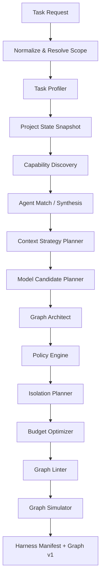

# Harness dinâmico — especificação completa

## 1. Definição

O harness é o sistema que transforma uma intenção aberta em uma organização executável de agentes, ferramentas, modelos, contexto, políticas, sandboxes e gates. Ele não é um prompt mestre e não é uma sequência fixa. É um compilador adaptativo com componentes probabilísticos e verificadores determinísticos.

A saída do harness é um **Harness Manifest** associado a uma **Graph Version**. Durante a execução, descobertas produzem sinais; o Graph Governor pode recompilar partes do harness e publicar novas versões do grafo.

## 2. Objetivos

1. selecionar o menor conjunto de capacidades capaz de cumprir o objetivo;
2. adaptar profundidade, crítica, teste e segurança ao risco real;
3. limitar tokens, custo, latência e expansão sem sacrificar evidência essencial;
4. evitar que agentes concedam a si mesmos permissões ou dispensem gates;
5. reduzir viés de confirmação;
6. tornar toda decisão relevante explicável e auditável;
7. permitir controle manual sem destruir consistência técnica;
8. continuar aprendendo no escopo do projeto sem criar memória opaca.

## 3. Não objetivos

- produzir o mesmo grafo para toda instalação;
- mapear domínio para um pack estático;
- usar um LLM como única camada de segurança;
- exigir aprovação humana em toda fase;
- impedir override consciente do owner;
- preservar etapas que deixaram de contribuir;
- maximizar número de agentes.

## 4. Pipeline de compilação


```mermaid
flowchart TD
    A[Task Request] --> B[Normalize & Resolve Scope]
    B --> C[Task Profiler]
    C --> D[Project State Snapshot]
    D --> E[Capability Discovery]
    E --> F[Agent Match / Synthesis]
    F --> G[Context Strategy Planner]
    G --> H[Model Candidate Planner]
    H --> I[Graph Architect]
    I --> J[Policy Engine]
    J --> K[Isolation Planner]
    K --> L[Budget Optimizer]
    L --> M[Graph Linter]
    M --> N[Graph Simulator]
    N --> O[Harness Manifest + Graph v1]
```

Os componentes podem trabalhar em paralelo quando seus inputs permitirem, mas o resultado final passa por policy e lint determinísticos.

## 5. Universal Intake e resolução de alvo

O intake converte texto, anexos, seleção de UI e origem em `Task Request`.

### 5.1 Resolução de intenção

Categorias mínimas:

- `new_execution`
- `continue_execution`
- `node_instruction`
- `graph_mutation`
- `human_decision`
- `document_update`
- `query_only`
- `conversation_only`

### 5.2 Ambiguidade

Quando duas interpretações operacionais são plausíveis e alteram estado de forma diferente, o sistema apresenta opções. Uma resposta informativa pode ser dada sem aguardar, mas nenhuma mutação ambígua é aplicada.

### 5.3 Scope resolution

O intake determina Workspace, Projeto, Subprojeto, execução e nó. Menções explícitas têm precedência. Seleção ativa no canvas é evidência contextual, não comando irreversível.

## 6. Task Profiler

### 6.1 Saída

O Task Profiler produz um vetor de sinais, não uma label única.

```yaml
task_profile:
  domains:
    - software_engineering: 0.82
    - product: 0.44
  complexity: high
  depth: cross_component
  uncertainty: 0.36
  security_risk: 0.71
  regression_risk: 0.78
  reversibility: medium
  data_sensitivity: confidential
  production_impact: direct
  evidence_need: high
  interaction_need: low
  initial_isolation_minimum: tier_1
  signals:
    touches_authentication: true
    modifies_database_schema: false
    deploy_requested: true
```

### 6.2 Fontes de classificação

- pedido do usuário;
- seleção do projeto;
- arquivos e símbolos referenciados;
- histórico recente;
- claims canônicas;
- repositório e dependências;
- produção/configuração;
- tools necessárias;
- modelo de ameaça;
- heurísticas determinísticas;
- classificador de modelo barato;
- verificador mais forte em casos ambíguos.

### 6.3 Redundância

Sinais de alto impacto devem ser confirmados por mais de uma fonte quando possível. Exemplo: `touches_authentication` pode vir de linguagem do usuário, path analysis e dependency graph.

### 6.4 Reclassificação contínua

O perfil é versionado. Descobertas posteriores podem elevar ou reduzir escopo, mas policies garantem que uma redução não ignore evidência contraditória.

## 7. Capability Discovery

### 7.1 Catálogo atômico

O catálogo contém capabilities, não workflows. Exemplos:

- repository_search;
- dependency_trace;
- semantic_diff;
- code_write;
- unit_test_execution;
- browser_navigation;
- web_research;
- source_verification;
- dataset_query;
- image_generation;
- document_materialization;
- security_review;
- deployment;
- rollback;
- stakeholder_simulation;
- copy_critique.

### 7.2 Query

Discovery considera:

- input/output compatibility;
- objective similarity;
- permissions;
- isolation;
- provider/model requirements;
- trust level;
- installed/available status;
- historical reliability;
- cost/latency;
- scope visibility;
- version compatibility.

### 7.3 Capability gap

Se uma capability necessária não existe, o harness pode:

1. compor capabilities menores;
2. sintetizar um agente usando tools existentes;
3. propor instalação de extensão;
4. pedir decisão humana;
5. declarar impossibilidade técnica.

Ele não inventa uma tool inexistente como se estivesse disponível.

## 8. Agent Matcher e Agent Synthesizer

### 8.1 Agent Match Score

Pontuação conceitual:

```text
match = objective_fit
      × contract_compatibility
      × capability_coverage
      × permission_feasibility
      × context_compatibility
      × freshness
      × historical_quality
      × availability
      − expected_cost
      − correlated_failure_risk
```

Nenhum valor histórico sozinho autoriza reuso. Um agente excelente em um cenário pode ser inadequado em outro.

### 8.2 Reuso

O matcher pode:

- reutilizar sem alteração;
- parametrizar a instância;
- usar definição com overlay temporário;
- derivar nova definição, se o usuário salvar depois;
- criar agente efêmero.

### 8.3 Síntese

Agente efêmero precisa declarar:

```yaml
agent_spec:
  objective: ...
  required_capabilities: [...]
  allowed_tools: [...]
  prohibited_actions: [...]
  input_schema: ...
  output_schema: ...
  completion_contract: ...
  evidence_requirements: [...]
  model_requirements: ...
  context_budget: ...
  isolation_minimum: ...
  memory_write_policy: ...
```

O linter rejeita agente sem contratos, permissions ou condição de término.

## 9. Context Strategy Planner

Planeja que conhecimento será necessário em cada fase, sem materializar todos os tokens antecipadamente.

### 9.1 Princípio

O planner cria referências e retrieval recipes. O Context Compiler materializa a cápsula no momento do nó, usando o snapshot correto.

### 9.2 Estratégias

- exact file/symbol retrieval;
- semantic retrieval;
- graph-neighborhood retrieval;
- temporal retrieval;
- contradiction-aware retrieval;
- dependency output inclusion;
- hierarchical summary;
- delta context;
- blind reviewer bundle;
- source bundle.

### 9.3 Budgets

Cada nó recebe:

- budget inicial;
- máximo expansível;
- prioridade dos itens;
- compressão permitida;
- conteúdo proibido;
- condition para expansão.

## 10. Model Candidate Planner

### 10.1 Perfis de modelo

Em vez de nomes fixos, o harness declara necessidades:

- `fast_classification`
- `structured_extraction`
- `long_context_reasoning`
- `critical_reasoning`
- `software_execution`
- `vision_analysis`
- `creative_generation`
- `low_cost_synthesis`
- `local_private`

### 10.2 Score de rota

```text
route_score = capability_fit
            + project_history
            + current_health
            + context_fit
            + tool_fit
            + privacy_fit
            + independence_bonus
            − latency_penalty
            − marginal_cost
            − quota_risk
            − correlated_error_risk
```

### 10.3 Diversidade

Quando policy exige revisão independente, o planner favorece:

- provider diferente;
- família de modelo diferente;
- prompt/papel diferente;
- blind context;
- ferramentas de verificação distintas.

### 10.4 Capacidade de assinatura

A capacidade pode ser desconhecida. O planner usa sinais observados, mas nunca presume ilimitado. Limite atingido pausa a rota; BYOK não é acionado automaticamente.

## 11. Graph Architect

### 11.1 Responsabilidade

Propõe topologia, paralelismo, agentes, gates, joins, retries e critérios. Não concede secrets, não remove policies e não executa.

### 11.2 Heurística do menor grafo

Para cada nó candidato, estimar:

```text
expected_value = risk_reduction
               + evidence_gain
               + progress_gain
               + uncertainty_reduction
               − cost
               − latency
               − coordination_overhead
               − context_duplication
```

Nós com baixo valor esperado são removidos ou fundidos, salvo requirement de policy.

### 11.3 Padrões permitidos, não packs

O Architect pode usar padrões abstratos:

- inspect → act → verify;
- independent parallel investigations;
- propose → critic → revise;
- fork by component → join evidence;
- canary → observe → expand;
- research → source verification → synthesis;
- generate variants → evaluate → select.

Esses padrões são primitives de raciocínio, não workflows fixos por domínio.

### 11.4 Decomposition

Um node deve ter objetivo claro, input finito, output tipado e conclusão verificável. Se a subtarefa exige contextos ou permissões incompatíveis, dividir.

### 11.5 Paralelismo

Paralelizar quando:

- branches são independentes;
- outputs podem ser unidos por contrato;
- diversidade melhora confiança;
- recursos permitem;
- risco de estado concorrente é controlado.

Evitar paralelismo quando aumenta duplicação, conflito de write ou quota pressure.

## 12. Policy Engine

### 12.1 Característica

Determinístico, versionado e separado do LLM. Pode consumir sinais probabilísticos, mas aplica regras explícitas.

### 12.2 Tipos de policy

- security;
- quality;
- privacy;
- cost;
- model/provider;
- isolation;
- deployment;
- data retention;
- collaboration;
- plugin trust;
- documentation;
- user interaction.

### 12.3 Exemplo

```yaml
policy:
  id: auth_change_requires_independent_review
  when:
    all:
      - signal: touches_authentication
        equals: true
      - signal: change_depth
        in: [component, cross_component, systemic]
  require:
    - capability: independent_security_review
    - capability: authentication_regression_test
    - evidence: rollback_plan
    - isolation_minimum: tier_1
  preferred:
    - reviewer_provider_differs_from_executor: true
  override:
    owner_allowed: true
    result_label: completed_with_security_waiver
```

### 12.4 Hard constraints

Hard constraints são impossibilidades ou políticas definidas como não dispensáveis pelo owner. Exemplo: secret nunca pode ser serializado em export. O modelo não pode mudar hard constraint.

### 12.5 Waiver

Waiver registra obrigação não atendida; não altera o resultado do evaluator. Uma execução pode estar `completed_with_waivers`.

## 13. Isolation Planner

Determina tier, network, filesystem, secret scope, resource limit e cleanup.

### 13.1 Sinais de elevação

- código não confiável;
- pacote novo/desconhecido;
- shell destrutivo;
- acesso a secrets;
- parsing de arquivo malicioso;
- browser com downloads;
- execução de binário;
- acesso de produção;
- análise ofensiva;
- plugin não verificado.

### 13.2 Elevação dinâmica

O runtime intercepta ação incompatível, emite Graph Signal, checkpointa e reexecuta em sandbox nova. Estado mutável do tier menor não é promovido cegamente.

## 14. Budget Optimizer

### 14.1 Budgets

- tokens por nó;
- output tokens;
- API cost;
- subscription concurrency;
- wall-clock;
- retries;
- nodes;
- mutations;
- context expansion;
- CPU/memory/storage;
- network egress.

### 14.2 Estratégias de economia

- classificador barato com escalation;
- cache de Context Capsules;
- reuse de extraction artifacts;
- delta context;
- output estruturado;
- tool result summarization;
- batch de retrieval;
- early stopping;
- branch cancellation;
- deterministic checks antes de LLM reviewer;
- reuse de agent definitions, não necessariamente de respostas;
- model routing por marginal quality.

### 14.3 Nunca economizar removendo evidência obrigatória

Optimizer pode trocar método equivalente, mas policy requirement permanece.

## 15. Graph Linter

Checks mínimos:

- IDs únicos;
- schemas resolvíveis;
- edge compatibility;
- nodes alcançáveis;
- entry/terminal nodes;
- condições válidas;
- ausência de ciclo não controlado;
- retries finitos;
- timeout;
- permission satisfiable;
- isolation satisfiable;
- model route available;
- context budget válido;
- required policies cobertas;
- completion contract possível;
- no secret path exposure;
- no direct graph mutation by agent;
- compensation para ação destrutiva quando exigido;
- user decision node para ambiguidade inevitável.

## 16. Graph Simulator

Simula:

- transições;
- branches condicionais;
- failures;
- retries;
- capacity wait;
- user pause;
- graph mutation;
- compensation;
- terminal states;
- deadlock;
- cost upper bound.

Não chama modelos ou tools externas. Usa fixtures de output schema.

## 17. Harness Manifest

O manifest deve ser suficiente para explicar e reproduzir o setup:

- snapshot de capabilities;
- agentes e versões;
- model candidates e selected route;
- graph;
- context plan;
- policies;
- isolation;
- budgets;
- evidence requirements;
- rationale resumido;
- compiler/linter versions;
- hashes.

## 18. Execução e feedback

### 18.1 Node runtime envelope

Antes do agente iniciar, o runtime monta:

- instructions;
- Context Capsule;
- tool contracts;
- leases;
- output schema;
- completion contract;
- budget;
- cancellation token.

### 18.2 Saída

Agente entrega:

- structured output;
- artifacts;
- evidence refs;
- uncertainty;
- missing information;
- graph signals;
- memory candidates.

### 18.3 Sem chain-of-thought como contrato

O sistema registra justificativas resumidas e evidências, não exige exposição de raciocínio privado. Auditoria deve depender de inputs, outputs, ferramentas e decisões estruturadas.

## 19. Graph Signals

Taxonomia inicial:

- unexpected_dependency;
- unexpected_security_boundary;
- scope_expansion;
- scope_reduction;
- missing_context;
- tool_unavailable;
- model_capacity_degraded;
- test_failure;
- contradictory_evidence;
- low_confidence;
- no_progress;
- budget_pressure;
- permission_required;
- isolation_elevation_required;
- user_intent_changed;
- output_contract_mismatch;
- documentation_impact;
- deploy_risk;

## 20. Graph Governor

### 20.1 Processo

```text
signal → normalize → validate evidence → reprofile → propose mutation
→ policy check → dependency/cost check → lint → publish Graph vN+1
```

### 20.2 Mutations

- add/remove optional node;
- replace/split/merge node;
- add parallel branch;
- cancel branch;
- change model for unstarted node;
- elevate isolation;
- expand context;
- add gate;
- retry;
- request human decision;
- redirect failure;
- invalidate outputs.

### 20.3 Controle de explosão

- max nodes;
- max mutations;
- max depth;
- semantic deduplication;
- no-progress detector;
- evidence required for expansion;
- expected-value threshold;
- branch budget;
- human escalation when nonconvergent.

## 21. Gates de qualidade

### 21.1 Gate contract

```yaml
gate:
  requirement: no_blocking_security_findings
  method:
    - deterministic_scanner
    - independent_model_review
  evidence_required:
    - scanner_report
    - review_report
  pass_expression: ...
  on_fail: remediation
  override: owner_allowed
```

### 21.2 Famílias

- unit/integration/e2e tests;
- static analysis;
- security review;
- performance benchmark;
- source verification;
- factual consistency;
- schema validation;
- visual review;
- accessibility;
- legal/compliance checklist;
- business acceptance;
- documentation freshness;
- rollback validation.

### 21.3 Gate adaptativo

Método pode mudar, requirement não. Exemplo: security review pode ser coberta por scanner + reviewer ou por dois reviewers especializados, conforme contexto.

## 22. Redução de viés de confirmação

### 22.1 Regras

- executor não emite aprovação final da própria mudança;
- reviewer recebe evidence e diff, não elogio/conclusão do executor;
- critic pode operar em blind mode;
- divergências são estruturadas;
- reviewer precisa citar location/evidence;
- aprovação vazia sem inspeção falha completion contract;
- diversidade de modelo é preferida quando marginalmente útil;
- deterministic tests precedem opinião quando possível;
- prompt do reviewer inclui busca ativa por falsificação;
- final verifier testa claims críticas, não só lê relatórios.

### 22.2 Disagreement Resolver

Quando reviewers divergem:

1. extrair claims de conflito;
2. pedir evidência específica;
3. executar teste discriminante;
4. usar terceiro árbitro somente se necessário;
5. preservar divergência se não resolvida;
6. marcar conclusão com incerteza.

## 23. Completion Engine

Execução conclui quando:

- terminal nodes concluíram ou foram waived/skipped validamente;
- completion contract global está satisfeito ou explicitamente waived;
- artifacts obrigatórios existem;
- evidence coverage atinge requirement;
- não há branch required ativa;
- Graph Version corrente é estável;
- documentação/knowledge update possui estado permitido pela policy.

Resultado:

- `completed`
- `completed_with_recommendations`
- `completed_with_waivers`
- `completed_by_manual_override`
- `deployed_without_full_validation`
- `partial`
- `blocked`
- `failed`
- `cancelled`

## 24. Controle manual

### 24.1 Desativar nó

- checkpoint;
- dependency impact;
- branch pause;
- alternativas como ghost nodes;
- nenhuma alternativa inicia automaticamente;
- owner escolhe substituir, waiver, manter pausado ou cancelar.

### 24.2 Editar nó

Cria overlay temporário. Se input/output mudar, edges são relintadas. Definição salva não muda.

### 24.3 Pular para deploy

Graph Draft registra removed nodes, new edge, unsatisfied obligations e risks. Após confirmação, policy waiver e Graph Version são publicados.

### 24.4 Rollback de graph

Rollback restaura topologia, não necessariamente efeitos externos. Para efeitos, compensation nodes precisam existir.

## 25. Exemplos de harness

### 25.1 Alteração leve

```text
Context Retriever → Patch Executor → Targeted Test → Diff Verifier
```

### 25.2 Mudança profunda

```text
Repository Mapper
  → Impact Analyst
  → Architect
  → Implementation branches
  → Integration Tests
  → Independent Critic
  → Security Review
  → Remediation loop
  → Final Verifier
  → Documentation Materializer
```

### 25.3 Demanda multidomínio

```text
Market Research ─┐
User Research  ──┼→ Product Synthesis → Copy + Design → Implementation
Technical Audit ─┘                         ↓
                                      Brand Review → Publish
```

Esses exemplos não são packs; o compiler cria algo semelhante apenas quando sinais e capabilities justificarem.

## 26. Avaliação do próprio harness

Métricas:

- task success;
- evidence coverage;
- unnecessary node ratio;
- missed gate rate;
- mutation count;
- no-progress loops;
- token/context efficiency;
- cost/time prediction error;
- agent reuse precision;
- reviewer false-positive/negative;
- manual override frequency;
- user graph edits;
- post-completion regressions.

O Dreams Engine usa essas métricas para sugerir melhorias, nunca para enfraquecer hard policies.

## 27. Conformance requirements

Uma implementação compatível deve:

- produzir manifest versionado;
- separar proposer de policy enforcement;
- impedir agent direct mutation;
- suportar structured graph signals;
- suportar context capsules;
- suportar user override e waiver;
- preservar event history;
- limitar graph expansion;
- expor decisões pelo public API;
- permitir substituir adapters.
