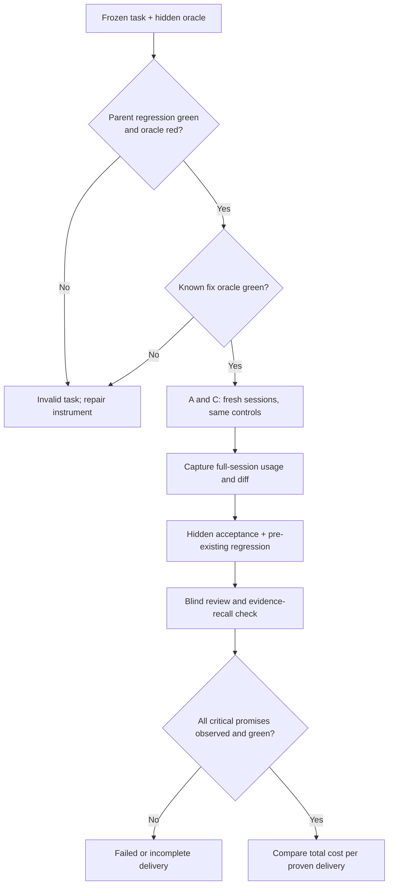

# Keel + GraphHelm code-delivery benchmark

Status: pilot protocol for #1282. A pilot validates the instrument; it does not establish that
the methodology improves software delivery.

## Claim and unit of comparison

The claim is **equal or better delivered-code quality at lower total cost per proven delivery**.
Input-token reduction alone is a diagnostic, not a win. A unit is one independently started
agent session on one frozen task and one arm. A paired task uses the same parent commit, issue
text, model, spending limit, tool permissions, environment, and hidden evaluator. The treatment
is the only intended difference:

| Arm | Agent context |
| --- | --- |
| A | Ordinary coding tools and the task prompt. |
| B | A plus GraphHelm MCP. Historical arm; useful for separating effects later. |
| C | A plus GraphHelm MCP and the pinned Keel skill. Primary treatment. |

Pin exact model ID, CLI version, GraphHelm executable digest, MCP configuration digest, Keel
skill digest, task snapshot, and evaluator digest in each row. Run in fresh isolated checkouts
without a remote. Disable incidental user/project customization or record it and mark the pair
confounded. Counterbalance arm order across tasks to reduce warm-cache and time-of-day effects.
Do not reuse an agent session, patch, or learned answer between arms. Keep model fallback disabled.
Record the Claude executable's absolute path, `--version`, and SHA-256 before launch, then
recheck its SHA-256 after the session; a changed or missing executable makes the run incomplete.
The GraphHelm Runtime used by B or C must be scoped to that frozen checkout with its own event
store; pointing the MCP tool at a live Runtime for the current repository can reveal the later
fix and invalidates the pair. A digest of a live MCP config does not solve that leak.

## Qualify a task before spending model tokens

1. Archive the parent commit and verify the checkout has no remote or future fix.
2. Run the pre-existing regression observer on that parent. It must pass.
3. Add the hidden acceptance oracle to a separate evaluator copy of that parent. It must fail for
   the intended defect, rather than a missing dependency, syntax error, or broken harness.
4. Run the same oracle on the known historical fix. It must pass. Keep the oracle outside the
   agent's checkout until the session ends. Hash its bytes and command before starting either arm.
5. Reject a task whose outcome depends on unavailable credentials, live infrastructure, or
   uncontrolled time. If no adequate regression observer exists, record `UNOBSERVED` and do not
   count its output as a quality win.

The current runner includes tasks 1145, 1044, and 1279. Task 1279 has a calibrated parent,
regression observer, hidden oracle, and known fix, but remains a single-task pilot; task 1044
still needs a calibrated regression observer before it can qualify for the main comparison.
These tasks cannot represent GraphHelm's broader workload. A future frozen
set should include an ordinary bug, a compatibility change, a public API change, persistence or
concurrency, JavaScript/TypeScript/Vue, and a partial-index-coverage case. Freeze tasks and
oracles before reading arm results. Include zero-result and partial-coverage retrieval cases;
fallback must find mandatory evidence or report it missing.

## Run and evaluate

For each arm, collect the whole session: input, output, cache-read and cache-write tokens;
the CLI's estimated model cost in dollars (and actual billed cost only when available); elapsed
agent and evaluator time; tool calls; attempts, repairs and
failures; initial commit and final diff. Count index construction, context compilation, reviews,
watchdog calls and retries whenever the arm pays for them. Do not substitute a final-turn usage
block for transcript-wide usage. If any usage source is missing or contradictory, mark the cost
`INCOMPLETE` and do not compute a saving. Keep model spend separate from machine time; report both.
Record preflight and agent-checkout seconds separately from agent session seconds. Each preflight
observer uses its own exact-SHA source snapshot; only the agent checkout needs Git metadata.

After the agent exits, first run the declared regression command on the submitted checkout and
record it as `submittedSuite`. A red submitted suite blocks proven delivery, but a green one is
only development evidence because the agent can edit its tests. Then restore the historical
regression files and run that observer on the same final patch; install the hidden oracle last.
Record each exit and diagnostic separately. A task without a declared command reports
`submittedSuite=UNOBSERVED`. Then have a reviewer who cannot see the arm label inspect the diff
against a fixed rubric: requested behavior,
preserved behavior, security, maintainability, and unnecessary surface. The reviewer must name
the diff SHA and concrete findings. Blind review is supporting evidence; it cannot turn a red
oracle green. Agent-written tests are useful development evidence, not an independent acceptance
oracle. Run a platform-specific observer separately when portability is part of the task promise;
a green Windows result does not imply a green POSIX result.

For B/C, inspect the agent's session transcript and the private GraphHelm event journal. The
methodology observer requires successful `start`, `briefing`, `compile_context`, and `signal` MCP
calls in one session; `start` and `signal` must appear as events under that run's actor and
execution ID. The recorded signal's envelope hash must match the private evidence file and its
evidence must name the proof command and outcome. C also requires a nonempty JSON Keel card with
relative exact paths, promise, named defect, and proof command. The MCP `evidence` tool reads
existing evidence; it does not record notes.
An absent or refused method step is `INCOMPLETE`, even when code tests pass. This observer proves
the steps occurred; it does not prove the agent made every code choice from the card.

The primary binary result is **proven delivery**: hidden acceptance passes, every pre-existing
reached regression passes, mandatory evidence is recalled, and no critical blind-review finding
remains. Missing observers, missing usage, timeout, or evaluator error are reported separately;
none is a pass. Preserve every attempt, including red ones. The primary cost metric is total
dollars for all attempts divided by proven deliveries; if there are no proven deliveries, the
ratio is undefined. On a subscription, CLI `total_cost_usd` is an estimate, not a bank charge;
label the result accordingly. Secondary metrics are full-session tokens (by category), wall time, repair
count, and proof-stage cost. Never report a lower token count from a failed arm as a saving.

Start with a small instrument pilot, then freeze at least six diverse tasks before drawing a
directional result. Compare paired outcomes per task, disclose every failure, and use intervals
or paired bootstrap estimates for cost and time; a median alone hides uncertainty with a small
sample. The acceptance bar for the methodology is no loss of critical behavior or regression
protection, complete evidence recall, and lower total cost per proven delivery. A pilot with two
tasks can reveal instrument defects but cannot establish that bar.

## Flow

## Current limits

`tools/development-benchmark` measures retrieval/context efficiency and mandatory-evidence
recall; it does not observe generated code or a complete coding session. `tools/token-bench`
observes real agent sessions but has a tiny historical corpus. Neither instrument, by itself,
proves that Keel prevents regressions. The paired code-delivery runner is the bridge; its first
job is to reject false green and incomplete cost rows. The
[task 1279 runner-v11 pilot](benchmark-evidence/task-1279-v11/README.md) retains the three
agent patches and blind-review outcomes. It is an instrument check, not a methodology win.
The [test-proof sensitivity replay](benchmark-evidence/task-1279-proof-sensitivity/README.md)
replays the three authored tests against the frozen defect and their patches. It does not
measure the effect of deleting unit tests.

## Test-portfolio comparison to run next

The separate hypothesis is that removing redundant tests, or replacing them with a stronger
observer, lowers **total cost per proven delivery without losing unique defect detection**.
Compare current Keel with current Keel plus a compact proof receipt and permission to prune a
test only when another observer covers the same obligation. Do not mix this treatment with an
AX executor or a different model route. Freeze paired tasks, initial source, hidden defects,
observer commands, relevant platforms, and spending limits before running either arm; balance
arm order. Include cases where a unit, property, concurrency, or security test is the smallest
adequate observer, and cases requiring a real process or user journey. A task with no redundant
tests is a valid zero-pruning result.

For each retained, replaced, or removed test, record its criterion, plausible defect, independent
expected value, observed boundary, platform and runtime mode, RED cause on the frozen defect,
GREEN result on the known fix, and any remaining observer that covers its obligation. Report
authored-test count, unique defects detected and missed, false greens, test run and repair time,
review time, model spend, and complete delivery cost separately. A test-count reduction or a
RED/GREEN result alone is not a quality win; no arm passes if a required obligation loses its
observer. Keep this comparison separate from the existing A/B/C methodology study until its
instruments are calibrated.

## First instrument check (2026-09-24)

Task 1145 passed the three controls: 29/29 pre-existing regression assertions on its parent,
6/36 hidden-oracle failures on that parent for the intended defect, and 36/36 hidden-oracle
assertions on the known fix. A first live A attempt then hit an expired Claude OAuth session
before any model tokens were used. The runner's initial verdict treated that as a task failure;
the corrected verdict classifies zero-token/zero-cost agent errors as `INCOMPLETE`. No A/C result
or cost-saving claim comes from that attempt.

An isolated fixture-only GraphHelm Runtime was started successfully on a dynamic loopback port
with a private event store and token. Its startup reported `model=false, tools=false`. That mode
can pilot the MCP workflow, but it cannot measure benefits of a real GraphHelm tool executor or
repository index. If the Runtime's model executor is enabled, this runner marks its cost
`INCOMPLETE` until that executor's model usage is added to session accounting. A later
full-methodology study needs the real executor, calibrated diverse
tasks, complete session accounting, and blind reviews.

## First live coding pilot (2026-09-24)

After Claude authentication, task 1145 was run sequentially from the same frozen parent with the
same hidden acceptance, pre-existing regression, requested `sonnet` route, USD 1.50 cap, and
12-minute agent limit. An initial C launch failed before model execution because the Windows
host encoded the pinned Keel skill using its legacy code page. #1279 fixed the runner to send
UTF-8. The failed launch remains an incomplete historical row.

| Arm | Agent time | First code edit | Hidden acceptance | Old regression | Final cost |
| --- | ---: | ---: | --- | --- | --- |
| A: ordinary | 485.5 s | about 84 s | 4/36 failed | 1/29 failed | USD 0.7924 CLI estimate |
| B: GraphHelm | 721.2 s, timeout | about 175 s | 4/36 failed | 1/29 failed | unobserved |
| C: GraphHelm + Keel | 720.3 s, timeout | none | 6/36 failed | 29/29 passed | unobserved |

None delivered proven code. B and C had partial local transcripts, but a timeout prevented a
terminal cost receipt. A's CLI model usage included Haiku and Sonnet while the coding transcript
named Sonnet; its CLI turn count also exceeded distinct assistant message IDs. Those accounting
questions remain open in #1276. #1280 now pins the Claude session ID before launch so future
timeouts retain identifiable partial transcript usage; partial usage is never a complete cost.

B called GraphHelm `start`, `briefing`, and `compile_context` and produced a patch before timing
out. C also called GraphHelm, but did not reach a code edit or final signal. The isolated Runtime
reported `model=false, tools=false`, so this pilot did not test a full GraphHelm tool executor or
index-assisted retrieval. Task 1145 concerns the old PostgreSQL gate and is unsuitable as the
sole representative of ordinary development. The C prompt forced the full GraphHelm/Keel flow;
the broader study must choose the risk-proportional Keel route before each task, including a
direct route where the method permits it. These single-run timing differences suggest possible
workflow overhead, not a causal cost or quality verdict.

The next calibrated task should be small enough to finish under the shared cap, then be followed
by the frozen diverse corpus, complete accounting, and blind patch review specified above. Full
run details and failed rows are retained in #1276; the broader study is tracked by #1282.
