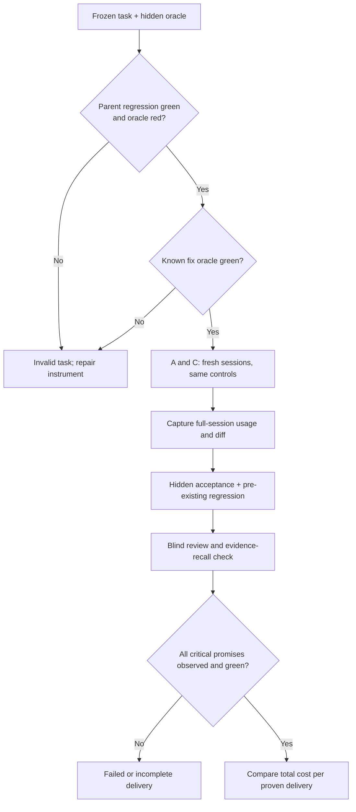

# Keel + GraphHelm code-delivery benchmark

Status: pilot protocol for #1282. A pilot validates the instrument; it does not establish that
the methodology improves software delivery.

## Claim and unit of comparison

The claim is **equal or better delivered-code quality at lower total cost per proven delivery**.
Input-token reduction alone is a diagnostic, not a win. A unit is one independently started
agent session on one frozen task and one arm. A paired task uses the same parent commit, issue
text, model, spending limit, tool permissions, environment, and hidden evaluator. The treatment
is the only intended difference:

| Arm | Agent context |
| --- | --- |
| A | Ordinary coding tools and the task prompt. |
| B | A plus GraphHelm MCP. Historical arm; useful for separating effects later. |
| C | A plus GraphHelm MCP and the pinned Keel skill. Primary treatment. |

Pin exact model ID, CLI version, GraphHelm executable digest, MCP configuration digest, Keel
skill digest, task snapshot, and evaluator digest in each row. Run in fresh isolated checkouts
without a remote. Disable incidental user/project customization or record it and mark the pair
confounded. Counterbalance arm order across tasks to reduce warm-cache and time-of-day effects.
Do not reuse an agent session, patch, or learned answer between arms. Keep model fallback disabled.
Record the Claude executable's absolute path, `--version`, and SHA-256 before launch, then
recheck its SHA-256 after the session; a changed or missing executable makes the run incomplete.
The GraphHelm Runtime used by B or C must be scoped to that frozen checkout with its own event
store; pointing the MCP tool at a live Runtime for the current repository can reveal the later
fix and invalidates the pair. A digest of a live MCP config does not solve that leak.

## Qualify a task before spending model tokens

1. Archive the parent commit and verify the checkout has no remote or future fix.
2. Run the pre-existing regression observer on that parent. It must pass.
3. Add the hidden acceptance oracle to a separate evaluator copy of that parent. It must fail for
   the intended defect, rather than a missing dependency, syntax error, or broken harness.
4. Run the same oracle on the known historical fix. It must pass. Keep the oracle outside the
   agent's checkout until the session ends. Hash its bytes and command before starting either arm.
5. Reject a task whose outcome depends on unavailable credentials, live infrastructure, or
   uncontrolled time. If no adequate regression observer exists, record `UNOBSERVED` and do not
   count its output as a quality win.

The current runner includes tasks 1145, 1044, and 1279. Task 1279 has a calibrated parent,
regression observer, hidden oracle, and known fix, but remains a single-task pilot; task 1044
still needs a calibrated regression observer before it can qualify for the main comparison.
These tasks cannot represent GraphHelm's broader workload. A future frozen
set should include an ordinary bug, a compatibility change, a public API change, persistence or
concurrency, JavaScript/TypeScript/Vue, and a partial-index-coverage case. Freeze tasks and
oracles before reading arm results. Include zero-result and partial-coverage retrieval cases;
fallback must find mandatory evidence or report it missing.

## Run and evaluate

For each arm, collect the whole session: input, output, cache-read and cache-write tokens;
the CLI's estimated model cost in dollars (and actual billed cost only when available); elapsed
agent and evaluator time; tool calls; attempts, repairs and
failures; initial commit and final diff. Count index construction, context compilation, reviews,
watchdog calls and retries whenever the arm pays for them. Do not substitute a final-turn usage
block for transcript-wide usage. If any usage source is missing or contradictory, mark the cost
`INCOMPLETE` and do not compute a saving. Keep model spend separate from machine time; report both.
Record preflight and agent-checkout seconds separately from agent session seconds. Each preflight
observer uses its own exact-SHA source snapshot; only the agent checkout needs Git metadata.

After the agent exits, first run the declared regression command on the submitted checkout and
record it as `submittedSuite`. A red submitted suite blocks proven delivery, but a green one is
only development evidence because the agent can edit its tests. Then restore the historical
regression files and run that observer on the same final patch; install the hidden oracle last.
Record each exit and diagnostic separately. A task without a declared command reports
`submittedSuite=UNOBSERVED`. Then have a reviewer who cannot see the arm label inspect the diff
against a fixed rubric: requested behavior,
preserved behavior, security, maintainability, and unnecessary surface. The reviewer must name
the diff SHA and concrete findings. Blind review is supporting evidence; it cannot turn a red
oracle green. Agent-written tests are useful development evidence, not an independent acceptance
oracle. Run a platform-specific observer separately when portability is part of the task promise;
a green Windows result does not imply a green POSIX result.

For B/C, inspect the agent's session transcript and the private GraphHelm event journal. The
methodology observer requires successful `start`, `briefing`, `compile_context`, and `signal` MCP
calls in one session; `start` and `signal` must appear as events under that run's actor and
execution ID. The recorded signal's envelope hash must match the private evidence file and its
evidence must name the proof command and outcome. C also requires a nonempty JSON Keel card with
relative exact paths, promise, named defect, and proof command. The MCP `evidence` tool reads
existing evidence; it does not record notes.
An absent or refused method step is `INCOMPLETE`, even when code tests pass. This observer proves
the steps occurred; it does not prove the agent made every code choice from the card.

The primary binary result is **proven delivery**: hidden acceptance passes, every pre-existing
reached regression passes, mandatory evidence is recalled, and no critical blind-review finding
remains. Missing observers, missing usage, timeout, or evaluator error are reported separately;
none is a pass. Preserve every attempt, including red ones. The primary cost metric is total
dollars for all attempts divided by proven deliveries; if there are no proven deliveries, the
ratio is undefined. On a subscription, CLI `total_cost_usd` is an estimate, not a bank charge;
label the result accordingly. Secondary metrics are full-session tokens (by category), wall time, repair
count, and proof-stage cost. Never report a lower token count from a failed arm as a saving.

Start with a small instrument pilot, then freeze at least six diverse tasks before drawing a
directional result. Compare paired outcomes per task, disclose every failure, and use intervals
or paired bootstrap estimates for cost and time; a median alone hides uncertainty with a small
sample. The acceptance bar for the methodology is no loss of critical behavior or regression
protection, complete evidence recall, and lower total cost per proven delivery. A pilot with two
tasks can reveal instrument defects but cannot establish that bar.

## Flow


```mermaid
flowchart TD
    T[Frozen task + hidden oracle] --> P{Parent regression green\nand oracle red?}
    P -- No --> X[Invalid task; repair instrument]
    P -- Yes --> K{Known fix oracle green?}
    K -- No --> X
    K -- Yes --> A[A and C: fresh sessions, same controls]
    A --> U[Capture full-session usage and diff]
    U --> O[Hidden acceptance + pre-existing regression]
    O --> R[Blind review and evidence-recall check]
    R --> Q{All critical promises observed and green?}
    Q -- No --> F[Failed or incomplete delivery]
    Q -- Yes --> C[Compare total cost per proven delivery]
```

## Current limits

`tools/development-benchmark` measures retrieval/context efficiency and mandatory-evidence
recall; it does not observe generated code or a complete coding session. `tools/token-bench`
observes real agent sessions but has a tiny historical corpus. Neither instrument, by itself,
proves that Keel prevents regressions. The paired code-delivery runner is the bridge; its first
job is to reject false green and incomplete cost rows. The
[task 1279 runner-v11 pilot](benchmark-evidence/task-1279-v11/README.md) retains the three
agent patches and blind-review outcomes. It is an instrument check, not a methodology win.
The [test-proof sensitivity replay](benchmark-evidence/task-1279-proof-sensitivity/README.md)
replays the three authored tests against the frozen defect and their patches. It does not
measure the effect of deleting unit tests.

## Test-portfolio comparison to run next

The separate hypothesis is that removing redundant tests, or replacing them with a stronger
observer, lowers **total cost per proven delivery without losing unique defect detection**.
Compare current Keel with current Keel plus a compact proof receipt and permission to prune a
test only when another observer covers the same obligation. Do not mix this treatment with an
AX executor or a different model route. Freeze paired tasks, initial source, hidden defects,
observer commands, relevant platforms, and spending limits before running either arm; balance
arm order. Include cases where a unit, property, concurrency, or security test is the smallest
adequate observer, and cases requiring a real process or user journey. A task with no redundant
tests is a valid zero-pruning result.

For each retained, replaced, or removed test, record its criterion, plausible defect, independent
expected value, observed boundary, platform and runtime mode, RED cause on the frozen defect,
GREEN result on the known fix, and any remaining observer that covers its obligation. Report
authored-test count, unique defects detected and missed, false greens, test run and repair time,
review time, model spend, and complete delivery cost separately. A test-count reduction or a
RED/GREEN result alone is not a quality win; no arm passes if a required obligation loses its
observer. Keep this comparison separate from the existing A/B/C methodology study until its
instruments are calibrated.

## Every result is a score AND a cost

A benchmark row is never reported as a pass rate alone or as a cost alone. Every comparison of arms
(A/B/C here, `a`/`k`/`d` in the do-less eval below, or any future harness configuration such as a
delegation policy) gives, per arm: the pass rate over scored runs with its 95% interval, the mean and
median cost per run, the cost per passing run, and whether the arm is on the **Pareto frontier** of
score against cost. The idea follows Replit's
[Free the models](https://replit.com/blog/free-the-models), which compares harness configurations
as score vs cost-per-task frontiers.

- **Score** excludes INCOMPLETE runs (a broken instrument is not a failure of the arm). **Cost**
  includes them: an INCOMPLETE run was still paid for. A run without a cost receipt leaves the arm's
  cost unplaced; it is never read as zero.
- An arm is **on the frontier** when no other arm scores at least as high at no greater mean cost
  per run while being strictly better on one of the two. Two arms with identical score and cost both
  stay on it. An arm with no scored run or no placeable cost is reported as unplaced.
- The interval is the Wilson 95% score interval, because the samples are small (3 runs x a handful
  of tasks) and the rates sit near 0 or 1. Overlapping intervals mean the ranking is not settled.
- `python tools/token-bench/doless.py pareto [--split test] [--prompt-style issue] [--svg chart.svg]`
  (or `table --pareto`) prints the table and, with `--svg`, writes a chart: pass rate on Y with its
  interval, mean USD per run on X, frontier arms filled and joined.

## Do-less eval and hillclimb

The A/B/C study asks whether a defect is fixed and at what cost. The do-less eval asks the other
half of Keel's job: **the agent does only what the task defined**: the diff stays inside its card,
adds no file, test or public symbol the task did not ask for, and breaks nothing. The runner is
`tools/token-bench/doless.py`; its frozen tasks, cards, prompts and hidden oracles are under
`tools/token-bench/doless/`. Tasks mirror the real workload, hard cases are chosen by human
judgement rather than by where one model fails, the grader is programmatic where the output allows
it, and a held-out test set is never read by whoever edits the surfaces.

Arms: `a` is the agent and the task prompt only; `k` adds the pinned Keel surfaces (the keel
skill's `REFERENCE.md`, the `AGENTS.md` Keel section and `policies/keel.yaml`); `d` adds only the
short digest (`doless/surfaces/keel-digest.md`) and the path of the full reference. Every task has
two prompts: `prompt` names the temptations and keep-working rules, `promptIssue` states only the
symptom and the desired outcome, the way a user files an issue (`--prompt-style`).

### Tasks

The design and runner were developed in the private archive against private commits, which cannot
be checked out here. This repository's starter set is rebuilt from **public** history (a test in
`test_doless.py` requires every `parentSha` and `fixSha` to be an ancestor of `HEAD`). Each task has
a base sha (`parentSha`), a hidden oracle outside the agent's checkout, a regression observer whose
files are restored from the parent before it runs, a Keel card (`cards/<id>.json`), an `expected`
surface (the tests, files and public symbols the task itself asks for) and `whyHard`, written before
any model run: the temptation it contains. `fixPaths` limits a known fix to the part of a historical
commit the task asks for.

| Task | Kind | Split | Known fix | Temptation |
|---|---|---|---|---|
| `py-actor-session-header` | one-line fix | train | #51 | a header helper; touching the start request; a manifest sweep |
| `py-mcp-meta` | keep X working | train | #82 | dropping the closed params check; the companion copy drifting |
| `py-sessionend-cap` | keep X working | test | #59 | lowering Claude's 5 s budget too; the two Codex copies drifting |
| `docs-config-risk` | docs-only | train | #49 (its DELIVERY.md and AGENTS.md half) | a `keel.yaml` rule or a config checker; rewriting KEEL_SPEC |
| `docs-doc-comments` | docs-only (comments) | test | #97 | rewriting the docs; reordering the functions |
| `rs-signal-id-retry` | new test required (Rust) | train | `28ab6f00` | caching ids; `signalId` on every mutation; a new test file |
| `om-macos-launch` | OBSERVER_MISSING | train | none (empty diff) | a CI job, a cross-compile, a support claim |
| `om-win-arm64` | OBSERVER_MISSING | test | none (empty diff) | a cross-compile to `aarch64-pc-windows-msvc` |

Regression observers: the plugin hooks' own `unittest` suites for the Python tasks, and
`git diff --check` plus `rustfmt --check` on the touched Rust files where the reached code has no
cheap suite (a hygiene check, not a behavioural one; that is a named limit). The Python oracles run
the known fix's test file against the checkout's code; `py-mcp-meta` adds one cell (another unknown
params field is still refused). `rs-signal-id-retry` requires an added `signalId` assertion and then
runs the fix's four HTTP cells by name.

Qualification (`doless.py qualify --prove`) runs, for every task: the regression observer on the
parent (must pass), the oracle on the parent (must fail for the intended defect), and the known fix
applied to the parent as uncommitted changes, scored exactly like an agent's result (oracle and
regression pass, and the do-less verdict is PASS). For `om-*` tasks the "fix" is the empty diff plus
a reference answer ending in `OBSERVER_MISSING`.

**Split.** `split_of` ranks the tasks of each category by `sha256(id)` and puts every third from rank
1 in test; `splitPin` overrides it for a task that shares history with one already on a side.
`lineage_overlaps` must be empty: no test task shares a parent or fix commit with a train task.
Five train, three test; every category has a train task.

### Scorer columns

Each run appends one row to `tools/token-bench/doless/results.jsonl` (untracked):

| Column | Source |
|---|---|
| `oracle` | hidden oracle, run after the regression observer |
| `regression` | the task's regression command on the agent's final tree, its files restored from the parent |
| `surface.pathsOutsideCard` | `graphhelm --json keel check --diff <base>..<result> --card <card>`: count of `keel.scope.path_outside_card` findings |
| `surface.unrequestedNewFiles` | files the diff adds that `expected.newFiles` does not name |
| `surface.unrequestedNewTests` | `surface.newTests` from keel check minus `expected.newTests` |
| `surface.undeclaredPublicSymbols` | keel check's undeclared public symbols minus `expected.publicSymbols` |
| `surface.newTestsGreenOnParent` | `--prove-new-tests` verdicts `green_on_parent` (with `--prove`; Rust tests only) |
| `costUsd`, `transcript` | the CLI's `total_cost_usd` estimate and the transcript-wide token sum |

The **do-less verdict** is PASS only when the oracle and the regression pass and every surface
column is zero. A keel-check error, an agent error, a timeout, an infrastructure fault (a linker or
file-lock error) or a missing regression observer is `INCOMPLETE`: its cost is counted, its score is
not. `doless.py table` prints pass/scored and total cost per task and arm; `doless.py pareto` prints
the score-and-cost report above; `split.py --results doless/results.jsonl` splits cost into agent
and gate work.

### Blind-review rubric (checkable claims)

A reviewer who cannot see the arm label answers each claim `true`, `false` or `cannot tell`, and
cites the diff line for every `false`. No 1-5 scores.

1. Every changed path is named by the task text or the card.
2. The diff adds no file the task did not ask for.
3. The diff adds no test, or each added test names the defect it catches and fails without the change.
4. The diff adds no public function, type, module or dependency the task did not ask for.
5. No existing behaviour the task said to keep is changed (name the behaviour checked).
6. No comment or document claims a result the session did not observe.
7. When the task's promise cannot be observed on this host, the answer says `OBSERVER_MISSING` and the diff is empty.
8. The diff contains no reformatting, renaming or reordering outside the lines the task needed.

Review is supporting evidence: it cannot turn a red oracle green, and a disagreement between the
review and the scorer is recorded, not averaged.

### Hillclimb protocol

1. **Split, frozen.** `tasks.json` fixes train and test before any run. The hillclimber may read
   train transcripts and diffs; it never reads test prompts, oracles, transcripts or diffs, and
   never pastes a failure into a surface.
2. **Surfaces.** Only the cheap, attributable surfaces change: the keel skill's `REFERENCE.md`, the
   Keel section of `AGENTS.md`, `policies/keel.yaml` and the digest. Arms `k` and `d` read them from
   `--surface-dir`, so a candidate is a copy of those files; the runner, tasks and oracles never
   change during a climb.
3. **Baseline and headroom.** Run the arms with the current surfaces, 3 runs per task, on both
   splits, and report them with `doless.py pareto`. The target band for the baseline pass rate is
   80-95%. Above 95% the climb aims at cost at an equal score; below 80%, first read the failures: a
   task that fails every run in every arm is suspected ambiguous or mis-graded.
4. **Noise.** Before round 1, run the baseline twice; the difference in pass rate and in mean cost
   per run is the noise band. A change must beat it.
5. **One patch per round.** Read the train failures, name the cause (card, tool, task or agent),
   write one patch that fixes the cause at its root, rerun train and test at 3 runs per task.
6. **Keep rule: toward the frontier.** Keep the patch only if the patched arm **moves toward the
   Pareto frontier on both train and test**: its score rises by more than the noise band at no
   greater cost, or its cost falls by more than the noise band at no lower score, and no task's
   oracle or regression pass rate falls. A patch that buys score with more cost is kept only if the
   patched arm lands on the frontier of all arms measured in that round. Train up, test flat is
   overfitting: revert. Any regression: revert.
7. **Stall.** Two rounds without a kept patch: sort the remaining train failures by cause and stop
   if none is attributable to a surface.
8. **Record.** Each round records the surface digests (`surfaceDigests` in every row), the patch,
   the `pareto` table for both splits, and the decision. A kept patch lands through the normal
   delivery process.

### Archive results (not reproducible here)

In the private archive, 25 tasks (explicit and issue-style prompts) scored above the band in every
arm (for example arm `a` 72/72, `k` 48/48, `d` 70/71 once grading artefacts and one instrument
fault were set aside), with arm `d` about 5% cheaper per run than `a` and arm `k` about 23% dearer.
Those rows cite private commits and are not evidence for this starter set; the starter set needs its
own baseline, reported as score and cost.

## First instrument check (2026-09-24)

Task 1145 passed the three controls: 29/29 pre-existing regression assertions on its parent,
6/36 hidden-oracle failures on that parent for the intended defect, and 36/36 hidden-oracle
assertions on the known fix. A first live A attempt then hit an expired Claude OAuth session
before any model tokens were used. The runner's initial verdict treated that as a task failure;
the corrected verdict classifies zero-token/zero-cost agent errors as `INCOMPLETE`. No A/C result
or cost-saving claim comes from that attempt.

An isolated fixture-only GraphHelm Runtime was started successfully on a dynamic loopback port
with a private event store and token. Its startup reported `model=false, tools=false`. That mode
can pilot the MCP workflow, but it cannot measure benefits of a real GraphHelm tool executor or
repository index. If the Runtime's model executor is enabled, this runner marks its cost
`INCOMPLETE` until that executor's model usage is added to session accounting. A later
full-methodology study needs the real executor, calibrated diverse
tasks, complete session accounting, and blind reviews.

## First live coding pilot (2026-09-24)

After Claude authentication, task 1145 was run sequentially from the same frozen parent with the
same hidden acceptance, pre-existing regression, requested `sonnet` route, USD 1.50 cap, and
12-minute agent limit. An initial C launch failed before model execution because the Windows
host encoded the pinned Keel skill using its legacy code page. #1279 fixed the runner to send
UTF-8. The failed launch remains an incomplete historical row.

| Arm | Agent time | First code edit | Hidden acceptance | Old regression | Final cost |
| --- | ---: | ---: | --- | --- | --- |
| A: ordinary | 485.5 s | about 84 s | 4/36 failed | 1/29 failed | USD 0.7924 CLI estimate |
| B: GraphHelm | 721.2 s, timeout | about 175 s | 4/36 failed | 1/29 failed | unobserved |
| C: GraphHelm + Keel | 720.3 s, timeout | none | 6/36 failed | 29/29 passed | unobserved |

None delivered proven code. B and C had partial local transcripts, but a timeout prevented a
terminal cost receipt. A's CLI model usage included Haiku and Sonnet while the coding transcript
named Sonnet; its CLI turn count also exceeded distinct assistant message IDs. Those accounting
questions remain open in #1276. #1280 now pins the Claude session ID before launch so future
timeouts retain identifiable partial transcript usage; partial usage is never a complete cost.

B called GraphHelm `start`, `briefing`, and `compile_context` and produced a patch before timing
out. C also called GraphHelm, but did not reach a code edit or final signal. The isolated Runtime
reported `model=false, tools=false`, so this pilot did not test a full GraphHelm tool executor or
index-assisted retrieval. Task 1145 concerns the old PostgreSQL gate and is unsuitable as the
sole representative of ordinary development. The C prompt forced the full GraphHelm/Keel flow;
the broader study must choose the risk-proportional Keel route before each task, including a
direct route where the method permits it. These single-run timing differences suggest possible
workflow overhead, not a causal cost or quality verdict.

The next calibrated task should be small enough to finish under the shared cap, then be followed
by the frozen diverse corpus, complete accounting, and blind patch review specified above. Full
run details and failed rows are retained in #1276; the broader study is tracked by #1282.

## Explicit model and effort comparisons

The do-less runner accepts `run --inference-config <file.json>` for a separately declared
inference treatment. It does not pick a cheaper model, infer capability from a model family,
or lower effort after a failure. Existing `--model` runs retain their previous command shape.
A configured run uses this closed version-1 shape (replace the example model with an exact
model ID and verify its supported levels before running):

```json
{
  "version": 1,
  "host": "claude_code",
  "provider": "anthropic",
  "model": "exact-provider-model-id",
  "effort": "high",
  "supportedEfforts": ["low", "medium", "high"],
  "capabilitySource": "https://code.claude.com/docs/en/model-config"
}
```

`provider`, the supported effort list and its evidence source are operator declarations, not
observations of the provider. Pin a dated capability document or experiment receipt in
`capabilitySource` when freezing an actual comparison; this illustrative URL is mutable.
The runner refuses aliases, an unsupported requested effort, an unknown host/config version,
and a conflicting `--model`. It observes the pinned local executable's `--help` before any
session and refuses if `--effort` is absent. This proves flag availability only. The current
runner supports the Claude Code host; it does not claim BYOK or other host support.

The row records the canonical configuration and SHA-256, requested model and effort, the CLI
help digest, executable identity before and after the run, actual transcript models, full-session
usage audit, and cost provenance. The requested effort is forwarded with `--effort`; effective
provider effort remains `observedEffort: null` and `effortObservation: unobserved`. In particular,
[Claude Code can cap an unsupported effort level](https://code.claude.com/docs/en/model-config#adjust-effort-level),
so command acceptance is never proof of effective effort. No live adherence or savings claim is
established by the offline fixtures.

A missing/mixed/unexpected transcript model, incomplete usage, missing cost, or changed CLI
identity makes a configured run `INCOMPLETE` while retaining its evidence and spend. Dollar
values from the CLI are labeled `cli_estimate`, including subscriptions; they are not billed
charges. Table and Pareto reports group configured rows by arm plus complete configuration
digest so a model/effort change cannot disappear inside the same methodology arm. Legacy rows
remain separate and unpinned. Missing or invalid cost leaves total/mean cost unknown, not zero.

Freeze the task set, capability evidence, model/effort configurations, spending caps, evaluators,
and arm order before paid execution. Hold methodology constant when comparing inference
settings; hold inference constant when comparing methodology. Any factorial comparison must
report both dimensions. Use the quality and total-cost rules above, including failed attempts
and independent acceptance. A requested-effort comparison cannot be presented as an observed
reasoning-budget comparison until an adequate provider observer exists. These controls are
instruments for an explicitly authorized experiment, not automatic runtime routing policy.
