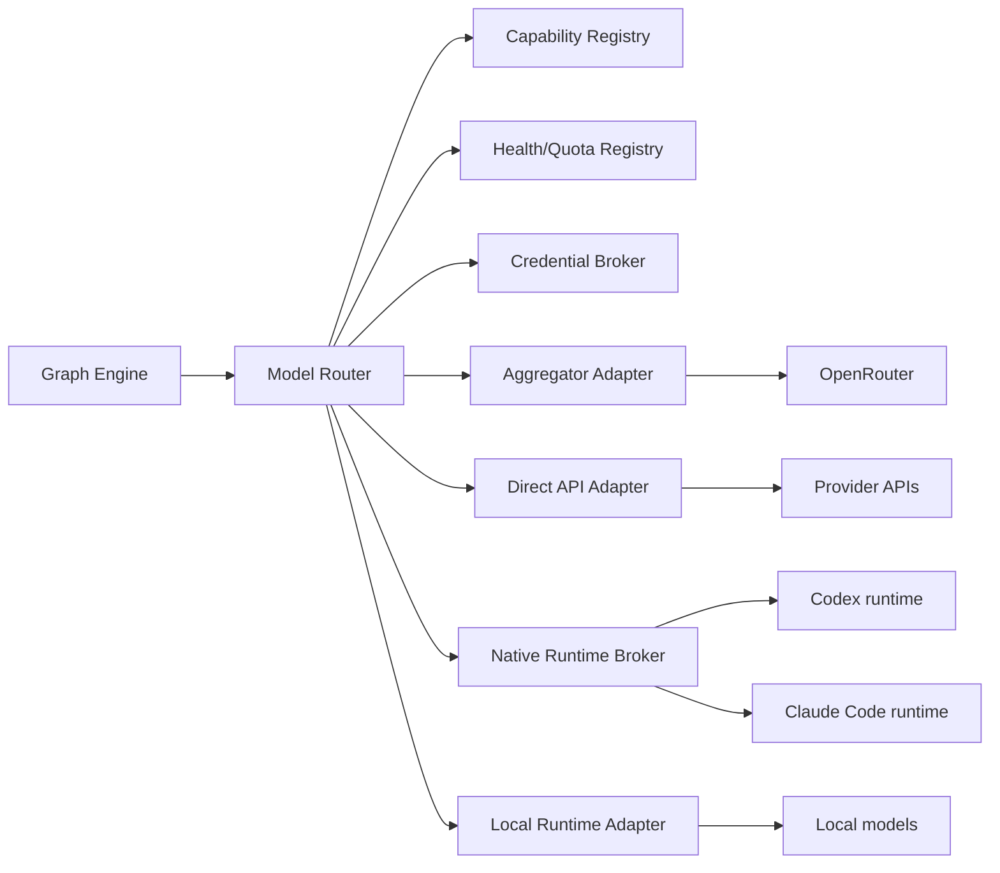

# Universal Model Gateway

## 1. Objective

Offer a common interface for models and runtimes without hiding important differences in capability, authentication, quota, cost, tool use, context, and provider terms.

The gateway does not turn a chat subscription into an arbitrary API. It integrates official runtimes that accept login via the user's account, when the provider offers that path, and integrates BYOK APIs separately.

## 2. Route types

### 2.1 Aggregator

Examples: OpenRouter and equivalent adapters.

Characteristics:

- one credential for multiple models;
- aggregator billing;
- normalized API;
- capabilities may vary from the native provider.

### 2.2 Direct API / BYOK

- OpenAI API;
- Anthropic API;
- xAI API;
- Google/Vertex;
- Bedrock;
- other providers.

The key belongs to the user and lives in the Credential Broker.

### 2.3 Native runtime

- Codex CLI/SDK authenticated via the official flow;
- Claude Code/SDK authenticated via the official flow;
- other future official clients.

Native runtime is an agentic tool with its own semantics. It should not be reduced to `chat.completions` when it has different filesystem/tools/session behavior.

### 2.4 OpenAI-compatible endpoint

vLLM, llama.cpp server, Ollama adapters, and other local/private endpoints.

### 2.5 Local embedded runtime

Model executed on the user's GPU/CPU, with a lifecycle adapter and resource scheduling.

### 2.6 System One judgment models

Examples: TypeSafe AI's Jev.

Characteristics:

- the model returns a typed judgment — one of a closed set (`Choice`), a yes/no probability
  (`Noul`), or a probability-weighted position on ordered levels (`Score`) — never free text;
- every answer carries a probability the caller can threshold;
- independent questions over the same state run in one request, in parallel;
- an order of magnitude cheaper and faster than a chat model on the same decision.

This route family exists for the decisions GraphHelm today pays a full chat completion for:
classifying an issue, selecting a lane or handler for a task, reading a review verdict,
deciding whether a gate result is a pass, a flake or a hang, ranking retrieved evidence.
It sits on the *classify and propose* side of the constitutional invariant: the judgment is a
typed signal; deterministic code still enforces schemas, policies, permissions and state
transitions, and the Policy Engine keeps no dependency on it. A judgment below the caller's
confidence threshold escalates to a reasoning model or a person; it is never acted on silently.
A System One route is selected explicitly by the Model Router like any other route and is never
an automatic paid fallback (§12).

The family is served by `adapters/model-gateway/src/systemone.rs` (`SystemOneAdapter`) on the
architect's judge door only; the manifest provider is `typesafe` over `direct_api`. A `typesafe`
route handed to the draft door refuses `UnsupportedCapability` before any request is built, and a
chat provider handed to the judge door refuses the same way.

Early-access status, the skill agents load, and the live documentation index are recorded in
`docs/reference/PROVIDER_AND_LICENSE_REFERENCES.md`.

## 3. Architecture



## 4. Model Route Manifest

```yaml
model_route:
  id: openai_codex_subscription
  provider: openai
  transport: native_runtime
  runtime: codex
  authentication: account_subscription
  billing_mode: subscription_quota
  capabilities:
    reasoning: high
    software_engineering: high
    repository_navigation: true
    tool_use: true
    image_input: provider_dependent
    structured_output: adapter_managed
  restrictions:
    arbitrary_api_access: false
    credential_export: false
    account_sharing: false
  health:
    state: available
    observed_at: 2026-08-08T12:00:00Z
  capacity:
    remaining: unknown
    recent_throttles: 0
    recommended_parallelism: 1
```

## 5. Capability discovery

The adapter declares and tests:

- input modalities;
- output modalities;
- observed/documented context window;
- tool calling;
- native repository actions;
- structured output support;
- streaming;
- cancellation;
- session resume;
- concurrency;
- authentication status;
- usage reporting;
- safety restrictions;
- prompt cache behavior: `none | implicit_prefix | explicit_breakpoints`, minimum cacheable prefix, cache TTL, and cache write cost multiplier — the fields the compiler's cache-aware assembly (`CONTEXT_KNOWLEDGE_DREAMS.md` §9) aligns to;
- data residency/retention metadata when known.

Capabilities are versioned because providers change.

## 6. Authentication

### 6.1 Principles

- browser opens only the provider's official domain;
- the platform never asks for the provider's password;
- no scraping of web chat;
- no cookie importing;
- no token copied from DevTools;
- use CLI/SDK/OAuth/documented flow;
- credentials stay on the VPS;
- desktop only holds mTLS identity and connection metadata;
- revocation is supported.

### 6.2 Native runtime flow

```text
User clicks Connect
→ Runtime Broker starts official login
→ Studio opens the provider's URL/device flow
→ user authenticates directly
→ official runtime persists the credential in a dedicated vault/namespace
→ broker runs health test
→ capability discovery
→ route becomes available
```

### 6.3 Separation

```text
Model Runtime Sandbox
  - provider credential
  - official client
  - no unrestricted access to the project

Tool Broker boundary

Execution Sandbox
  - project/worktree
  - mediated tools
  - no provider credential
```

When an official runtime requires directory access, it must operate in a dedicated workspace with an isolated secrets namespace and a tools/filesystem policy; never mount the credentials directory inside untrusted code.

## 7. Credential Broker

### 7.1 Store

- encrypted at rest;
- master key separate from the data;
- unseal by the owner;
- optional integration with Vault/KMS;
- access audit;
- rotation/revoke;
- separate encrypted backup.

### 7.2 Secret references

```yaml
secret_ref:
  id: secret_openrouter_primary
  type: api_key
  provider: openrouter
  scope: workspace
  usable_by:
    - model_route: openrouter_main
  exportable: false
```

### 7.3 Lease

The value is resolved only within the authorized process and for the shortest possible time. It never enters a prompt, log, or artifact.

## 8. Model Router

### 8.1 Input

```yaml
model_requirements:
  profiles:
    - critical_reasoning
  modalities:
    input: [text, code]
    output: [structured_text]
  tools:
    repository_read: true
  context_tokens_min: 16000
  independence_from:
    - node: implementation
  privacy:
    local_only: false
  latency_preference: balanced
  cost_preference: economical
```

### 8.2 Candidate filtering

Exclude routes that are:

- not authenticated;
- insufficient in capabilities;
- forbidden by policy;
- unavailable in quota;
- incompatible in data handling;
- in violation of the provider independence requirement;
- insufficient in context;
- unavailable in runtime/platform.

### 8.3 Scoring

Record score components without revealing internal provider details:

```yaml
routing_decision:
  node: security_review
  candidates:
    - route: claude_subscription
      score: 0.91
      factors:
        capability_fit: 0.95
        project_history: 0.90
        independence: 1.00
        health: 0.90
        cost: subscription
    - route: codex_subscription
      score: 0.76
      factors:
        independence: 0.40
  selected: claude_subscription
```

### 8.4 No fixed brand rules

The framework does not hardcode "Claude reviews" or "Codex implements." User configuration may prefer or forbid routes, but the default is capability-based.

## 9. Work profiles

Normative profiles describe the need, not the provider:

- `fast_classification`
- `cheap_extraction`
- `balanced_reasoning`
- `critical_reasoning`
- `long_context_synthesis`
- `software_execution`
- `vision_reasoning`
- `creative_generation`
- `source_grounded_research`
- `local_private`
- `high_reliability_structured_output`

Adapters map models/runtimes to profiles with confidence and local benchmark data.

## 10. Local benchmark

The gateway can run opt-in evals on the project:

- schema compliance;
- repository task success;
- critique quality;
- source citation;
- latency;
- tool reliability;
- token/cost;
- context sensitivity.

Results are local and feed the router. Benchmarking must not send private data to an external registry without opt-in.

## 11. Usage normalization

### 11.1 APIs

- input tokens;
- output tokens;
- cache read tokens and cache write tokens (the effective hit ratio derives from them; a write-heavy pattern can cost more than an uncached call and must be visible);
- tool calls;
- monetary cost;
- rate limits.

### 11.2 Subscriptions

- observed quota state;
- reset when exposed;
- recent throttles;
- observed concurrency;
- route availability;
- task interruption;
- provider banner/status.

Do not invent token counts/cost when the runtime does not provide them.

### 11.3 Local

- GPU seconds;
- CPU seconds;
- memory;
- energy optional;
- queue time;
- model load time.

### 11.4 Graded marginal cost

Every route reports one normalized `marginal_cost` per call, with an explicit grade recorded
alongside the value and the routing decision:

- `exact` — observed monetary cost (APIs/aggregators, §11.1);
- `estimate` — fraction of the observed quota window consumed (subscriptions, §11.2; grading,
  never inventing, per the rule above);
- `unknown` — permitted; a consumer treats it as neutral, never as zero.

This is the contract half only: it defines the unit and the record. Scoring over it and budget
enforcement against it belong to the router and harness implementations.

## 12. Exhausted capacity policy

Normative decision: **pause, with no automatic paid fallback**.

Flow:

1. adapter detects limit/throttle/auth failure;
2. node checkpoint;
3. route health updated;
4. dependent nodes go `waiting_for_model_capacity`;
5. other independent nodes may continue;
6. Studio shows options;
7. user chooses wait, retry, reconnect, manual switch, or cancel;
8. resume from checkpoint.

Manually switching routes creates an event and may invalidate cache/model-dependent output per policy.

## 13. Session management

Native runtimes can maintain a session. The manifest records a session reference, not a credential. Session resume must respect the current Context Capsule; native history must not introduce unaudited context. Options:

- stateless call preferred;
- managed session with redacted transcript artifacts;
- session reset in reviewer blind;
- session pin only within the same node attempt.

## 14. Tool use

Two strategies:

### 14.1 Gateway-native tool calls

Model calls the Tool Broker via schema.

### 14.2 Runtime-native agent tools

Codex/Claude Code may have their own tools. The adapter must:

- map permission modes;
- intercept/log tool operations when supported;
- execute in a dedicated workspace/sandbox;
- forbid access to the credential store;
- produce equivalent artifacts/events;
- declare observability gaps.

If the runtime does not offer sufficient control for a high-risk task, policy may require a more controllable adapter/API or stronger isolation.

## 15. Structured outputs

The gateway attempts, in order:

1. provider-native schema;
2. tool/function output;
3. constrained decoding when available;
4. parser + limited repair attempt;
5. fail `malformed_output`.

Repair never silently changes semantics; the original and repaired output are both preserved.

## 16. Privacy and data policy

Each route declares known metadata:

- consumer/business/API;
- data training controls;
- retention;
- region;
- ZDR availability;
- provider terms reference;
- last verified date.

As these conditions change, metadata needs updating and a warning when stale. User policy decides which routes are permitted by sensitivity.

## 17. Errors

Taxonomy:

- auth_required;
- auth_revoked;
- quota_exhausted;
- rate_limited;
- provider_unavailable;
- model_removed;
- context_too_large;
- malformed_output;
- tool_denied;
- runtime_crashed;
- unsupported_capability;
- policy_denied;
- cancelled;
- timeout.

## 18. Health

Health probes must not consume excessive quota. Use:

- credential/session metadata;
- lightweight status;
- passive errors;
- periodic minimal probe;
- optional provider status adapter.

States:

- available;
- degraded;
- waiting_reset;
- auth_required;
- unavailable;
- disabled.

## 19. User controls

Per route:

- enabled;
- allowed scopes;
- subscription_only;
- max parallelism;
- allowed profiles;
- forbidden data classes;
- manual-only;
- preferred/avoid;
- budget;
- reset/reconnect;
- delete credential.

## 20. Acceptance criteria

- BYOK and subscription are distinct billing modes;
- no web password/cookie is collected;
- credentials never enter the execution sandbox;
- the router logs its decision;
- provider name does not determine a fixed function;
- subscription quota pauses with no paid fallback;
- manual switch works;
- native runtime tools are mediated/audited to the extent supported;
- stale provider metadata generates a warning;
- the local model route is a first-class citizen.
