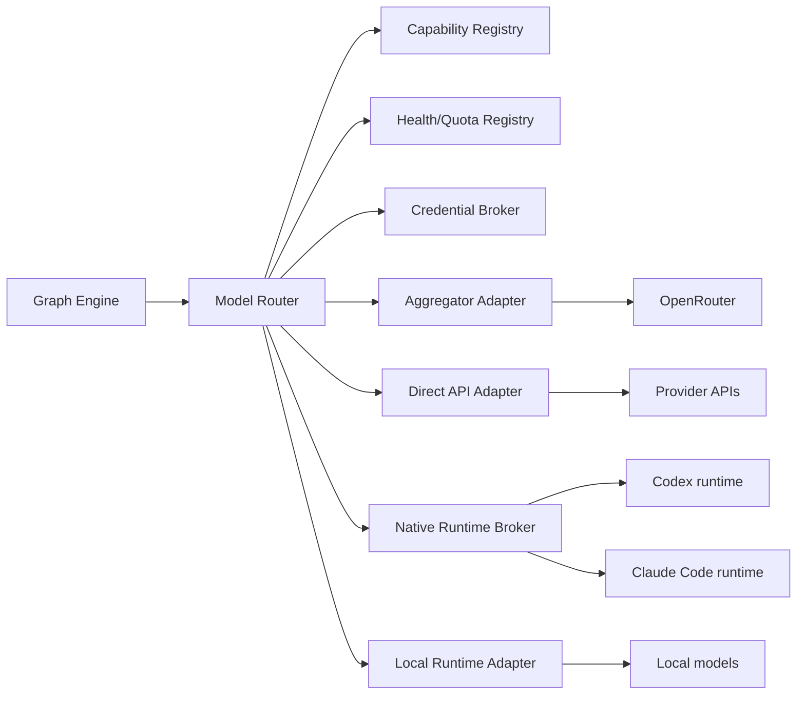

# Universal Model Gateway

## 1. Objetivo

Oferecer uma interface comum para modelos e runtimes sem esconder diferenças importantes de capability, autenticação, quota, custo, tool use, contexto e termos do provedor.

O gateway não transforma uma assinatura de chat em API arbitrária. Ele integra runtimes oficiais que aceitam login da conta do usuário, quando o provedor oferece esse caminho, e integra APIs por BYOK separadamente.

## 2. Tipos de rota

### 2.1 Aggregator

Exemplos: OpenRouter e adapters equivalentes.

Características:

- uma credencial para múltiplos modelos;
- billing do agregador;
- API normalizada;
- capabilities podem variar do provider nativo.

### 2.2 Direct API / BYOK

- OpenAI API;
- Anthropic API;
- xAI API;
- Google/Vertex;
- Bedrock;
- outros providers.

A chave pertence ao usuário e fica no Credential Broker.

### 2.3 Native runtime

- Codex CLI/SDK autenticado por fluxo oficial;
- Claude Code/SDK autenticado por fluxo oficial;
- outros clientes oficiais futuros.

Native runtime é uma ferramenta agentiva com semantics próprias. Não deve ser reduzido a `chat.completions` quando possui filesystem/tools/session behavior diferentes.

### 2.4 OpenAI-compatible endpoint

vLLM, llama.cpp server, Ollama adapters e outros endpoints locais/privados.

### 2.5 Local embedded runtime

Modelo executado em GPU/CPU do usuário, com adapter de lifecycle e resource scheduling.

## 3. Arquitetura


```mermaid
flowchart LR
    GE[Graph Engine] --> MR[Model Router]
    MR --> CR[Capability Registry]
    MR --> HR[Health/Quota Registry]
    MR --> CB[Credential Broker]
    MR --> A1[Aggregator Adapter]
    MR --> A2[Direct API Adapter]
    MR --> A3[Native Runtime Broker]
    MR --> A4[Local Runtime Adapter]
    A3 --> COD[Codex runtime]
    A3 --> CLA[Claude Code runtime]
    A2 --> API[Provider APIs]
    A1 --> OR[OpenRouter]
    A4 --> LOC[Local models]
```

## 4. Model Route Manifest

```yaml
model_route:
  id: openai_codex_subscription
  provider: openai
  transport: native_runtime
  runtime: codex
  authentication: account_subscription
  billing_mode: subscription_quota
  capabilities:
    reasoning: high
    software_engineering: high
    repository_navigation: true
    tool_use: true
    image_input: provider_dependent
    structured_output: adapter_managed
  restrictions:
    arbitrary_api_access: false
    credential_export: false
    account_sharing: false
  health:
    state: available
    observed_at: 2026-08-08T12:00:00Z
  capacity:
    remaining: unknown
    recent_throttles: 0
    recommended_parallelism: 1
```

## 5. Capability discovery

Adapter declara e testa:

- input modalities;
- output modalities;
- context window observada/documentada;
- tool calling;
- native repository actions;
- structured output support;
- streaming;
- cancellation;
- session resume;
- concurrency;
- authentication status;
- usage reporting;
- safety restrictions;
- data residency/retention metadata quando conhecido.

Capabilities são versionadas porque providers mudam.

## 6. Autenticação

### 6.1 Princípios

- browser abre apenas domínio oficial do provider;
- plataforma nunca solicita senha do provider;
- sem scraping de web chat;
- sem importar cookies;
- sem token copiado de DevTools;
- usar CLI/SDK/OAuth/documented flow;
- credentials ficam na VPS;
- desktop guarda somente identidade mTLS e metadata de conexão;
- revogação é suportada.

### 6.2 Fluxo de runtime nativo

```text
Usuário clica Conectar
→ Runtime Broker inicia login oficial
→ Studio abre URL/device flow do provider
→ usuário autentica diretamente
→ runtime oficial persiste credencial no vault/namespace dedicado
→ broker executa health test
→ capability discovery
→ route fica available
```

### 6.3 Separação

```text
Model Runtime Sandbox
  - credencial do provider
  - cliente oficial
  - sem acesso irrestrito ao projeto

Tool Broker boundary

Execution Sandbox
  - projeto/worktree
  - tools mediadas
  - sem credencial do provider
```

Quando runtime oficial exige acesso ao diretório, ele deve operar em workspace dedicado com secrets namespace isolado e policy de tools/filesystem; nunca montar o diretório de credenciais dentro de código não confiável.

## 7. Credential Broker

### 7.1 Store

- encrypted at rest;
- master key separada dos dados;
- unseal pelo owner;
- integração opcional com Vault/KMS;
- audit de acesso;
- rotation/revoke;
- backup criptografado separado.

### 7.2 Secret references

```yaml
secret_ref:
  id: secret_openrouter_primary
  type: api_key
  provider: openrouter
  scope: workspace
  usable_by:
    - model_route: openrouter_main
  exportable: false
```

### 7.3 Lease

Valor é resolvido somente no processo autorizado e pelo menor tempo possível. Não entra em prompt, log ou artifact.

## 8. Model Router

### 8.1 Input

```yaml
model_requirements:
  profiles:
    - critical_reasoning
  modalities:
    input: [text, code]
    output: [structured_text]
  tools:
    repository_read: true
  context_tokens_min: 16000
  independence_from:
    - node: implementation
  privacy:
    local_only: false
  latency_preference: balanced
  cost_preference: economical
```

### 8.2 Candidate filtering

Excluir rotas:

- não autenticadas;
- capabilities insuficientes;
- proibidas por policy;
- quota indisponível;
- data handling incompatível;
- provider independence requirement violado;
- context insuficiente;
- runtime/platform indisponível.

### 8.3 Scoring

Registrar componentes do score sem revelar detalhes internos do provider:

```yaml
routing_decision:
  node: security_review
  candidates:
    - route: claude_subscription
      score: 0.91
      factors:
        capability_fit: 0.95
        project_history: 0.90
        independence: 1.00
        health: 0.90
        cost: subscription
    - route: codex_subscription
      score: 0.76
      factors:
        independence: 0.40
  selected: claude_subscription
```

### 8.4 Sem regras fixas por marca

O framework não codifica “Claude revisa” ou “Codex implementa”. Configuração do usuário pode preferir ou proibir rotas, mas o default é capability-based.

## 9. Perfis de trabalho

Perfis normativos descrevem necessidade, não provider:

- `fast_classification`
- `cheap_extraction`
- `balanced_reasoning`
- `critical_reasoning`
- `long_context_synthesis`
- `software_execution`
- `vision_reasoning`
- `creative_generation`
- `source_grounded_research`
- `local_private`
- `high_reliability_structured_output`

Adapters mapeiam models/runtimes aos perfis com confidence e benchmark local.

## 10. Benchmark local

O gateway pode executar evals opt-in no projeto:

- schema compliance;
- repository task success;
- critique quality;
- source citation;
- latency;
- tool reliability;
- token/cost;
- context sensitivity.

Resultados são locais e alimentam router. Benchmark não deve enviar dados privados a registry externo sem opt-in.

## 11. Usage normalization

### 11.1 APIs

- input tokens;
- output tokens;
- cache;
- tool calls;
- monetary cost;
- rate limits.

### 11.2 Assinaturas

- quota state observada;
- reset quando exposto;
- recent throttles;
- concurrency observada;
- route availability;
- task interruption;
- provider banner/status.

Não inventar número de tokens/custo quando runtime não fornece.

### 11.3 Local

- GPU seconds;
- CPU seconds;
- memory;
- energy optional;
- queue time;
- model load time.

## 12. Política de capacidade esgotada

Decisão normativa: **pausar, sem fallback automático pago**.

Fluxo:

1. adapter detecta limit/throttle/auth failure;
2. checkpoint do node;
3. route health atualizada;
4. nodes dependentes `waiting_for_model_capacity`;
5. outros nodes independentes podem seguir;
6. Studio mostra opções;
7. usuário escolhe wait, retry, reconnect, manual switch ou cancel;
8. resume do checkpoint.

Trocar manualmente de rota cria event e pode invalidar cache/model-dependent output conforme policy.

## 13. Session management

Native runtimes podem manter sessão. Manifest registra session reference, não credential. Session resume precisa respeitar Context Capsule atual; histórico nativo não pode introduzir contexto não auditado. Opções:

- stateless call preferida;
- managed session com transcript artifacts redigidos;
- session reset em reviewer blind;
- session pin somente dentro da mesma node attempt.

## 14. Tool use

Duas estratégias:

### 14.1 Gateway-native tool calls

Model chama Tool Broker por schema.

### 14.2 Runtime-native agent tools

Codex/Claude Code podem possuir tools próprias. Adapter deve:

- mapear permission modes;
- interceptar/registrar tool operations quando suportado;
- executar em workspace/sandbox dedicado;
- proibir acesso a credential store;
- produzir artifacts/events equivalentes;
- declarar gaps de observability.

Se runtime não oferecer controle suficiente para uma tarefa de alto risco, policy pode exigir adapter/API mais controlável ou isolation superior.

## 15. Structured outputs

Gateway tenta, em ordem:

1. provider-native schema;
2. tool/function output;
3. constrained decoding quando disponível;
4. parser + repair attempt limitado;
5. fail `malformed_output`.

Repair nunca muda semantics silenciosamente; original e repaired output são preservados.

## 16. Privacy e data policy

Cada route declara metadata conhecida:

- consumer/business/API;
- data training controls;
- retention;
- region;
- ZDR availability;
- provider terms reference;
- last verified date.

Como essas condições mudam, metadata precisa de atualização e warning quando stale. User policy decide routes permitidas por sensitivity.

## 17. Errors

Taxonomia:

- auth_required;
- auth_revoked;
- quota_exhausted;
- rate_limited;
- provider_unavailable;
- model_removed;
- context_too_large;
- malformed_output;
- tool_denied;
- runtime_crashed;
- unsupported_capability;
- policy_denied;
- cancelled;
- timeout.

## 18. Health

Health probes não devem consumir quota excessiva. Use:

- credential/session metadata;
- lightweight status;
- passive errors;
- periodic minimal probe;
- provider status adapter opcional.

States:

- available;
- degraded;
- waiting_reset;
- auth_required;
- unavailable;
- disabled.

## 19. User controls

Por route:

- enabled;
- allowed scopes;
- subscription_only;
- max parallelism;
- allowed profiles;
- forbidden data classes;
- manual-only;
- preferred/avoid;
- budget;
- reset/reconnect;
- delete credential.

## 20. Critérios de aceite

- BYOK e assinatura são billing modes distintos;
- nenhuma senha/cookie web é coletada;
- credentials não entram em execution sandbox;
- router registra decisão;
- provider name não determina função fixa;
- quota de assinatura pausa sem fallback pago;
- manual switch funciona;
- native runtime tools são mediadas/auditadas na medida suportada;
- stale provider metadata gera warning;
- local model route é cidadão de primeira classe.
