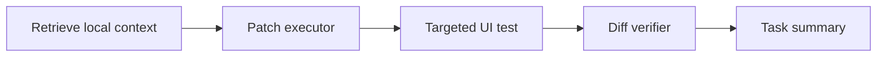
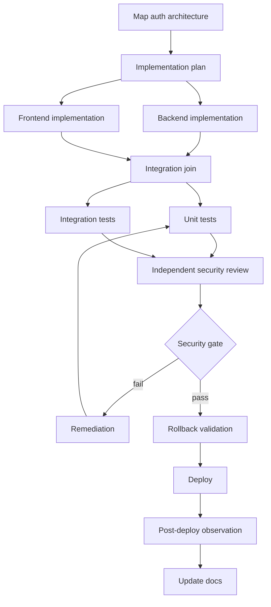
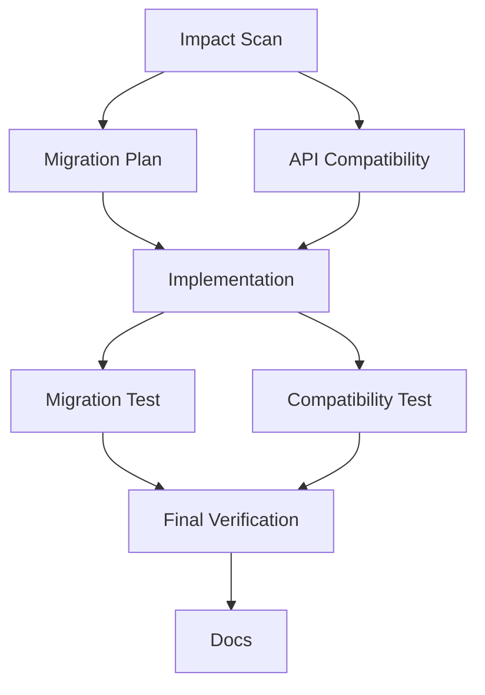
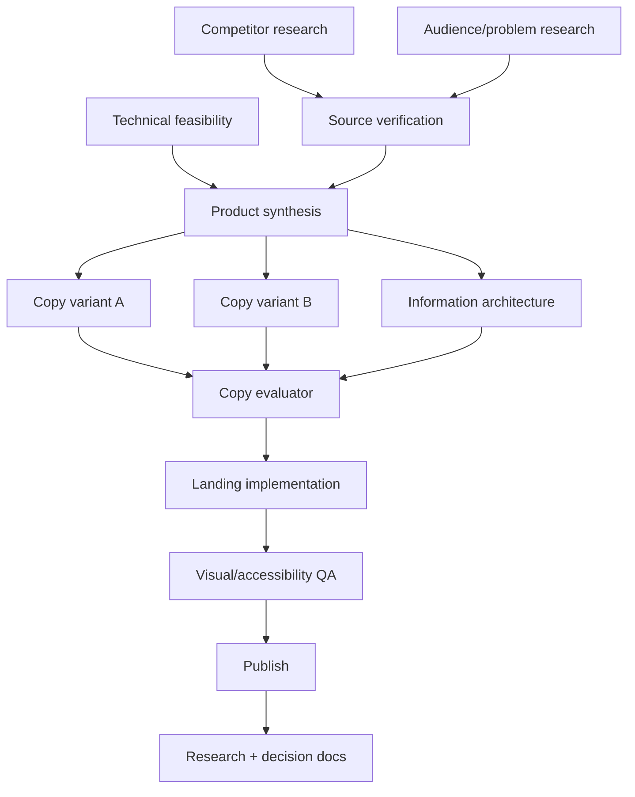
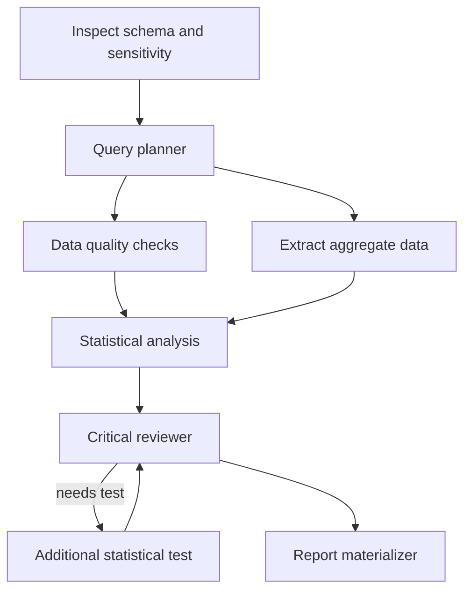

# Example Executions

These examples show how the same core composes different graphs. They are not fixed packs or mandatory templates.

## 1. Small UI fix

### Request

> Fix the spacing of the save button on the users screen.

### Profile

```yaml
complexity: low
depth: local
security_risk: 0.05
regression_risk: 0.20
reversibility: high
```

### Graph



### Rationale

Do not create an architect, security reviewer, or full test suite. The diff verifier confirms that only the expected scope changed.

## 2. Authentication change

### Request

> Add magic link login and deploy.

### Initial profile

```yaml
complexity: high
depth: cross_component
security_risk: 0.88
regression_risk: 0.79
production_impact: direct
```

### Initial graph



### Policy additions

- independent security review;
- auth regression tests;
- secret exposure scan;
- rollback plan;
- Tier 1 minimum; Tier 2 for email provider secret tool;
- post-deploy observation.

### User override

The user removes `SR`, `G`, and `RB`, connecting `IT → DEP`.

The Graph Draft shows:

- 3 nodes removed;
- 3 obligations unsatisfied;
- risk: auth vulnerability, rollback unvalidated;
- result label: `deployed_without_full_validation`.

After confirming, no substitute reviewer starts. A waiver is recorded and the deploy proceeds.

## 3. Unexpected discovery during a simple task

### Request

> Rename the `username` field to `handle`.

### Initial graph

```text
Impact Scan → Patch → Targeted Tests → Docs
```

### Signal

Impact Scan finds that the field is a foreign key and part of the public API.

```yaml
graph_signal:
  type: scope_expansion
  severity: high
  evidence:
    - db/schema.sql:42
    - api/openapi.yaml:118
  recommendations:
    - add_migration_plan
    - add_api_compatibility_review
```

### Graph v2



Completed output from Impact Scan is preserved. The old patch is invalidated.

## 4. Research and landing page creation

### Request

> Research competitors, define the value proposition, write the landing page, and publish it.

### Possible graph



Capabilities come from research, browser, product, copy, frontend, deploy, and docs. There is no "marketing pack".

## 5. Data analysis

### Request

> Analyze the cancellations from the last six months and find the main reasons.

### Graph



Policies may prevent sending row-level PII to an external model. Context uses aggregate artifacts.

## 6. Internal contractual document

### Request

> Compare these two versions of the contract and highlight commercial risks.

### Graph

```text
Document parser
→ Clause alignment
→ Difference extraction
→ Risk classifier
→ Independent reviewer
→ Evidence-linked report
```

The system must flag that it does not replace legal advice and keep every finding linked to the clauses.

## 7. Subscription limit

During `Backend implementation`, the Codex subscription hits its limit.

State:

```yaml
execution:
  status: waiting_for_model_capacity
  blocked_route: openai_codex_subscription
  blocked_nodes:
    - backend_implementation
  preserved:
    completed_nodes: true
    context_capsules: true
    workspace: true
```

The frontend branch on Claude can finish if independent. The user chooses to wait. No OpenRouter key is used.

## 8. Deactivate agent

The user stops `Performance Reviewer`.

Flow:

1. checkpoint;
2. branch pause;
3. harness detects requirement `performance_evidence_required`;
4. proposes ghost nodes:
   - deterministic benchmark;
   - alternative reviewer;
   - waive requirement;
5. user chooses "keep paused";
6. nothing starts;
7. hours later, the user approves the deterministic benchmark;
8. Graph vN+1 is published.

## 9. Dreams finds outdated documentation

The dream cycle finds a doc saying authentication uses a session cookie, but the current source/ADR shows JWT.

Shadow actions:

- create contradiction;
- inspect evidence;
- supersede old claim;
- patch generated section;
- run doc consistency;
- independent critic;
- atomic commit.

The Event Store remains intact. The old doc stays in history.

## 10. Dreams finds a possible bug

Dreams observes three similar failures in a webhook. It creates a task:

```yaml
origin: dream
finding:
  category: probable_race_condition
  confidence: 0.81
  evidence:
    - exec_931
    - exec_948
    - log_artifact_182
suggested_outcome:
  - reproduce
  - confirm_or_refute
  - patch_if_confirmed
  - add_regression_test
```

The Task Profiler may conclude it is not a bug. Dreams does not modify code.

## 11. Blind reviewer

The executor implements a cache. The reviewer receives:

- acceptance criteria;
- diff;
- relevant files;
- tests;
- architecture constraints.

It does not receive:

- "implementation completed successfully";
- executor confidence;
- executor subjective rationale;
- praise from earlier nodes.

The reviewer finds a stale cache path with its source location. A remediation branch is added.

## 12. Multi-project isolation

The workspace contains Tramitei and RadarMargem. The `Tramitei/backend` subproject receives:

- Tramitei vision;
- backend architecture;
- global security policy;
- shared coding conventions.

It does not receive:

- RadarMargem code;
- Tramitei marketing campaign;
- unrelated credentials;
- memories from a sibling agent.

The cross-project retrieval test must return zero unauthorized items.

## 13. Untrusted plugin

The user installs a community browser plugin. The manifest requests optional network and filesystem access. Conformance detects an attempt to access `/home/runtime/.config`.

Result:

- call denied;
- plugin quarantined;
- security event;
- no credential access;
- user notified;
- graph branch blocked or substitute proposed.

## 14. Manual graph

In Manual Graph, the user creates:

```text
Research Agent → Writer → Publish
```

The harness acts as a linter:

- Writer output schema incompatible with Publish input;
- missing source verification;
- Publish target not configured.

The system suggests corrections. The user can waive source verification, but cannot publish without a configured target/technical setup.
