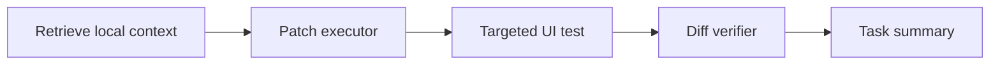
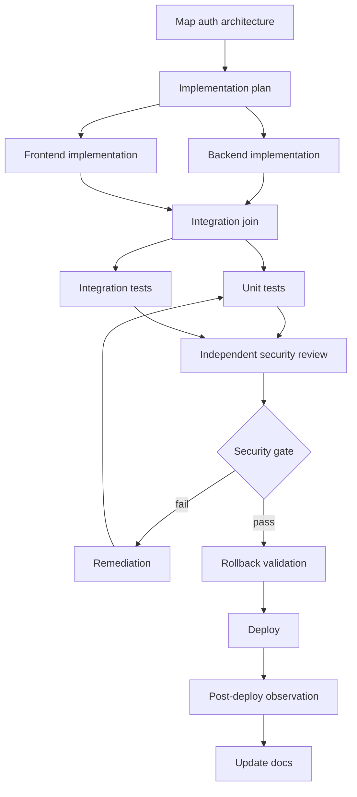
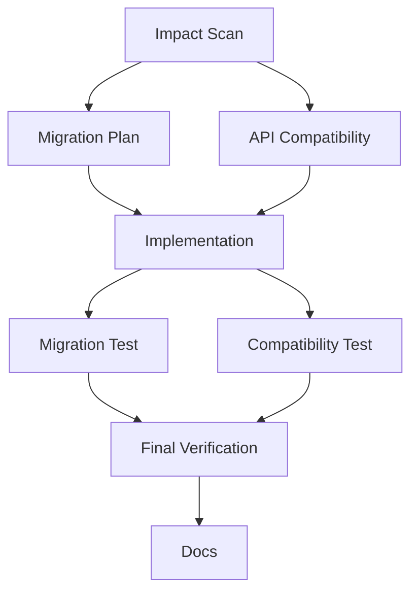
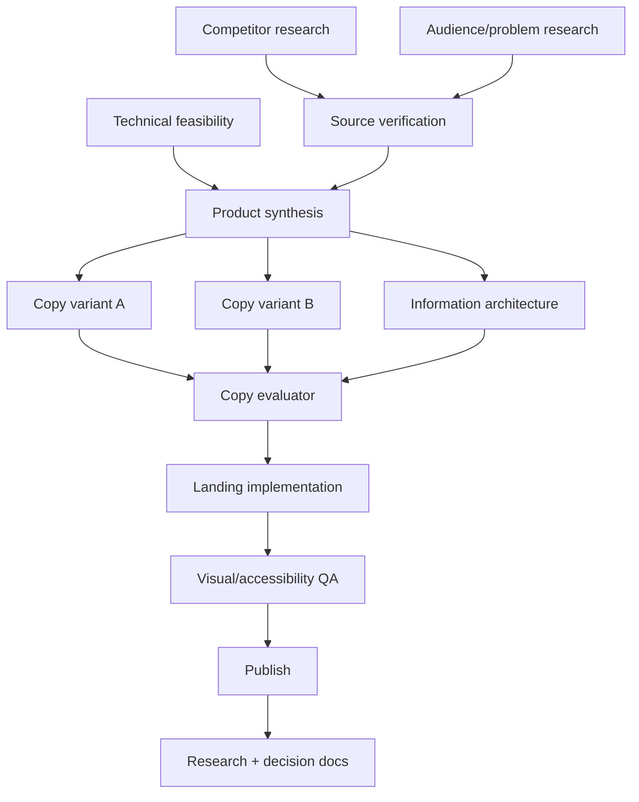
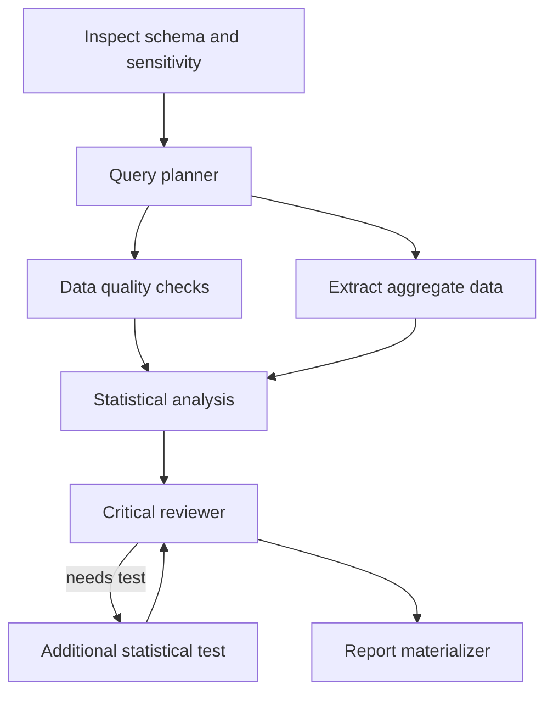

# Exemplos de execuções

Os exemplos mostram como o mesmo núcleo compõe grafos diferentes. Não são packs fixos nem templates obrigatórios.

## 1. Correção pequena de UI

### Pedido

> Corrija o espaçamento do botão de salvar na tela de usuários.

### Perfil

```yaml
complexity: low
depth: local
security_risk: 0.05
regression_risk: 0.20
reversibility: high
```

### Grafo


```mermaid
flowchart LR
    C[Retrieve local context] --> E[Patch executor]
    E --> T[Targeted UI test]
    T --> V[Diff verifier]
    V --> D[Task summary]
```

### Razão

Não criar architect, security reviewer ou full test suite. Diff verifier confirma que apenas scope esperado mudou.

## 2. Alteração em autenticação

### Pedido

> Adicione login por link mágico e faça deploy.

### Perfil inicial

```yaml
complexity: high
depth: cross_component
security_risk: 0.88
regression_risk: 0.79
production_impact: direct
```

### Grafo inicial


```mermaid
flowchart TD
    M[Map auth architecture] --> P[Implementation plan]
    P --> I1[Backend implementation]
    P --> I2[Frontend implementation]
    I1 --> J[Integration join]
    I2 --> J
    J --> UT[Unit tests]
    J --> IT[Integration tests]
    UT --> SR[Independent security review]
    IT --> SR
    SR --> G{Security gate}
    G -->|fail| R[Remediation]
    R --> UT
    G -->|pass| RB[Rollback validation]
    RB --> DEP[Deploy]
    DEP --> OBS[Post-deploy observation]
    OBS --> DOC[Update docs]
```

### Policy additions

- independent security review;
- auth regression tests;
- secret exposure scan;
- rollback plan;
- Tier 1 minimum; Tier 2 for email provider secret tool;
- post-deploy observation.

### User override

O usuário remove `SR`, `G` e `RB`, conectando `IT → DEP`.

O Graph Draft mostra:

- 3 nodes removidos;
- 3 obligations unsatisfied;
- risk: auth vulnerability, rollback unvalidated;
- result label: `deployed_without_full_validation`.

Após confirmar, nenhum substitute reviewer inicia. Waiver é registrado e deploy segue.

## 3. Descoberta inesperada durante tarefa simples

### Pedido

> Renomeie o campo `username` para `handle`.

### Grafo inicial

```text
Impact Scan → Patch → Targeted Tests → Docs
```

### Signal

Impact Scan encontra que o campo é chave externa e parte da API pública.

```yaml
graph_signal:
  type: scope_expansion
  severity: high
  evidence:
    - db/schema.sql:42
    - api/openapi.yaml:118
  recommendations:
    - add_migration_plan
    - add_api_compatibility_review
```

### Graph v2


```mermaid
flowchart TD
    IS[Impact Scan] --> MP[Migration Plan]
    IS --> AP[API Compatibility]
    MP --> IM[Implementation]
    AP --> IM
    IM --> MT[Migration Test]
    IM --> CT[Compatibility Test]
    MT --> V[Final Verification]
    CT --> V
    V --> DOC[Docs]
```

Completed output do Impact Scan é preservado. Patch antigo é invalidado.

## 4. Pesquisa e criação de landing page

### Pedido

> Pesquise concorrentes, defina a proposta de valor, escreva a landing e publique.

### Grafo possível


```mermaid
flowchart TD
    R1[Competitor research] --> SV[Source verification]
    R2[Audience/problem research] --> SV
    R3[Technical feasibility] --> SYN[Product synthesis]
    SV --> SYN
    SYN --> C1[Copy variant A]
    SYN --> C2[Copy variant B]
    SYN --> D[Information architecture]
    C1 --> EV[Copy evaluator]
    C2 --> EV
    D --> EV
    EV --> LP[Landing implementation]
    LP --> QA[Visual/accessibility QA]
    QA --> PUB[Publish]
    PUB --> DOC[Research + decision docs]
```

Capabilities vêm de research, browser, product, copy, frontend, deploy e docs. Não existe “marketing pack”.

## 5. Análise de dados

### Pedido

> Analise os cancelamentos dos últimos seis meses e encontre os principais motivos.

### Grafo


```mermaid
flowchart TD
    S[Inspect schema and sensitivity] --> Q[Query planner]
    Q --> DQ[Data quality checks]
    Q --> EX[Extract aggregate data]
    DQ --> AN[Statistical analysis]
    EX --> AN
    AN --> CR[Critical reviewer]
    CR -->|needs test| ST[Additional statistical test]
    ST --> CR
    CR --> REP[Report materializer]
```

Policies podem impedir envio de row-level PII a external model. Context usa aggregate artifacts.

## 6. Documento contratual interno

### Pedido

> Compare estas duas versões do contrato e destaque riscos comerciais.

### Grafo

```text
Document parser
→ Clause alignment
→ Difference extraction
→ Risk classifier
→ Independent reviewer
→ Evidence-linked report
```

O sistema deve marcar que não substitui aconselhamento jurídico e manter cada finding ligado às cláusulas.

## 7. Limite de assinatura

Durante `Backend implementation`, Codex subscription atinge limite.

State:

```yaml
execution:
  status: waiting_for_model_capacity
  blocked_route: openai_codex_subscription
  blocked_nodes:
    - backend_implementation
  preserved:
    completed_nodes: true
    context_capsules: true
    workspace: true
```

Frontend branch em Claude pode terminar se independente. O usuário escolhe esperar. Nenhuma chave OpenRouter é usada.

## 8. Desativar agente

Usuário para `Performance Reviewer`.

Fluxo:

1. checkpoint;
2. branch pause;
3. harness detecta requirement `performance_evidence_required`;
4. propõe ghost nodes:
   - deterministic benchmark;
   - alternative reviewer;
   - waive requirement;
5. usuário escolhe “manter pausado”;
6. nada inicia;
7. horas depois, usuário aprova deterministic benchmark;
8. Graph vN+1 é publicado.

## 9. Dreams encontra documentação obsoleta

Dream cycle encontra doc dizendo que autenticação usa session cookie, mas source/ADR atual mostram JWT.

Shadow actions:

- create contradiction;
- inspect evidence;
- supersede old claim;
- patch generated section;
- run doc consistency;
- independent critic;
- atomic commit.

Event Store permanece intacto. Doc antigo fica no history.

## 10. Dreams encontra possível bug

Dreams observa três failures semelhantes em webhook. Cria task:

```yaml
origin: dream
finding:
  category: probable_race_condition
  confidence: 0.81
  evidence:
    - exec_931
    - exec_948
    - log_artifact_182
suggested_outcome:
  - reproduce
  - confirm_or_refute
  - patch_if_confirmed
  - add_regression_test
```

Task Profiler pode concluir que não é bug. Dreams não altera código.

## 11. Revisor cego

Executor implementa cache. Reviewer recebe:

- acceptance criteria;
- diff;
- relevant files;
- tests;
- architecture constraints.

Não recebe:

- “implementation completed successfully”;
- executor confidence;
- executor subjective rationale;
- praise from earlier nodes.

Reviewer encontra stale cache path com source location. Remediation branch é adicionada.

## 12. Multi-project isolation

Workspace contém Tramitei e RadarMargem. Subproject `Tramitei/backend` recebe:

- Tramitei vision;
- backend architecture;
- global security policy;
- shared coding conventions.

Não recebe:

- RadarMargem code;
- Tramitei marketing campaign;
- unrelated credentials;
- memories de sibling agent.

Cross-project retrieval test deve retornar zero itens não autorizados.

## 13. Plugin não confiável

Usuário instala browser plugin community. Manifest pede network e filesystem optional. Conformance detecta tentativa de acessar `/home/runtime/.config`.

Resultado:

- call denied;
- plugin quarantined;
- security event;
- no credential access;
- user notified;
- graph branch blocked or substitute proposed.

## 14. Grafo manual

Em Manual Graph, usuário cria:

```text
Research Agent → Writer → Publish
```

Harness atua como linter:

- Writer output schema incompatível com Publish input;
- falta source verification;
- Publish target não configurado.

O sistema sugere corrections. Usuário pode waive source verification, mas não publicar sem target/configuração técnica.
