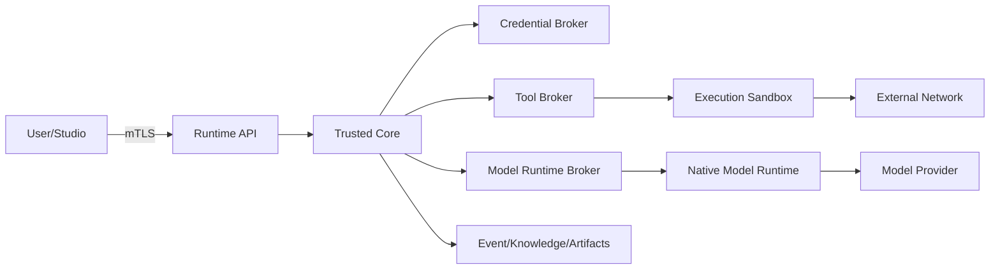

# Security, isolation and threat model

## 1. Objective

GraphHelm runs models, tools, plugins and potentially untrusted code on the user's infrastructure. The security model assumes that prompts, repositories, dependencies, external sources and extensions can be malicious or induce dangerous behavior.

Security does not depend on "the agent obeying". It depends on capability leases, policy enforcement, sandboxes, secret separation, typed tools, audit and limits.

## 2. Protected assets

- model and API credentials;
- SSH keys and Runtime identity;
- project code and documents;
- personal/confidential data;
- production environments;
- VPS infrastructure;
- Event Store and audit trail;
- Knowledge Graph integrity;
- policies and hard constraints;
- artifacts and backups;
- user identity;
- plugin supply chain;
- quotas and budget.

## 3. Trust boundaries



Boundaries:

1. Studio ↔ Runtime;
2. Runtime core ↔ plugins;
3. Tool Broker ↔ execution sandbox;
4. Runtime core ↔ model runtime;
5. Credential Broker ↔ all consumers;
6. sandbox ↔ network;
7. project data ↔ external provider;
8. Dreams ↔ canonical knowledge;
9. user override ↔ policy obligations.

## 4. Adversaries and failure modes

- malicious code in the repository;
- prompt injection via README, issue, web page or document;
- compromised dependency/package;
- malicious plugin;
- compromised or hallucinating provider/model;
- agent attempting to expand permissions;
- user deceived by UI;
- attacker with partial VPS access;
- secret in log/output;
- cross-project data leak;
- compromised update channel;
- malicious artifact;
- future insider in a multiuser environment;
- stale knowledge leading to dangerous action.

## 5. Principles

1. deny by default;
2. least privilege;
3. short-lived capability leases;
4. no secrets in prompts when avoidable;
5. separate model credentials from code execution;
6. immutable audit;
7. isolation proportional to risk;
8. user-visible permissions;
9. explicit external side effects;
10. assume prompt injection;
11. validate outputs, not intentions;
12. no shared mutable state across unrelated executions.

## 6. Isolation tiers

### Tier 0 — Cognitive

Usage:

- planning;
- classification;
- research over sanitized artifacts;
- critique;
- read-only inspection.

Controls:

- no shell write;
- no project write;
- network only if capability/policy;
- sanitized context;
- no secrets;
- process/container optional, but logical isolation mandatory.

### Tier 1 — Execution Workspace

Usage:

- common code/document edits;
- tests;
- builds;
- local transformations.

Controls:

- Git worktree or snapshot;
- ephemeral container;
- restricted user;
- no Docker socket;
- read-only base image;
- scoped writable workspace;
- network deny/allowlist;
- resource limits;
- cleanup.

### Tier 2 — Segmented Execution

Usage:

- different agents with conflicting trust;
- secret-mediated operations;
- unverified plugins;
- external integrations;
- sensitive data;
- package installation.

Controls:

- separate containers per agent/group;
- separate filesystem namespace;
- brokered artifact exchange;
- seccomp/AppArmor/SELinux profile;
- egress proxy;
- no direct inter-container network;
- brokered secrets;
- stronger audit.

### Tier 3 — Hardened Sandbox

Usage:

- unknown code/binary;
- malware analysis;
- offensive security;
- highly sensitive tasks;
- dependencies with elevated risk;
- arbitrary untrusted execution.

Controls:

- microVM, Kata, gVisor or equivalent;
- kernel boundary stronger than container;
- disposable disk;
- network off/default;
- no host mounts;
- attested images where possible;
- strict time/resources;
- artifact scanning on exit.

## 7. Isolation selection

Input signals:

- source trust;
- code execution;
- package install;
- binary execution;
- shell destructiveness;
- secret use;
- production access;
- sensitive data;
- plugin trust;
- network destinations;
- file formats;
- exploit indicators;
- agent behavior.

Policy sets minimum. Harness may choose higher. Runtime can elevate on intercepted action. Lowering after start requires new sandbox and policy re-evaluation.

## 8. Capability leases

### 8.1 Lease fields

```yaml
capability_lease:
  id: lease_...
  actor: agent_runtime_...
  capability: repository.write
  scope:
    paths:
      - /workspace/src/payments/**
  granted_by: policy_engine
  valid_from: timestamp
  expires_at: node_end
  max_uses: optional
  revocable: true
  audit_level: full
```

### 8.2 Rules

- no implicit inheritance;
- shortest duration;
- scope narrowing;
- revocation on pause/cancel;
- revalidate on graph mutation;
- secret and production leases require dedicated policy;
- attempts outside scope are denied and signaled.

## 9. Credential Broker

### 9.1 Storage

- encrypted at rest;
- master key not stored alongside ciphertext in plaintext;
- optional hardware/KMS support;
- per-workspace/project ACL;
- rotation/revoke;
- no value in database query logs;
- memory zeroing best effort;
- backups encrypted.

### 9.2 Access patterns

Preferred:

- broker performs request on behalf of tool;
- short-lived token minted;
- file descriptor/Unix socket handoff;
- environment injection only in dedicated process;
- secret reference in graph.

Avoid:

- placing key in Context Capsule;
- mounting provider config directory into untrusted workspace;
- returning secret to agent output;
- persistent environment variables across nodes.

## 10. Model runtime separation

Native model clients may store credentials locally. They run in dedicated namespace/container/user. Project tools are mediated. If a runtime requires filesystem access, expose only execution workspace, never credential directories of other providers or host home.

## 11. Tool Broker security

Checks:

1. schema;
2. actor identity;
3. lease;
4. policy;
5. path canonicalization;
6. symlink escape;
7. command allow/deny;
8. network allowlist;
9. secret reference;
10. rate/size;
11. sandbox health;
12. output scan/redaction.

Command execution uses argv, not shell string, unless shell capability explicitly granted.

## 12. Prompt injection defense

### 12.1 Treat content as data

Files, web pages, issues and artifacts are untrusted content. Context Capsule labels source and trust. System instructions, policies and contracts are separated from retrieved text.

### 12.2 Controls

- source tagging;
- instruction/content boundary;
- ignore external requests for secrets/permissions;
- tool calls require leases independent of prompt;
- suspicious instruction detector;
- high-risk action confirmation/policy;
- least context;
- no hidden auto-install;
- output verification;
- reviewer blind to malicious irrelevant source when possible.

### 12.3 Injection signal

Agent/runtime can emit `prompt_injection_suspected`. Graph Governor may add source verifier, isolate source, reduce tools or elevate tier.

## 13. Repository threats

- malicious AGENTS.md/instructions;
- scripts executed during install/test;
- postinstall hooks;
- test exfiltration;
- symlink traversal;
- huge files/decompression bomb;
- binary parser exploit;
- Git hooks;
- submodule URLs;
- credential files.

Controls:

- instructions treated by trust hierarchy;
- disable hooks by default;
- package install in isolated tier;
- network deny during tests unless required;
- file size/type limits;
- no host credentials;
- scan secrets before provider upload;
- content-addressed source snapshot.

## 14. Supply-chain security

- signed releases;
- pinned image digests;
- SBOM;
- provenance attestations;
- dependency scanning;
- reproducible builds target;
- plugin signature;
- registry revocation;
- update rollback;
- no auto permission expansion;
- security advisory channel.

## 15. Cross-project isolation

- separate namespaces/ACLs;
- Context Compiler enforces scope;
- no sibling inheritance by default;
- secrets scoped;
- artifact refs authorize on read;
- vector/full-text indexes include scope filters;
- cache keys include project scope;
- agent memory cannot cross scope without promotion.

## 16. Knowledge poisoning

Threat: erroneous or malicious output becomes canonical truth.

Controls:

- candidate status;
- provenance;
- validation policy by claim type;
- confidence/TTL;
- contradiction tracking;
- Dreams shadow validation;
- user-protected docs;
- no agent self-promotion of claim;
- source authority metadata;
- rollback.

## 17. Graph and policy attacks

Threats:

- agent emits signal to remove review;
- graph expansion DoS;
- cycle creation;
- bypass via malformed output;
- policy prompt injection;
- mutation race.

Controls:

- agents cannot mutate directly;
- Graph Governor + deterministic linter;
- mutation limits;
- policy separate from prompt;
- optimistic concurrency;
- schema validation;
- owner-visible waivers;
- hard constraints non-overridable by model.

## 18. User override safety

Owner can bypass quality/security gates. UI must prevent deceptive consent:

- list exact gates removed;
- state consequences plainly;
- distinguish warning from technical blocker;
- no prechecked consent;
- record actor/time/scope;
- no automatic replacement after override;
- result label reflects waiver;
- incident correlation available later.

User cannot bypass physical impossibility. Owner can change own hard policies only through separate settings action, not incidental graph drag.

## 19. Production access

Production tools require:

- explicit target ref;
- scoped credentials;
- environment label;
- effect preview;
- capability lease;
- audit;
- optional canary/rollback policy;
- no wildcard secret access;
- secret not exposed to model;
- deploy receipt artifact.

Owner may waive tests/review, but deploy adapter still requires target, auth and valid input.

## 20. Network security

- deny by default;
- egress proxy/allowlist;
- DNS control;
- block metadata services;
- no local network scan without capability;
- TLS validation;
- proxy logs redacted;
- destination declaration in plugin manifest;
- per-call network lease where feasible.

## 21. Artifact security

- content hash;
- MIME sniffing;
- size limits;
- malware scan for executable/archive;
- quarantine;
- no auto-open active content;
- sanitized previews;
- access control;
- retention policy;
- export redaction.

## 22. Logs and telemetry

- structured logs;
- secret redaction at source and sink;
- no raw prompt by default in high sensitivity mode;
- configurable retention;
- local telemetry default;
- external telemetry opt-in;
- audit log tamper evidence;
- crash dump filtering.

## 23. Threat matrix

| Threat | Impact | Primary controls |
|---|---|---|
| Secret exfiltration by code | Critical | broker separation, no host mounts, network deny, scanning |
| Malicious plugin | Critical | manifest, signature, Tier 2/3, permission review, quarantine |
| Prompt injection | High | content labels, leases, policy separation, source verification |
| Docker socket escape | Critical | socket never mounted, rootless/isolated runtime |
| Cross-project leak | High | ACL/scope filters, separate caches/indexes |
| Graph explosion | Medium/High | node/mutation budgets, no-progress detector |
| Self-approval | High | independent gates, blind review, deterministic evidence |
| Knowledge poisoning | High | candidate claims, provenance, validation, Dreams shadow |
| Unsafe owner override | High | explicit waiver, impact view, accurate result label |
| Supply-chain compromise | Critical | signatures, digest pinning, SBOM, reproducible builds |
| Stale auth/session | Medium | health, revoke, waiting state, no fallback |
| Log secret leakage | High | redaction, scanners, restricted access |

## 24. Security events

- permission denied;
- lease granted/revoked;
- secret accessed;
- injection suspected;
- network denied;
- sandbox elevated;
- sandbox escape suspected;
- plugin quarantined;
- artifact quarantined;
- policy waived;
- production effect;
- auth revoked;
- secret scan finding.

## 25. Incident response

1. isolate affected execution/sandbox;
2. revoke leases/secrets;
3. preserve immutable evidence;
4. quarantine artifacts/plugins;
5. identify projects/routes affected;
6. rotate credentials;
7. generate incident graph/task;
8. patch through normal workflow;
9. publish advisory if open-source impact;
10. update threat model/policies.

## 26. Security disclosure

The repository must have a `SECURITY.md` with a private reporting channel, supported versions, response targets and coordinated disclosure. Vulnerabilities involving provider auth must also follow provider reporting rules.

## 27. Acceptance criteria

- code sandbox does not see model credentials;
- Docker socket never mounted in untrusted container;
- paths and symlinks are canonicalized;
- network deny works;
- secret scanner covers logs/artifacts/exports;
- graph agent does not alter policy;
- Dreams does not expand permission;
- cross-project retrieval tests pass;
- owner override records waiver;
- Tier elevation creates a clean environment;
- plugin permission expansion requires confirmation.
