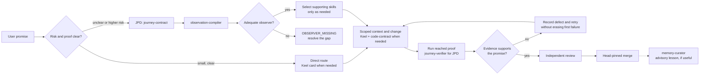

# GraphHelm skills

This is the entry point for the skills shipped in GraphHelm's two built-in development extensions
and the separately installable [GraphHelm plugin](../../plugins/graphhelm/README.md).
The package manifests are the inventory: `graphhelm-development-contracts` contains four skills
and `graphhelm-jpd` contains eight. A skill guides an agent; it does not grant permission, enforce
policy, certify evidence, or publish a graph. The Runtime's typed contracts and deterministic
controls retain those jobs.

## How they fit together

The diagram reads **left to right**. It shows a typical route, not twelve mandatory steps. Select
only the skills needed for the promise and its risk. A small, reversible change can use the direct
route; unclear proof or higher-risk work can use the expanded Journey-Proven Development (JPD)
route. An unavailable observer stops the proof claim.

`plan-council`, `defect-bounty`, `skill-synthesizer`, `skill-evaluator`, and `retry-provenance` are
supporting skills, not a fixed pipeline. The [current delivery process](../process/DELIVERY.md)
sets the repository's issue, evidence, review, and merge rules. A full `ci/gate.ps1` run is optional;
the author and reviewer run the checks reached by the change.

## Built-in skill catalog

| Skill | Use it when | Output or boundary |
|---|---|---|
| [Keel](../../extensions/builtin/graphhelm-development-contracts/skills/keel/SKILL.md) | An agent is planning or writing a code change | A scoped card, declared write surface, and named proof; guidance and measurement, with no automatic penalty ladder |
| [Code contract](../../extensions/builtin/graphhelm-development-contracts/skills/code-contract/SKILL.md) | Scope or acceptance criteria are still implicit | A proposed development contract, not enforcement |
| [Context retrieval](../../extensions/builtin/graphhelm-development-contracts/skills/context-retrieval/SKILL.md) | The answer needs repository or execution evidence that has not been gathered | A cited context result with declared gaps, not a truth decision |
| [Memory curator](../../extensions/builtin/graphhelm-development-contracts/skills/memory-curator/SKILL.md) | Landed work produced a durable lesson | An advisory memory candidate, never a direct memory write |
| [Journey contract](../../extensions/builtin/graphhelm-jpd/skills/journey-contract/SKILL.md) | The user-visible journey and failure contract need definition | A proposed journey contract |
| [Observation compiler](../../extensions/builtin/graphhelm-jpd/skills/observation-compiler/SKILL.md) | A promise needs a named proof instrument | Typed evidence obligations or `OBSERVER_MISSING` |
| [Plan council](../../extensions/builtin/graphhelm-jpd/skills/plan-council/SKILL.md) | Risk warrants multiple perspectives | Arguments and dissent for a risk-specific decision |
| [Defect bounty](../../extensions/builtin/graphhelm-jpd/skills/defect-bounty/SKILL.md) | A journey defect claim needs challenge | A minimized, replayable claim or a falsification attempt |
| [Skill synthesizer](../../extensions/builtin/graphhelm-jpd/skills/skill-synthesizer/SKILL.md) | Installed capabilities need task-local composition | An advisory Skill Capsule draft, not installation or promotion |
| [Skill evaluator](../../extensions/builtin/graphhelm-jpd/skills/skill-evaluator/SKILL.md) | A task-local capsule needs assessment | An advisory evaluation candidate, not an automatic promotion |
| [Retry provenance](../../extensions/builtin/graphhelm-jpd/skills/retry-provenance/SKILL.md) | Work is retried after a failure | A linked attempt chain that preserves the first failure |
| [Journey verifier](../../extensions/builtin/graphhelm-jpd/skills/journey-verifier/SKILL.md) | The JPD obligations have adequate observers | The strongest result supported by observed evidence; missing proof stays unresolved |

The installable `graphhelm` plugin adds [GraphHelm guide](../../plugins/graphhelm/skills/graphhelm-guide/SKILL.md)
for an overview of the method, [GraphHelm setup](../../plugins/graphhelm/skills/graphhelm-setup/SKILL.md)
for reviewed host adoption, and [GraphHelm resume](../../plugins/graphhelm/skills/graphhelm-resume/SKILL.md)
for exactly two evidence-based next actions. These are separate from the twelve skills in the
two built-in extension manifests. Its [installation guide](../../plugins/graphhelm/README.md)
lists the Codex and Claude commands and the host-specific invocation names.

The [development-contracts package](../../extensions/builtin/graphhelm-development-contracts/README.md)
and [JPD package](../../extensions/builtin/graphhelm-jpd/README.md) explain permissions, manifests,
host adapters, and validation limits. The separate
[Keel contract-index skill](../../tools/keel-contract-index/SKILL.md) is a maintainer tool; it is
not one of the twelve built-in extension skills. Example chat-surface operator skills live under
`examples/` and are not part of this catalog.

## Discovery is not activation

The checked-in `SKILL.md` files and host plugin views make skills discoverable. Finding a skill
does not install its package, activate a project skill, grant a Runtime capability, or certify a
journey. The built-in JPD package currently emits advisory task-local drafts; its README lists the
missing validator and activation work. See [getting started](../install/GETTING_STARTED.md) for
the current setup path and [agents, skills, tools and plugins](../agents/AGENTS_SKILLS_PLUGINS.md)
for the broader model.
