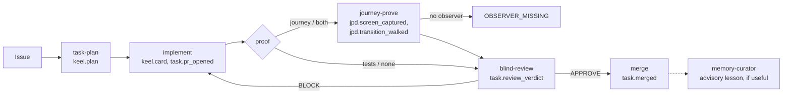

# GraphHelm skills

This is the entry point for the skills shipped in GraphHelm's two built-in development extensions
and the separately installable [GraphHelm plugin](../../plugins/graphhelm/README.md).
The [development-contracts manifest](../../extensions/builtin/graphhelm-development-contracts/extension.json)
and [JPD manifest](../../extensions/builtin/graphhelm-jpd/extension.json) are the inventory.
Entry skills have `SKILL.md` paths; supporting assets such as
[Keel's reference](../../extensions/builtin/graphhelm-development-contracts/skills/keel/REFERENCE.md)
are not separate entry skills. A skill guides an agent; it does not grant permission, enforce
policy, certify evidence, or publish a graph. The Runtime's typed contracts and deterministic
controls retain those jobs.

## How they fit together

Every task runs the same five steps after its issue, in any agent host. Each step is one skill and
names the record it emits ([journey-first Keel design](../specs/2026-10-07-journey-first-keel-design.md)
§§6–7). Use only as much of each step as the change needs: a docs or one-line change plans `proof:
none` and needs no journey.

```mermaid
flowchart LR
  I["Issue"] --> P["task-plan<br/>keel.plan"]
  P --> M["implement<br/>keel.card, task.pr_opened"]
  M --> J{"proof"}
  J -->|"journey / both"| V["journey-prove<br/>jpd.screen_captured,<br/>jpd.transition_walked"]
  J -->|"tests / none"| R
  V -->|"no observer"| X["OBSERVER_MISSING"]
  V --> R["blind-review<br/>task.review_verdict"]
  R -->|"BLOCK"| M
  R -->|"APPROVE"| G["merge<br/>task.merged"]
  G -.-> L["memory-curator<br/>advisory lesson, if useful"]
```

`keel` carries the binding rules that `implement` follows; `test-audit` gates every new, changed or
removed test; `journey-map` and `journey-contract` create the journeys that `journey-prove`
replays (`journey-prove` itself ships with #381). `keel plan` is being built (design phase B); until it lands, `task-plan` says how to write the
plan by hand. The `task.*` records are live (#388). The [current delivery process](../process/DELIVERY.md)
sets the repository's issue, evidence, review, and merge rules.

## Built-in skill catalog

| Skill | Use it when | Output or boundary |
|---|---|---|
| [Task plan](../../extensions/builtin/graphhelm-development-contracts/skills/task-plan/SKILL.md) | An issue is about to become code | The task's `keel.plan`: paths, promise, proof kind, reviews, skills |
| [Implement](../../extensions/builtin/graphhelm-development-contracts/skills/implement/SKILL.md) | The plan exists and code is next | The change inside the card, cited context, reached tests run, PR opened |
| [Keel](../../extensions/builtin/graphhelm-development-contracts/skills/keel/SKILL.md) | Any code change (implement's core) | A scoped card, declared write surface, and named proof; guidance and measurement, with no automatic penalty ladder |
| [Test audit](../../extensions/builtin/graphhelm-development-contracts/skills/test-audit/SKILL.md) | Before adding or changing tests, when a suite is slow or noisy, or when pruning tests | An authoring gate, suite audit, or deletion record naming the covering observer; guidance without enforcement |
| [Journey map](../../extensions/builtin/graphhelm-jpd/skills/journey-map/SKILL.md) | A project has screens but no journeys | Draft journey flows and a first capture baseline |
| [Journey contract](../../extensions/builtin/graphhelm-jpd/skills/journey-contract/SKILL.md) | One new user-visible behavior needs a journey | A proposed journey flow and contract |
| [Blind review](../../extensions/builtin/graphhelm-development-contracts/skills/blind-review/SKILL.md) | You are a PR's one assigned reviewer | One verdict on a pinned head with commands and results |
| [Merge](../../extensions/builtin/graphhelm-development-contracts/skills/merge/SKILL.md) | You approved the PR | A pinned squash merge, read back, workspace released |
| [Memory curator](../../extensions/builtin/graphhelm-development-contracts/skills/memory-curator/SKILL.md) | Landed work produced a durable lesson | An advisory memory candidate, never a direct memory write |

The installable `graphhelm` plugin adds [GraphHelm guide](../../plugins/graphhelm/skills/graphhelm-guide/SKILL.md)
for an overview of the method, [GraphHelm setup](../../plugins/graphhelm/skills/graphhelm-setup/SKILL.md)
for reviewed host adoption, and [GraphHelm resume](../../plugins/graphhelm/skills/graphhelm-resume/SKILL.md)
for exactly two evidence-based next actions. These are separate from the entry skills in the
two built-in extension manifests. Its [installation guide](../../plugins/graphhelm/README.md)
lists the Codex and Claude commands and the host-specific invocation names.

The [development-contracts package](../../extensions/builtin/graphhelm-development-contracts/README.md)
and [JPD package](../../extensions/builtin/graphhelm-jpd/README.md) explain permissions, manifests,
host adapters, and validation limits. The separate
[Keel contract-index skill](../../tools/keel-contract-index/SKILL.md) is a maintainer tool; it is
not one of the built-in extension skills. Example chat-surface operator skills live under
`examples/` and are not part of this catalog.

## Discovery is not activation

The checked-in `SKILL.md` files and host plugin views make skills discoverable. Finding a skill
does not install its package, activate a project skill, grant a Runtime capability, or certify a
journey. The built-in JPD package currently emits advisory task-local drafts; its README lists the
missing validator and activation work. See [getting started](../install/GETTING_STARTED.md) for
the current setup path and [agents, skills, tools and plugins](../agents/AGENTS_SKILLS_PLUGINS.md)
for the broader model.
