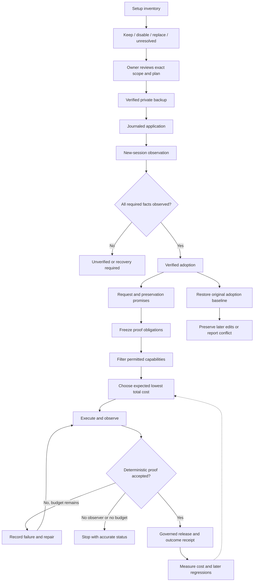

# GraphHelm methodology adoption and validation

Status: proposed implementation design, transcribed from the owner's approved strategy on 2026-09-21. No product implementation or live configuration migration was performed while writing these plans. Implementation details remain subject to owner review. This document does not amend accepted decisions by implication.

## 1. Objective and boundaries

Make a proven user promise the unit of work. GraphHelm adopts an existing agent environment reversibly, compiles change and preservation promises into observation obligations, and selects permitted capabilities using measured total cost per proven outcome. A plugin instruction is advice; deterministic Runtime policy remains the enforcement boundary.

Four independently deliverable subprojects implement this design:

1. Setup, backup, and restore (the setup-backup-restore plan; `docs/process/DELIVERY.md`, History).
2. Journey proof pilot (the journey-proof-pilot plan; `docs/process/DELIVERY.md`, History).
3. Structured agent context (the structured-agent-context plan; `docs/process/DELIVERY.md`, History).
4. Economic route selection (the economic-route-selection plan; `docs/process/DELIVERY.md`, History).

Start with subproject 1. Subprojects 2 and 3 can proceed independently after their public contracts are frozen. Economic accounting may start independently; promotion of an economic router depends on a trustworthy outcome observer from subproject 2. Do not run overlapping changes to CLI argument/dispatch files in parallel. Integrate each delivered slice before starting another slice owning those files.

## 2. Current evidence

Source inspection baseline: `026718e51ffdc20611c97fd8705ca56052c7c7d6` in this worktree. Inspection is not execution proof. The nearest code graph was a different checkout, `F-github-GraphHelm`, generation `2026-09-18T23:17:18Z`; relevant coverage reported missing/untracked freshness. Current source reads were used instead.

| Area | Present | Remaining obligation |
|---|---|---|
| Project initialization | `apps/cli/src/commands/init.rs` provisions local state, merges Claude MCP, emits a Codex snippet | Unified adoption and reversible modification of existing host configuration |
| Extensions | `core/extension-host/src/install.rs` stages, validates, activates and rolls back versions | Host discovery/activation and migration must participate in adoption recovery |
| JPD | `apps/cli/src/commands/quality.rs` registers geometry, retry-lineage and journey-contract gates | A valid artifact or different actor ID alone does not prove an observed outcome |
| Missing observers | JPD schema admits `OBSERVER_MISSING` | A deterministic runtime producer for the missing-capability path |
| Jev | `core/architect/src/judgment/` and `adapters/model-gateway/src/systemone.rs` | Economic calibration and a separately specified routing consumer |
| Economics | `core/gateway/src/eligibility.rs` filters candidates; context accounting records partial usage | Monetary receipts and outcome-linked route choice |
| Machine context | Development envelopes, policies and context compiler | Real caller data on remaining partial public surfaces |

Reconcile stale implementation descriptions in `docs/harness/JOURNEY_PROVEN_DEVELOPMENT.md` section 12 and the built-in package READMEs in their owning implementation changes. Do not remove target obligations just because some code exists.

## 3. Global constraints

- Rust 1.97.1; edition 2024.
- English repository documentation.
- One Extension model; host wrappers do not create a second package authority.
- Only the Governor publishes operational graph mutations.
- Core modules depend on interfaces, never concrete adapters.
- Unknown evidence never becomes proven evidence.
- Subscription exhaustion pauses; no automatic paid fallback.
- Offline tests require no network, browser session, credentials, or provider account.
- `ci/gate.ps1` is the authoritative local gate; GitHub Actions stays disabled.
- Issue-first implementation; no production code before an assigned GitHub issue exists.
- Preserve unrelated user changes; no blanket replacement of existing configuration.
- No secrets in prompts, logs, public plans, receipts, fixtures, or exported manifests.
- All newly introduced bounds are explicit, enforced, and tested at both sides.

New filesystem operations must preserve platform access restrictions and resist symlink, junction, hard-link and path-swap attacks. Reuse the retained-handle design in `adapters/tool-host/src/documents.rs`; it currently handles bounded UTF-8 existing project documents and is not itself a general backup implementation. Do not broaden it silently.

## 4. Setup, backup and restore contract

### 4.1 Public journey

`graphhelm setup` inventories the effective environment and presents keep/disable/replace/unresolved decisions with reasons, effects, scopes and evidence. It must discover all installed skills exposed by supported host inventory surfaces, including disabled entries, duplicates and inherited/global instructions. Installed, enabled and actually loaded are distinct states. Unsupported, inaccessible or truncated scopes are explicit coverage gaps, never an empty successful inventory.

The no-argument terminal flow previews changes and offers applying the exact reviewed plan. A nonterminal invocation only emits a machine-readable plan unless supplied an explicit plan digest and apply action. Application creates and verifies a backup automatically before the first host mutation. `graphhelm backup` creates a manual checkpoint; `graphhelm restore` previews and applies a selected checkpoint. Restore can return the environment to its pre-adoption state without a running GraphHelm Runtime, model, provider, or usable host application.

Default writes are project-scoped. User-wide changes require that scope explicitly in the reviewed plan. Organization-managed rules are inventoried when visible, never modified or bypassed. A global instruction conflict that cannot be neutralized within the authorized scope blocks a complete-compatibility claim.

### 4.2 Classification

Preserve personal communication preferences, project facts and security rules. Replace old methodology only at reviewed source ranges or named host keys. Disable conflicting skills/plugins rather than deleting their source packages. Compatible tools remain usable. Mixed prose is not safely classified by a keyword or filename: uncertain segments require an explicit owner resolution.

Jev is optional advisory classification. Inputs are bounded, locally redacted rule excerpts; credentials and raw settings never leave the machine. Missing judge, low confidence, malformed output and conflicting classifications yield unresolved items, not automatic deletion. No confidence threshold grants permission to weaken security. The proposal records classifier/model/version and cited source ranges. Deterministic code checks source hashes, scope, approved decisions, protected categories and host capabilities before mutation.

### 4.3 Backup custody

Use a user-owned state root outside the project by default: `%LOCALAPPDATA%/GraphHelm/adoption` on Windows and `$XDG_STATE_HOME/graphhelm/adoption` (or `~/.local/state/graphhelm/adoption`) on Linux. Do not store backup secrets in a repository. Backups contain original bytes, existence state, access metadata, package/version identities and reversible host operations. Public output contains opaque backup IDs and redacted summaries. Restrict access before writing bytes. Keep raw backup material local and never send it to a model.

A setup baseline is immutable and separate from later manual checkpoints. `restore --original` selects the first baseline for the adoption, not the newest checkpoint. Setup upgrades cannot replace this baseline. Restore supports a missing/corrupt backup refusal and never fabricates recovery. No automatic retention deletion in this slice; expose size and location to the owner.

Manual checkpoints are private, hash-bound recovery data with explicit project, home, and state-root
provenance. Integrity verification is separate from restore eligibility: an old unlinked snapshot
may verify as bytes but cannot authorize restore, while an old snapshot explicitly linked by an
adoption journal remains eligible. A selected manual checkpoint previews explicit replacements for
present supported files and preserves absent files; it does not claim ownership-aware rollback of
adoption packages or shared user state. The preview binds current bytes and access metadata, and
edits after preview refuse as stale. Restore uses the same durable journal and recovery path as
adoption rollback, with no Runtime, model, provider, or network dependency.

### 4.4 Consistency and recovery

A multi-file/multi-host migration is a journaled operation, not a single atomic filesystem transaction. Each file publication is atomic where the platform supports it. Persist original snapshots and an operation journal before writes; sync and verify each transition. Recheck original file identity and content immediately before replacement. Require affected host sessions to be closed or otherwise prove a supported reload boundary; do not kill a user's sessions.

States: `planned`, `backed_up`, `applying`, `installed_unverified`, `verified`, `restoring`, `restored`, `recovery_required`. If interrupted, refuse a second apply until recovery reconciles observed bytes with journaled before/after hashes. If an unrelated writer changed a destination, preserve those bytes and report a conflict. Never advertise all-or-nothing behavior while a crashed process may have left partial writes.

Restore uses a three-way comparison: baseline, GraphHelm's recorded after-state, and current state. Restore untouched fields automatically, retain independent later edits, and refuse overlapping edits pending a reviewed resolution. For an exact unchanged after-state, restore the original bytes and metadata. Remove only artifacts created by this adoption and still matching its after-state. Snapshot the current state before restore itself mutates anything.

### 4.5 Host compatibility

Claude settings are JSON; Codex settings are TOML. `AGENTS.md` is an instruction file, not a universal `settings.json`. Detect configuration roots using host-supported overrides; never assume one home path or edit another profile's files. Inventory hooks, rule imports, MCP entries, plugin activation, local skills, and managed restrictions without executing discovered hooks or commands.

Use verified host interfaces and capability probes. If an installed host version lacks a noninteractive plugin installation interface, report `host_action_required`, preserve the original environment, and identify the supported host action. Do not write undocumented plugin databases or claim unattended installation succeeded. Resume against a newly inventoried, reviewed plan after the action. This is a platform capability limitation, not permission to omit plugin activation from the target journey.

Official references checked 2026-09-21:

- [Claude settings precedence](https://code.claude.com/docs/en/settings): local, project, user and managed settings are separate scopes; managed restrictions cannot be overridden by setup.
- [Claude plugin management](https://code.claude.com/docs/en/discover-plugins): shell plugin commands support scoped installation; a new session or supported reload is needed to observe activation.
- [Codex configuration](https://learn.chatgpt.com/docs/config-file/config-basic): user and trusted project TOML layers have different precedence.
- [Codex local skills](https://learn.chatgpt.com/docs/build-skills): documented `skills.config` entries can disable a skill by path; refresh in a new session.
- [Codex plugins](https://learn.chatgpt.com/docs/plugins): desktop and CLI plugin-browser installation is documented; these sources alone do not establish a noninteractive `codex plugin install` command.
- [Codex instructions](https://learn.chatgpt.com/docs/agent-configuration/agents-md): discover effective instruction layers rather than replacing only a leaf file.

Pin tested host versions and capability receipts in integration evidence; revalidate this table at implementation time. The offline gate uses inert fake host processes. A separate observer-enabled rehearsal proves actual loading, MCP capability use and effective methodology. File installation alone produces `installed_unverified`.

## 5. Journey-Proven Development

Freeze new promises and preservation promises before execution. Each promise names actor, precondition, semantic action, expected visible/durable outcome, failure/recovery behavior, prohibited effects, observer and proof strength. A reviewer cannot reduce a proof requirement to get a passing implementation; a changed contract is a new version with a reason.

Keep unit, property, integration, concurrency, CLI and browser tests when they observe the right boundary. Select affected proofs using a fresh dependency map and run the critical-journey baseline. Incomplete maps broaden the check set; they never justify a negative claim. The first pilot is a real CLI journey with direct filesystem observations, not a browser engine project.

Bind proof to exact source revision, contract digest, environment, input fixture, observer version, run and attempt. Distinct agent names are insufficient independence: protect observation provenance and prevent implementation-controlled evidence from self-certifying. Record all attempts; an explained repair may become recovered success, an unexplained intermittent pass remains unresolved. Missing required observation deterministically emits `OBSERVER_MISSING`.

Test the proof system with seeded defects and corrupted evidence. Include a positive control, a product defect, a broken observer, a stale receipt, actor self-observation, a missing capability and a lost first failure. Agreement between personas is not a release gate.

## 6. Economics

Optimize total cost of all attempts divided by proven outcomes, at fixed quality obligations. A zero-success denominator is undefined, not zero. Measure currency, amount, model/route/tool, usage/cache categories, price basis/version, and measured/derived/unavailable provenance. Include routing, review, repair and failed attempts; disclose unknown portions. Keep human time, latency, quota and allocated subscription costs distinct from incremental cash.

Filter by permission, health, capability and required quality before ranking. Deterministic tools can win without a model call. Jev can advise among eligible choices using calibrated evidence; it cannot approve tools, bypass gates or create authority. Extending its role beyond D-054's architect consumers requires an explicit ADR/RFC before wiring a new production consumer. Pin calibration data separately from holdout evaluation; do not tune and report on the same tasks. Bound retries and escalation. Subscription exhaustion never silently switches to paid usage.

First compare current workflow against fixed-route GraphHelm on the same frozen task starts with equal acceptance checks, budget and model access. Then compare a fixed route to the economic router on held-out tasks. Begin with 12 paired tasks as a feasibility pilot, disclose small-sample uncertainty, retain failed/cancelled runs and report regressions plus quality parity. Do not claim savings while required cost or outcome data is unavailable.

## 7. Machine communication

Use schema-first, versioned JSON at machine boundaries, JSONL for append-only events, YAML for editable configuration where appropriate, and short Markdown for host-required skill files and human explanations. No automatic claim that one syntax uses fewer tokens. Preserve a single authoritative contract and derive human presentation from it.

References carry stable identities, digests and bounded retrieval; they cannot resolve to unrelated snapshots or escape authorized roots. Required context is never silently dropped. Measure format alternatives over equivalent content using the actual tokenizer/model and interpretation checks. The structured-context slice does not build a new memory registry or a second Extension format.

## 8. Visual map

## 9. Threat assessment and release

Untrusted inputs include repository instructions, installed skill prose, imported rules, plugin manifests, host output and backup files. Principal risks are instruction injection into classification, secret leakage, global unintended changes, file identity races, package drift, self-certified evidence and deceptively cheap failed work. The implementation plans assign concrete tests to these boundaries.

Before code: create or link scoped issues with exactly one permitted label, establish a clean execution branch, and record exact files in scope. Before merge: focused proofs, full local gate on final code, required independent lane reviews, closing-keyword check, and main-owned merge proof. After merge: verify each public journey on the merged revision and perform the explicitly enabled host rehearsal before claiming verified host adoption. No paid experiment or real user configuration migration is authorized merely by saving these plans.
