# GraphHelm Engineering Program Plan Index

**Baseline:** approved specification at `72c376499e4fc92f7a1097432c703d73c1b2f6b0`

**Tracking issue:** [#1](https://github.com/stabem/GraphHelm/issues/1) for the first milestone

**Delivery rule:** each row below becomes its own reviewed implementation plan, issue, branch/worktree, acceptance suite, and merge. Later plans may refine file paths after earlier public contracts exist, but may not bypass the dependency order or constitutional invariants in `AGENTS.md`.

## Program decomposition

The product is intentionally split at contract and trust boundaries. A plan is independently testable when it delivers a usable public interface or complete adapter, includes its own negative tests, and does not rely on fake implementations from a later plan.

| Order | Planned implementation plan | Depends on | Independently testable outcome |
|---:|---|---|---|
| 01 | `2026-08-08-graphhelm-foundation-graph-kernel.md` | specification only | Offline CLI loads YAML/JSON, validates schemas, versions and hashes graphs, lints and evaluates policies, applies atomic drafts/waivers, simulates, appends events, and replays projections. |
| 02 | `2026-08-08-graphhelm-protocols-and-schema-evolution.md` | 01 | Versioned protocol package, schema compatibility checker, migrations, conformance fixtures, and generated JSON views enforce SemVer without changing provisional `p50.dev` identifiers. |
| 03 | `2026-08-08-graphhelm-event-evidence-store.md` | 01, 02 | Production Event/Evidence Store repository contract, PostgreSQL adapter, ordered/idempotent append, retention/tombstone policy, artifact references, migrations, backup, and rebuildable projections. |
| 04 | `2026-08-08-graphhelm-graph-engine-governor.md` | 01–03 | Durable Graph Engine schedules governed graphs with forks, joins, conditions, retries, timeouts, compensation, pause/resume/cancel, checkpoints, signals, output invalidation, and Graph Governor publication. |
| 05 | `2026-08-08-graphhelm-runtime-api-scheduler.md` | 02–04 | Single-node Runtime daemon exposes public versioned API/CLI and event streaming, optimistic concurrency, actor identity, durable jobs/leasing, recovery, and no private Studio-only operations. |
| 06 | `2026-08-08-graphhelm-context-compiler.md` | 02, 03, 05 | Context Compiler produces immutable scoped capsules with provenance, exclusions, budgets, contradiction presentation, deterministic cache/invalidation, blind-review bundles, and audited expansion requests. |
| 07 | `2026-08-08-graphhelm-knowledge-and-living-docs.md` | 03, 06 | Project Knowledge Graph and Living Documentation projections support temporal claims, contradiction/supersession, provenance, protected/generated sections, freshness, diff, and snapshot-safe materialization. |
| 08 | `2026-08-08-graphhelm-agent-skill-tool-registry.md` | 02, 03, 05–07 | Project Agent Registry and capability/skill/tool/plugin contracts support search, match, synthesis inputs, overlays, versioning, evidence/TTL memories, trust, conformance, quarantine, and explicit promotion. |
| 09 | `2026-08-08-graphhelm-harness-compiler.md` | 02, 04–08 | Intake, Task Profile, capability discovery, agent matching/synthesis, context strategy, model requirements, Graph Architect proposals, deterministic policy/lint/simulation, budgets, and minimal-graph rationale produce a versioned Harness Manifest. |
| 10 | `2026-08-08-graphhelm-universal-model-gateway.md` | 02, 03, 05, 08, 09 | Provider-neutral Model Gateway and Credential Broker interfaces route by capability/health/cost/privacy, separate BYOK/subscription/local modes, pause on quota, redact outputs, and expose official adapter conformance without embedding credentials. |
| 11 | `2026-08-08-graphhelm-official-model-adapters.md` | 10 | Individually reviewable OpenAI/Codex, Anthropic/Claude, OpenRouter/direct API, OpenAI-compatible, and local runtime adapters use only current official auth paths and pass contract, quota, cancellation, isolation, and audit tests. Each provider adapter is a separate issue/branch beneath this plan. |
| 12 | `2026-08-08-graphhelm-tool-broker-isolation.md` | 02–05, 08–10 | Tool Broker validates identity/schema/leases/path/network/secret scope; Tier 0/1 reference isolation uses clean worktrees and rootless ephemeral containers; elevation, cleanup, quarantine, symlink escape, and Docker-socket denial are proven. |
| 13 | `2026-08-08-graphhelm-dreams-engine.md` | 03, 06–09, 12 | Dreams scheduler operates only at safe points in shadow workspaces, validates claims/docs/memories/agents/skills/index changes, requires independent criticism, commits or discards atomically, rolls back, and converts code findings into normal tasks. |
| 14 | `2026-08-08-graphhelm-studio-shell-graph-editor.md` | 02, 05 | Tauri 2/React Studio connects only through public APIs, persists a local encrypted/disposable cache, renders accessible graph/list parity, routes commands, survives reconnect/version drift, and never runs agents locally. |
| 15 | `2026-08-08-graphhelm-studio-operational-flows.md` | 04–14 | Node inspector, Graph Draft review, ghost nodes, agents/docs/artifacts/claims panels, model connections, policies, events/replay, Dreams Center, and explicit override/deploy flows operate against real Runtime contracts with no mocked success path. |
| 16 | `2026-08-08-graphhelm-ssh-docker-bootstrap.md` | 05, 10, 12, 14 | Read-only VPS diagnosis, previewed SSH bootstrap, rootless Docker/Podman deployment, mTLS identity, update/rollback/uninstall, health checks, and post-bootstrap API operation work on Linux x86_64/arm64 without a mandatory central service. |
| 17 | `2026-08-08-graphhelm-observability-recovery.md` | 03–16 | OpenTelemetry-compatible local logs/metrics/traces, redaction, checkpoints, restart recovery, alerts, health dashboard, quarantine/runbooks, backup/restore, and SLO tests satisfy the operations specification. |
| 18 | `2026-08-08-graphhelm-export-replay-conformance.md` | 02–17 | Sanitized project/execution export, deterministic/branch/substituted replay, compatibility matrices, Runtime/Studio/DSL/plugin/adapter conformance suites, and reproducible manifests prove portability without secrets. |
| 19 | `2026-08-08-graphhelm-sdks-cli-packaging-releases.md` | 02, 05, 18 | Generated TypeScript/Python SDKs, expanded CLI, signed cross-platform artifacts/images, SBOM, provenance, migration checks, release manifest, upgrade path, and release automation form a complete public distribution. |
| 20 | `2026-08-08-graphhelm-ecosystem-collaboration.md` | 08, 15, 18, 19 | Federated/open registries, signing/revocation, alternate registries, multiuser identity/RBAC/approvals/comments, multi-worker scheduling, enterprise controls, and optional hosted services are added without closing or coupling the self-hosted core. |

## Dependency waves

```mermaid
flowchart LR
    A["01 Foundation Kernel"] --> B["02 Protocol Evolution"]
    A --> C["03 Event Evidence Store"]
    B --> C
    C --> D["04 Graph Engine Governor"]
    D --> E["05 Runtime API Scheduler"]
    E --> F["06 Context Compiler"]
    F --> G["07 Knowledge Living Docs"]
    G --> H["08 Agent Skill Tool Registry"]
    H --> I["09 Harness Compiler"]
    I --> J["10-11 Model Gateway and Adapters"]
    J --> K["12 Tool Broker Isolation"]
    K --> L["13 Dreams Engine"]
    E --> M["14 Studio Shell"]
    L --> N["15 Studio Operational Flows"]
    M --> N
    N --> O["16 Bootstrap"]
    O --> P["17 Observability Recovery"]
    P --> Q["18 Export Replay Conformance"]
    Q --> R["19 SDKs Packaging Releases"]
    R --> S["20 Ecosystem Collaboration"]
```

Plans may run in parallel only after their shared contracts are merged and their file ownership is disjoint. Examples: Context Compiler (06) and the initial Studio shell (14) can proceed after Runtime API contracts stabilize; provider adapters under 11 can proceed independently against the merged Model Gateway conformance suite.

## Cross-cutting gates for every plan

Every detailed plan must contain:

- exact files, public interfaces, schema/event changes, test fixtures, commands, RED/GREEN evidence, and commit boundaries;
- a threat assessment covering trust boundaries, secrets, prompt injection, external effects, data retention, and rollback proportional to the subsystem;
- compatibility analysis for schemas, events, APIs, exports, adapters, and provisional wire IDs;
- deterministic tests before model-based evaluation whenever both can address the requirement;
- actor, idempotency, provenance, sensitivity, and audit behavior for every mutation;
- no mandatory hosted service, no external telemetry by default, and no hidden private API;
- public documentation, conformance evidence, dependency/license notes, and a post-merge verification plan;
- a strict out-of-scope section preventing ceremonial scaffolds for later rows.

## Milestone release grouping

- **Kernel proof:** 01–02.
- **Runnable trusted core:** 03–05.
- **Contextual agent platform:** 06–12.
- **Cognitive maintenance and complete local UX:** 13–16.
- **Operational beta:** 17–19.
- **Ecosystem/enterprise evolution:** 20, split into smaller issues per capability before implementation.

No release grouping authorizes implementing multiple rows in one branch. The current branch may implement only plan 01.
