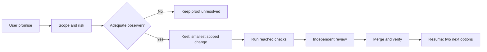

# GraphHelm guide

GraphHelm is an experimental, local-first agent operating system. Its plugin skills help an agent decide what to do; the CLI and Runtime provide typed contracts, deterministic checks, execution control, and evidence. A skill's text is never authority to bypass permissions, publish a graph, or claim an unobserved result.



For a small reversible change with a clear observer, use the direct route. For unclear proof, persistence, permissions, compatibility, security, or external effects, use Journey-Proven Development (JPD): describe the user journey, compile each promise into an observable obligation, and refuse a success claim if the required observer is missing. Keel keeps context and new code surface proportional, then asks for the **lowest total cost per proven delivery** after quality is preserved. Count repairs, reviews, and repeated work, not tokens alone. Neither method replaces the repository's review and merge rules.

GraphHelm's Governor owns operational graph publication. Agents send typed signals and proposals; deterministic code enforces schemas, policies, permissions, and state transitions. A plugin install does not start the Runtime, configure MCP credentials, activate an extension package, or change a user's existing instructions. `graphhelm setup` starts with inventory and a preview; applying a reviewed plan requires explicit acceptance and creates a backup before supported host files change. `graphhelm restore` previews recovery before applying it. See the [CLI preview](https://github.com/stabem/GraphHelm/releases/tag/v0.1.0), [getting started](https://github.com/stabem/GraphHelm/blob/main/docs/install/GETTING_STARTED.md), [skills map](https://github.com/stabem/GraphHelm/blob/main/docs/skills/README.md), and [current delivery process](https://github.com/stabem/GraphHelm/blob/main/docs/process/DELIVERY.md).

## Install from the repository

The `graphhelm` plugin contains this guide and `graphhelm-resume`. The same marketplace also lists the existing `graphhelm-jpd` and `graphhelm-development-contracts` plugins. Install those companions only when their skill families are needed; both can connect to the same local Runtime and require a separately configured trusted CLI, token file, and per-session actor. Installing any plugin alone does not install the GraphHelm executable.

In **Claude Code**:

```text
claude plugin marketplace add stabem/GraphHelm
claude plugin install graphhelm@graphhelm
```

In **Codex CLI**:

```text
codex plugin marketplace add stabem/GraphHelm
codex plugin add graphhelm@graphhelm
```

After installation, start a fresh session. In Claude Code, use `/graphhelm:graphhelm-guide` or `/graphhelm:graphhelm-resume`; Claude namespaces plugin skills, so the installed command is not bare `/graphhelm-resume`. In Codex, invoke `$graphhelm-guide` or `$graphhelm-resume`. The resume skill reads current evidence and offers exactly two next actions with one recommendation; it does not take either action for you.

To add a companion, install `graphhelm-jpd@graphhelm` or `graphhelm-development-contracts@graphhelm` with the host's `plugin install` / `plugin add` command. The [skill catalog](https://github.com/stabem/GraphHelm/blob/main/docs/skills/README.md) shows when each is useful. Their MCP registration needs `GRAPHHELM_CLI` to be an absolute trusted executable path, `GRAPHHELM_TOKEN_FILE` to name a local token file, and `GRAPHHELM_ACTOR` to identify the chat session. Never paste the token value into a manifest or prompt.
