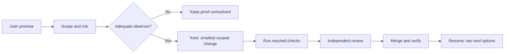

# GraphHelm guide

GraphHelm is an experimental, local-first agent operating system. Its plugin skills help an agent decide what to do; the CLI and Runtime provide typed contracts, deterministic checks, execution control, and evidence. A skill's text is never authority to bypass permissions, publish a graph, or claim an unobserved result.


```mermaid
flowchart LR
  A[User promise] --> B[Scope and risk]
  B --> C{Adequate observer?}
  C -->|No| M[Keep proof unresolved]
  C -->|Yes| D[Keel: smallest scoped change]
  D --> E[Run reached checks]
  E --> F[Independent review]
  F --> G[Merge and verify]
  G --> H[Resume: two next options]
```

For a small reversible change with a clear observer, use the direct route. For unclear proof, persistence, permissions, compatibility, security, or external effects, use Journey-Proven Development (JPD): describe the user journey, compile each promise into an observable obligation, and refuse a success claim if the required observer is missing. Keel keeps context and new code surface proportional, then asks for the **lowest total cost per proven delivery** after quality is preserved. Count repairs, reviews, and repeated work, not tokens alone. Neither method replaces the repository's review and merge rules.

GraphHelm's Governor owns operational graph publication. Agents send typed signals and proposals; deterministic code enforces schemas, policies, permissions, and state transitions. A plugin install does not start the Runtime, install the CLI, activate an extension package, or change a user's existing instructions. `graphhelm init` creates a project MCP entry that selects the authenticated Runtime from the project identity, without pinning a port or token path; `graphhelm setup --resolve home/.claude.json=register-mcp` can register the same project-aware command at user scope. Direct `--url` and `--token-file` connections remain available when an operator deliberately wants to pin one Runtime. `graphhelm setup` starts with inventory and a preview; applying a reviewed plan requires explicit acceptance and creates a backup before supported host files change. `graphhelm restore` previews recovery before applying it. See the [CLI preview](https://github.com/stabem/GraphHelm/releases/tag/v0.1.1), [getting started](https://github.com/stabem/GraphHelm/blob/main/docs/install/GETTING_STARTED.md), [skills map](https://github.com/stabem/GraphHelm/blob/main/docs/skills/README.md), and [current delivery process](https://github.com/stabem/GraphHelm/blob/main/docs/process/DELIVERY.md).

## Install from the repository

The `graphhelm` plugin contains this guide, `graphhelm-setup`, and `graphhelm-resume`. The same marketplace also lists the existing `graphhelm-jpd` and `graphhelm-development-contracts` plugins. Install those companions only when their skill families are needed; both can connect to the same local Runtime and require a separately configured trusted CLI, token file, and per-session actor. Installing any plugin alone does not install the GraphHelm executable.

In **Claude Code**:

```text
claude plugin marketplace add stabem/GraphHelm
claude plugin install graphhelm@graphhelm
```

In **Codex CLI**:

```text
codex plugin marketplace add stabem/GraphHelm
codex plugin add graphhelm@graphhelm
codex plugin add graphhelm-codex-hooks@graphhelm
```

After installation, start a fresh session. In Claude Code, use `/graphhelm:graphhelm-guide`, `/graphhelm:graphhelm-setup`, or `/graphhelm:graphhelm-resume`; Claude namespaces plugin skills, so the installed commands are not bare `/graphhelm-setup` or `/graphhelm-resume`. In Codex, invoke `$graphhelm-guide`, `$graphhelm-setup`, or `$graphhelm-resume`. The setup skill guides the separate `graphhelm setup` CLI through inventory, a reviewed plan, backup, and restore; invoking the skill alone changes no host files. The resume skill reads current evidence and offers exactly two next actions with one recommendation; it does not take either action for you.

## Session hooks (version 0.1.20)

This installed plugin includes command hooks for Claude Code. Affected Codex versions use the
separate `graphhelm-codex-hooks` compatibility companion, which is the only Codex hook
registration. Unbound sessions are
silent by default. When the session is explicitly bound to a GraphHelm execution, `SessionStart`
injects a short Keel reminder, and startup and
resume read one Runtime briefing and return a bounded summary of its next action and pending
work. There is no unconditional second briefing read: request detailed evidence only when the
next action needs it. Compaction restores cached context labeled as not refreshed, without an
HTTP read. A cached summary never authorizes a state transition; the Runtime still validates
the current state. `SessionEnd` records an attributed
`agent_session_ended` signal. It never marks a task or node complete. The hook does not create a
run, pick a run by project name, or forward the host's raw payload.

Each hook process accepts one bounded JSON object frame. It returns after the first
complete object, even when the caller keeps stdin open; a process performs one
operation and does not consume a second object. EOF before a complete object, invalid
UTF-8 or JSON, a non-object value, and an oversized frame remain invalid input.

SessionStart allows one request up to five seconds of socket inactivity, within
Claude's ten-second hook declaration, including startup and durable cache
publication. Runtime's five-second operator read budget is a progress check and
does not guarantee a response within five seconds. SessionEnd also allows five
seconds of socket inactivity; both plugins declare ten seconds for that event.
Older Codex versions may clamp larger declarations to three seconds. Inspect the
installed host's effective budget rather than assuming it honors a declaration.

Claude has a separate shared shutdown budget, which defaults to 1.5 seconds.
A plugin's SessionEnd `timeout` does **not** raise that shared budget. Set
`CLAUDE_CODE_SESSIONEND_HOOKS_TIMEOUT_MS=10000` in the environment that launches
Claude when using the bound end hook. This is a supported host setting; changing
it inside a hook cannot change its parent's budget. See the
[Claude SessionEnd reference](https://code.claude.com/docs/en/hooks#sessionend).
This setting permits more shutdown time, not more requests or tokens. A desktop
process already running must be restarted from the configured launch environment.

A socket inactivity limit is not a wall-time deadline. Host cancellation can stop
the hook before its acknowledgement is observed, while a separately recorded
Runtime effect remains durable. An unavailable briefing or acknowledgement stays
UNOBSERVED; it never becomes task success and is never retried by this hook.

Python 3 must be on the host's `PATH`. Set these variables in the environment that launches the
agent host:

- `GRAPHHELM_EXECUTION_ID`: exact execution ID to bind. Without it, the hook makes no Runtime
  request and injects no context by default.
- `GRAPHHELM_KEEL_CONTEXT=1`: explicitly enable the short Keel reminder in an unbound session.
- `GRAPHHELM_TOKEN_FILE`: path to the local Runtime token file, required for a bound run.
- `GRAPHHELM_RUNTIME_URL`: Runtime API origin; defaults to `http://127.0.0.1:8791`.
- `GRAPHHELM_SESSION_ID`: optional expected host session ID. A mismatch leaves the operation
  unobserved rather than reading or writing a different session's binding.
- `GRAPHHELM_NODE_ID`: optional explicit node reference. It is labeled as configured; the hook
  does not infer an assignment from the next pending node or claim that the Runtime assigned it.

For example, in PowerShell before launching an agent in a terminal:

```powershell
$env:GRAPHHELM_EXECUTION_ID = 'run-example'
$env:GRAPHHELM_TOKEN_FILE = 'C:/path/to/events.token'
$env:GRAPHHELM_RUNTIME_URL = 'http://127.0.0.1:8793'
$env:CLAUDE_CODE_SESSIONEND_HOOKS_TIMEOUT_MS = '10000'
claude
```

The same environment variables apply to Codex. A desktop app that was already running will not
inherit variables set later in a terminal. Codex asks the user to review and trust new plugin
hooks before running them. Updating the plugin does not override that host decision.

Third-party agent hosts can use the same script as a portable adapter. Pass an explicit bounded
host identity such as `--host my-agent`; unknown hosts use the `graphhelm-portable-v1` JSON
contract automatically. `start` returns a bounded `context`, `end` returns its acknowledged
delivery state, and `inspect` returns local observations. A portable response reports the adapter
boundary and `activation: "unobserved"`; it does not claim that the host loaded the hook or
accepted a task. Use `--format portable` when the host wants this shared machine-readable
contract; the built-in `claude` and `codex` hooks keep their native envelopes by default.

The token stays in its file and travels only to a loopback HTTP or HTTPS Runtime. A redirect is
refused. The hook prints `UNOBSERVED` if a bound read or write fails, without blocking the agent
session or claiming a record landed. End signals require a Runtime keyring; this hook does not
write an unsealed `evidenceOut` file. A full signal budget also leaves the end unobserved.

A repeated end hook uses the same signal body and idempotency key. Once the Runtime acknowledges
the matching execution and signal IDs, the hook saves that confirmation and skips later sends.
An unconfirmed request remains retryable. A rejected graph mutation does not mean the signal
was not recorded: those are different results in the Runtime contract.

State is scoped to host, Runtime origin, execution and session, outside the repository under the
user's local state directory; `GRAPHHELM_HOOK_STATE_DIR` can override that path. Actors carry a
session-specific identity rather than only a host name. The end request also sends the host session
ID as `X-GraphHelm-Actor-Session` for the Runtime's structured presence record. These observations
do not assign or complete operational nodes, and session end is not proof that the work passed.

Since version 0.1.3, hooks use a new state and signal-key namespace: 0.1.2 timestamp files have
no delivery acknowledgment and are not migrated as proof. A corrupt record stays unobserved; it is
not silently replaced with a new signal under the same key. The local lock is released by the OS if the host
terminates the hook. Delivery deduplication is scoped to this protocol, not an exactly-once claim
across plugin upgrades or deletion of local state.

The hook calls no model. Cached compaction avoids a Runtime request, and confirmed repeated end
delivery avoids another request. These are request-count guarantees covered by local HTTP tests,
not a measured reduction in a complete task's billed tokens. The hook returns only bounded typed
summary fields, never the full objective, transcript or Runtime command text.

### Explicit task handoff

`hooks/task_handoff.py` is a provider-neutral command adapter for any host that can run Python.
It is explicit and is never called automatically by SessionStart or SessionEnd. `offer` records a
sealed `task_handoff_offer` signal for one exact recipient host and session. `receive` reads the
original journal event, opens its sealed envelope, reads a fresh bounded briefing, and records a
sealed `task_handoff_received` signal with `replyTo` pointing to the offer. `status` reconstructs
offers and matching receipts from the Runtime journal.

When `status` names an offer ID, it opens only that offer's sealed content. It still validates the
current recipient's receipt records to determine which reference that offer; receipt matching and
integrity checks are unchanged. Unfiltered status continues opening all offer records. An unavailable
unrelated offer cannot block a targeted read, while unavailable or corrupt selected evidence is refused.

A timed-out or disconnected write can have committed before its response was lost. The adapter
does not repeat that POST. It reads the journal and validates the exact sealed offer or receipt,
including content hash, execution, actor and addressing. Only verified durable evidence permits
`state: recorded`; the result retains `writeAcknowledgement: unobserved` for that attempt.
Missing, invalid or unavailable evidence remains unobserved. Explicit HTTP refusals are not
reconciled into success. This proves retrieval only: `accepted: false`, task completion and native
host activation remain separate. Socket timeouts still bound inactivity rather than total wall time;
the caller must bound the whole operation, including reconciliation reads.

```powershell
python <installed-plugin>/hooks/task_handoff.py offer --host claude --session-id <sender-session> --recipient-host codex --recipient-session-id <receiver-session> --handoff-id <bounded-id>
python <installed-plugin>/hooks/task_handoff.py receive --host codex --session-id <receiver-session> --offer-id <offer-id>
python <installed-plugin>/hooks/task_handoff.py status --host codex --session-id <receiver-session> --offer-id <offer-id>
```

The adapter requires the Runtime to seal the signal evidence. It re-reads the journal and sealed
evidence on retries, so losing local hook state does not create a second offer. It validates the
execution, source actor, target actor, protocol metadata, evidence hash, and `replyTo`; bounded
incomplete pagination or missing evidence stays unobserved. A receipt proves that the receiving
adapter retrieved the offer and current briefing. It does not prove model comprehension, task
acceptance, node ownership, permission transfer, or completion. Runtime owner credentials authorize
declared actor labels; they do not cryptographically authenticate the host or model.

Each explicit handoff request allows up to five seconds of socket inactivity per Runtime request;
the caller must still impose its own whole-process deadline. A timeout remains unobserved and is
not retried automatically. `--handoff-id` distinguishes multiple offers between the same two
sessions in one execution; repeating the same id replays the journal record after local state loss.

The same adapter has an optional, explicitly configured stdio MCP mode. The Codex compatibility
companion registers it with a plugin-relative working directory and script path; the main plugin does not register a second
server. The server makes no Runtime request while starting. Its legacy environment session mode
uses `GRAPHHELM_MCP_HOST`, `GRAPHHELM_SESSION_ID`, `GRAPHHELM_EXECUTION_ID`,
`GRAPHHELM_TOKEN_FILE`, and (when needed) `GRAPHHELM_RUNTIME_URL`. For normal Codex calls, opt
into native metadata mode with `GRAPHHELM_MCP_SESSION_SOURCE=codex_metadata`; it requires
`GRAPHHELM_MCP_HOST=codex` and each `tools/call` `_meta` object to contain equal, valid
`threadId` and `sessionId` values. `GRAPHHELM_SESSION_ID`, when set, pins that per-call identity.
The server does not retain a session between calls. Initialize and tool discovery can run unbound;
an actual tool call without fixed execution, Runtime, and token configuration remains unobserved.
The companion explicitly forwards the host's task execution, Runtime URL, token-file path, optional
session pin, and optional node binding through `env_vars`. It never forwards the token contents or
accepts those settings from model arguments. Starting Codex without these task settings leaves the
server discoverable but its task calls unobserved.

Configure the trusted server process and run directly when needed:

```powershell
python <installed-plugin>/hooks/task_handoff.py --mcp-stdio
```

The server exposes `offer`, `receive`, and `status` through standard newline-delimited MCP
JSON-RPC. Host, execution, Runtime URL, and token path come only from trusted server
configuration. In native Codex mode, the host supplies the session identity in per-call metadata;
tool arguments can name the recipient or offer, but cannot replace any binding. Missing, malformed,
conflicting, or pinned-mismatched metadata fails before Runtime I/O. In legacy mode, the
environment session contract is unchanged.
Requests are bounded and unknown fields fail closed. A tool failure returns MCP `isError: true`
and an unobserved result. An oversized or unterminated frame closes the transport after a sanitized
error; its remaining bytes cannot become another request. This local transport proves adapter behavior only; native host trust and
activation still need a separate fresh-session observation.

### Setup inspection

The `graphhelm-setup` skill includes a hook inspection step. Resolve the actual installed plugin
directory from the host's plugin inventory, then run the Claude hook from `graphhelm` or the Codex
hook from the installed `graphhelm-codex-hooks` companion:

```text
python <installed-plugin>/hooks/session_hook.py inspect --host claude
python <installed-codex-hooks>/hooks/session_hook.py inspect --host codex --session-id <actual-session-id>
```

Inspection is read-only, makes no Runtime request, and does not read token contents. It reports
configuration and local script observations. It cannot establish that the host trusted or loaded
the hook; a manual invocation can also create a local observation. Keep activation unverified
until the host's own fresh-session event is observed. Do not register a second copy in settings.
The adoption CLI does not migrate opaque hook commands; the setup skill identifies legacy
registrations and requires an explicit, backed-up migration for those entries.

The optional `SubagentStart` and `SubagentStop` hooks record a child identity under the host
session bound to the current execution. They do not receive the direct nested delegator, task
title, result, or acceptance verdict. Studio shows only the verified host-session link and the
observed lifecycle events; a missing stop never means the child is still working. Claude's
`TaskCreated` and `TaskCompleted` hooks separately record the bounded task subject, native task
id, optional teammate name, and observed task phase. They do not link that task to a subagent id
or certify that its output was accepted. Task descriptions and transcripts are not uploaded.
Installing updated source does not prove host activation; verify a fresh native session
separately.

To add a methodology companion, install `graphhelm-jpd@graphhelm` or `graphhelm-development-contracts@graphhelm` with the host's `plugin install` / `plugin add` command. Install `graphhelm-codex-hooks@graphhelm` for Codex hook compatibility as shown above. The [skill catalog](https://github.com/stabem/GraphHelm/blob/main/docs/skills/README.md) shows when each is useful. Their MCP registration needs `GRAPHHELM_CLI` to be an absolute trusted executable path, `GRAPHHELM_TOKEN_FILE` to name a local token file, and `GRAPHHELM_ACTOR` to identify the chat session. Never paste the token value into a manifest or prompt.
