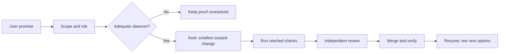

# GraphHelm guide

GraphHelm is an experimental, local-first agent operating system. Its plugin skills help an agent decide what to do; the CLI and Runtime provide typed contracts, deterministic checks, execution control, and evidence. A skill's text is never authority to bypass permissions, publish a graph, or claim an unobserved result.


```mermaid
flowchart LR
  A[User promise] --> B[Scope and risk]
  B --> C{Adequate observer?}
  C -->|No| M[Keep proof unresolved]
  C -->|Yes| D[Keel: smallest scoped change]
  D --> E[Run reached checks]
  E --> F[Independent review]
  F --> G[Merge and verify]
  G --> H[Resume: two next options]
```

For a small reversible change with a clear observer, use the direct route. For unclear proof, persistence, permissions, compatibility, security, or external effects, use Journey-Proven Development (JPD): describe the user journey, compile each promise into an observable obligation, and refuse a success claim if the required observer is missing. Keel keeps context and new code surface proportional, then asks for the **lowest total cost per proven delivery** after quality is preserved. Count repairs, reviews, and repeated work, not tokens alone. Neither method replaces the repository's review and merge rules.

GraphHelm's Governor owns operational graph publication. Agents send typed signals and proposals; deterministic code enforces schemas, policies, permissions, and state transitions. A plugin install does not start the Runtime, configure MCP credentials, activate an extension package, or change a user's existing instructions. `graphhelm setup` starts with inventory and a preview; applying a reviewed plan requires explicit acceptance and creates a backup before supported host files change. `graphhelm restore` previews recovery before applying it. See the [CLI preview](https://github.com/stabem/GraphHelm/releases/tag/v0.1.0), [getting started](https://github.com/stabem/GraphHelm/blob/main/docs/install/GETTING_STARTED.md), [skills map](https://github.com/stabem/GraphHelm/blob/main/docs/skills/README.md), and [current delivery process](https://github.com/stabem/GraphHelm/blob/main/docs/process/DELIVERY.md).

## Install from the repository

The `graphhelm` plugin contains this guide, `graphhelm-setup`, and `graphhelm-resume`. The same marketplace also lists the existing `graphhelm-jpd` and `graphhelm-development-contracts` plugins. Install those companions only when their skill families are needed; both can connect to the same local Runtime and require a separately configured trusted CLI, token file, and per-session actor. Installing any plugin alone does not install the GraphHelm executable.

In **Claude Code**:

```text
claude plugin marketplace add stabem/GraphHelm
claude plugin install graphhelm@graphhelm
```

In **Codex CLI**:

```text
codex plugin marketplace add stabem/GraphHelm
codex plugin add graphhelm@graphhelm
```

After installation, start a fresh session. In Claude Code, use `/graphhelm:graphhelm-guide`, `/graphhelm:graphhelm-setup`, or `/graphhelm:graphhelm-resume`; Claude namespaces plugin skills, so the installed commands are not bare `/graphhelm-setup` or `/graphhelm-resume`. In Codex, invoke `$graphhelm-guide`, `$graphhelm-setup`, or `$graphhelm-resume`. The setup skill guides the separate `graphhelm setup` CLI through inventory, a reviewed plan, backup, and restore; invoking the skill alone changes no host files. The resume skill reads current evidence and offers exactly two next actions with one recommendation; it does not take either action for you.

## Session hooks (version 0.1.2)

This installed plugin includes command hooks for Claude Code and Codex. `SessionStart` injects a
short Keel reminder. When the session is explicitly bound to a GraphHelm execution, it also reads
the latest Runtime briefing and gives the agent its sequence and next-step kind. The agent reads
the full briefing through GraphHelm before acting. `SessionEnd` records an attributed
`agent_session_ended` signal. It never marks a task or node complete. The hook does not create a
run, pick a run by project name, or forward the host's raw payload.

Python 3 must be on the host's `PATH`. Set these variables in the environment that launches the
agent host:

- `GRAPHHELM_EXECUTION_ID`: exact execution ID to bind. Without it, the hook gives Keel context
  only and writes to no run.
- `GRAPHHELM_TOKEN_FILE`: path to the local Runtime token file, required for a bound run.
- `GRAPHHELM_RUNTIME_URL`: Runtime API origin; defaults to `http://127.0.0.1:8791`.

For example, in PowerShell before launching an agent in a terminal:

```powershell
$env:GRAPHHELM_EXECUTION_ID = 'run-example'
$env:GRAPHHELM_TOKEN_FILE = 'C:/path/to/events.token'
$env:GRAPHHELM_RUNTIME_URL = 'http://127.0.0.1:8793'
claude
```

The same environment variables apply to Codex. A desktop app that was already running will not
inherit variables set later in a terminal. Codex asks the user to review and trust new plugin
hooks before running them. Updating the plugin does not override that host decision.

The token stays in its file and travels only to a loopback HTTP or HTTPS Runtime. A redirect is
refused. The hook prints `UNOBSERVED` if a bound read or write fails, without blocking the agent
session or claiming a record landed. End signals require a Runtime keyring; this hook does not
write an unsealed `evidenceOut` file. A full signal budget also leaves the end unobserved.

A repeated end hook uses the same signal body and idempotency key. The timestamp record is kept
outside the repo under the user's local state directory; `GRAPHHELM_HOOK_STATE_DIR` can override
that path. A resumed agent session reads a new briefing. Session end is a host lifecycle fact,
not proof that the work passed.

To add a companion, install `graphhelm-jpd@graphhelm` or `graphhelm-development-contracts@graphhelm` with the host's `plugin install` / `plugin add` command. The [skill catalog](https://github.com/stabem/GraphHelm/blob/main/docs/skills/README.md) shows when each is useful. Their MCP registration needs `GRAPHHELM_CLI` to be an absolute trusted executable path, `GRAPHHELM_TOKEN_FILE` to name a local token file, and `GRAPHHELM_ACTOR` to identify the chat session. Never paste the token value into a manifest or prompt.
